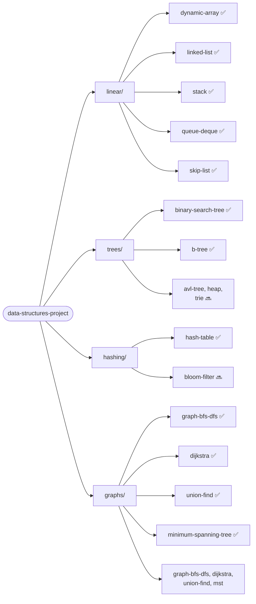

# The Grand Data Structures Project

A modular Java project demonstrating the classic data structures taught in a university CS
curriculum — one Gradle module per structure, each with its own README, a from-scratch
implementation, a second implementation applying that structure to a real scenario, and a JMH
microbenchmark that turns the textbook Big-O claim into a measured, reproducible number.
Everything is plain JVM: no hosted demo, no external services, `./gradlew build` and you're
done.

This is a portfolio project by [Leon Lourenço](https://github.com/leon-lourenco), a senior
backend engineer, built in public in scoped batches. It's a sibling to this author's
[design-patterns-project](https://github.com/leon-lourenco/design-patterns-project) — same
conventions, same author, a different fundamental: data structures and their complexity
trade-offs instead of GoF patterns.

## Why classic + applied + benchmark

A structure implemented from scratch proves you understand its mechanics — resizing, chaining,
rotations, traversal. It doesn't prove you know *when* to reach for it over the alternative, and
it doesn't prove the textbook Big-O claim actually holds in a real JVM. So every module carries
three things instead of one:

- **classic/** — the structure itself, hand-rolled (no relying on the equivalent
  `java.util` type as a shortcut), with tests that exercise its real edge cases (collisions,
  degenerate insertion order, rebalancing, resize/rehash).
- **applied/** — the same structure solving a real scenario, chosen by asking: what's the
  actual problem this structure solves, and where has that exact problem shown up? The mapping
  isn't fintech-only by default — it's deliberately pulled from wherever in the author's
  background (payments, insurance, telecom, mainframe modernization) the underlying problem is
  the most natural fit.
- **jmh/** — a JMH microbenchmark that measures the operation the module's complexity claim is
  about, usually as a direct A/B: O(1) vs O(n), average case vs. worst case, balanced vs.
  degenerate. The numbers quoted in each README are copied from a real local run, not estimated.

## Status

| # | Structure | Category | Applied scenario | Status |
|---|-----------|----------|-------------------|--------|
| 1 | [Dynamic Array](linear/dynamic-array) | Linear | Insurance batch-ingestion record buffer (insurer) | ✅ |
| 2 | [Linked List](linear/linked-list) | Linear | Insurance claim workflow stage chain (insurer) — mid-pipeline insertion without shifting | ✅ |
| 3 | [Stack](linear/stack) | Linear | Legacy COBOL copybook bracket/nesting validator (legacy bank modernization) | ✅ |
| 4 | [Queue / Deque](linear/queue-deque) | Linear | Support ticket FIFO triage with VIP fast-track (telecom) | ✅ |
| 5 | [Skip List](linear/skip-list) | Linear | Concurrent-friendly ordered index for a rate-limiter window, contrasted with balanced-tree rebalancing contention | ✅ |
| 6 | [Binary Search Tree](trees/binary-search-tree) | Trees | BACEN PIX transaction-limit tier lookup (ordered floor query) | ✅ |
| 7 | AVL Tree | Trees | Guaranteed O(log n) fraud-rule ordered index (fraud platform), contrasted against the BST's degenerate case | ⬜ |
| 8 | Heap / Priority Queue | Trees | SLA-priority ticket escalation queue (telecom) | ⬜ |
| 9 | Trie | Trees | BACEN PIX-key prefix autocomplete/validation (CPF/email/phone/random key) | ⬜ |
| 10 | [B-Tree](trees/b-tree) | Trees | Simulating an RDBMS index structure for a legacy bank's mainframe modernization narrative | ✅ |
| 11 | [Hash Table](hashing/hash-table) | Hashing | PIX idempotency-key dedup cache | ✅ |
| 12 | Bloom Filter | Hashing | Fraud/blocklist pre-check before a real DB round trip (insurer/fraud platform) | ⬜ |
| 13 | [Graph (BFS/DFS)](graphs/graph-bfs-dfs) | Graphs | AML account-relationship network traversal (fraud/compliance team) | ✅ |
| 14 | [Dijkstra](graphs/dijkstra) | Graphs | Cheapest interbank settlement routing across rails (PIX/TED/Boleto) by fee weight | ✅ |
| 15 | [Union-Find](graphs/union-find) | Graphs | Fraud-ring cluster detection via incrementally unioned accounts/devices (fraud platform) | ✅ |
| 16 | [Minimum Spanning Tree](graphs/minimum-spanning-tree) | Graphs | Cell-tower backhaul buildout cost minimization (telecom) | ✅ |

Modules are added incrementally, one per commit, as each structure is implemented — every
module lands with its own classic/applied/benchmark implementation, README, and 100% JaCoCo
instruction + branch coverage before its row here flips to ✅.

## Structure



Every structure module follows the same skeleton:

```
<category>/<structure>/
├── build.gradle.kts          # only present when the module needs extra dependencies
├── README.md                 # problem, solution, complexity, both examples, benchmark, coverage
└── src/
    ├── main/java/com/datastructures/<category>/<structure>/
    │   ├── classic/           # the from-scratch implementation
    │   └── applied/           # the real-scenario usage
    ├── test/java/...          # mirrors the classic/applied split
    └── jmh/java/com/datastructures/<category>/<structure>/benchmark/
        └── ...                # JMH microbenchmark(s) proving the complexity claim empirically
```

## Tech stack

Java 26, Gradle 9.7 (Kotlin DSL, wrapper committed — `./gradlew` works without installing
Gradle), JUnit 5, AssertJ, JaCoCo 0.8.15, JMH 1.37. No Spring, no framework — every module is
plain Java, since the point is the data structure, not a container.

**JMH wiring note:** the community `me.champeau.jmh` Gradle plugin's last release (0.7.3,
January 2025) is only tested up to Gradle 8.10/Java 21. Rather than fight a stale plugin
against Gradle 9.7/Java 26, each module's `src/jmh/java` is wired directly as a plain Gradle
source set (see the root `build.gradle.kts`) with JMH's own annotation processor generating the
benchmark runner classes — no third-party plugin in the loop.

## Running it

```bash
./gradlew build                                              # compiles every module
./gradlew test                                                # runs every module's tests
./gradlew :trees:binary-search-tree:jacocoTestReport          # per-module coverage report (HTML)
./gradlew :trees:binary-search-tree:jmh                       # per-module JMH benchmark run
```

No Docker, no database, no network calls — every test and benchmark runs against in-process
code. Coverage and benchmark numbers quoted in each module's README are copied from a real
local run (JDK 26.0.2 on this machine), not estimated.

## License

MIT — see [LICENSE](LICENSE).
