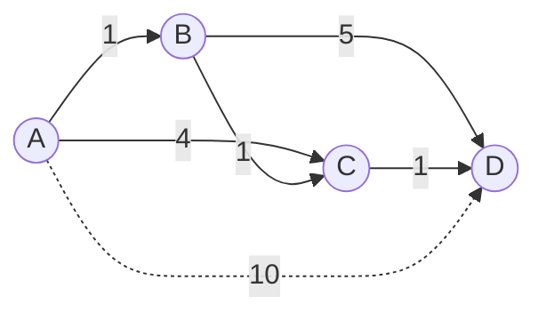

# Dijkstra's Algorithm

**Categoría:** Graphs

## El problema

Un grafo con aristas ponderadas no tiene una única "distancia" entre dos nodos de la forma en que una cuadrícula la tiene — el camino más barato puede tener más saltos que uno más caro. Forzar por fuerza bruta cada camino entre un origen y cada otro nodo es combinatoriamente inviable más allá de un puñado de nodos. Lo que se necesita es una forma de construir incrementalmente la verdadera distancia más corta hasta cada nodo, sin volver a examinar nunca un nodo una vez que su distancia más corta se conoce con certeza.

## La solución

En cada paso, finaliza vorazmente el nodo no finalizado más cercano, luego relaja (potencialmente reduce) la distancia provisional de cada uno de sus vecinos a través de él. Como cada peso de arista es no negativo, una vez que un nodo se finaliza — su distancia más corta queda fija — nada finalizado después podría jamás ofrecerle un camino más barato, ya que cualquier camino así tendría que pasar por un nodo que está más lejos de lo que él ya está. Esa única garantía es todo el argumento de corrección, y es también exactamente por qué este algoritmo se rompe en el momento en que se permite un peso de arista negativo.



| Operación | Costo | Por qué |
|---|---|---|
| `shortestPathFrom(source)` | O((V+E) log V) | cada nodo se finaliza una vez, cada arista se relaja una vez, cada operación de cola es O(log V) |
| verificación de relajación única | O(1) amortizado | una búsqueda en el mapa más una comparación |

## Ejemplo clásico

[`classic/WeightedGraph`](src/main/java/com/datastructures/graphs/dijkstra/classic/WeightedGraph.java) es un grafo no dirigido, de pesos no negativos, almacenado como una lista de adyacencia hecha a mano, con `shortestPathFrom(source)` — el algoritmo de Dijkstra — como su operación central. La frontera es una `java.util.PriorityQueue` simple, una excepción deliberada y documentada a la regla habitual de este repositorio de "sin atajos de java.util": la estructura de datos que este módulo muestra es el propio algoritmo de grafos — la estrategia de relajación voraz de Dijkstra — no la mecánica del heap, que es su propia estructura separada, con su propio módulo dedicado (futuro) en la hoja de ruta de este repositorio. [`WeightedGraphTest`](src/test/java/com/datastructures/graphs/dijkstra/classic/WeightedGraphTest.java) cubre un nodo aislado inalcanzable, un nodo cuya distancia más corta debe relajarse hacia abajo más de una vez (forzando al algoritmo a saltarse una entrada de cola obsoleta, ya finalizada), y un camino alternativo peor que *no* debe sobrescribir una distancia ya conocida y mejor.

## Ejemplo aplicado: enrutamiento de liquidación interbancaria

[`applied/InterbankSettlementRouter`](src/main/java/com/datastructures/graphs/dijkstra/applied/InterbankSettlementRouter.java) enruta una liquidación a través de rieles de bancos corresponsales — saltos estilo PIX, TED y Boleto, cada uno con su propia comisión — en lugar de asumir un único camino fijo o la menor cantidad de saltos. Mover fondos de una cuenta de origen a un destino rara vez ocurre por un único riel directo: pasa por cuentas corresponsales intermedias, y la cadena de saltos más barata no siempre es la que tiene la menor cantidad de saltos o el primer paso más barato. Modelar cada riel conocido como una arista ponderada y ejecutar Dijkstra desde la cuenta de origen encuentra la ruta de comisión total mínima en una sola pasada. [`InterbankSettlementRouterTest`](src/test/java/com/datastructures/graphs/dijkstra/applied/InterbankSettlementRouterTest.java) cubre un caso en el que una ruta corresponsal de dos saltos supera a un riel directo más caro, y un caso en el que ninguna cadena conocida de rieles llega al destino.

## Benchmark

```bash
./gradlew :graphs:dijkstra:jmh
```

Ejecución real (JMH 1.37, JDK 26.0.2, 2 iteraciones de calentamiento + 3 iteraciones de medición, 1 fork). Un grafo conexo aleatorio, con densidad de aristas mantenida en aproximadamente 4 aristas por nodo a medida que la cantidad de nodos aumenta, de modo que V y E crecen juntos:

| Costo de `shortestPathFrom` | nodes=100 (~400 aristas) | nodes=1,000 (~4,000 aristas) | nodes=10,000 (~40,000 aristas) |
|---|---:|---:|---:|
| ns/op | 34,839.05 ns | 640,390.84 ns | 18,694,286.03 ns |

El costo crece notablemente más rápido que la cantidad de nodos por sí sola (100x nodos -> ~536x más lento), lo cual concuerda con lo que realmente se está midiendo: tanto V como E escalan juntos aquí (densidad de aristas mantenida en ~4 por nodo), así que la carga de trabajo en sí crece más rápido que V, y la cola de prioridad con eliminación perezosa usada aquí (sin decrease-key; un nodo relajado recibe una nueva entrada de cola en su lugar) hace que la cola pueda contener una cantidad del orden de E entradas en lugar de V, empujando la constante real más cerca de O(E log E) que del O((V+E) log V) idealizado. De cualquier forma, la forma es inconfundiblemente mucho mejor que cuadrática y peor que lineal — exactamente el territorio de "más inteligente que la fuerza bruta, pero no gratis" que se supone que este algoritmo debe ocupar.

## Cuándo no usarlo

- ¿Algún peso de arista puede ser negativo? El argumento voraz de Dijkstra de "una vez finalizado, nunca revisitado" se rompe de inmediato — Bellman-Ford (tolera pesos negativos, detecta ciclos negativos) es la herramienta correcta en ese caso, a un costo más alto de O(V·E).
- ¿Necesitas el camino más corto entre *todos* los pares de nodos, no solo desde un origen? Ejecutar esto una vez por nodo cuesta O(V·(V+E) log V); un algoritmo de todos los pares como Floyd-Warshall (O(V^3), pero sin overhead de cola de prioridad por ejecución) suele ganar cuando de todas formas se necesita la mayoría de los pares.
- ¿Grafo no ponderado (cada arista cuesta efectivamente lo mismo)? Un BFS simple encuentra el camino más corto en O(V+E) sin necesitar ninguna cola de prioridad — el futuro módulo Graph (BFS/DFS) de este repositorio es el más adecuado para ese caso más acotado.

## Cobertura de pruebas

100% de cobertura de instrucciones, 100% de cobertura de ramas (JaCoCo). Reprodúcelo tú mismo:

```bash
./gradlew :graphs:dijkstra:jacocoTestReport
```

Informe en `graphs/dijkstra/build/reports/jacoco/test/html/index.html`.
