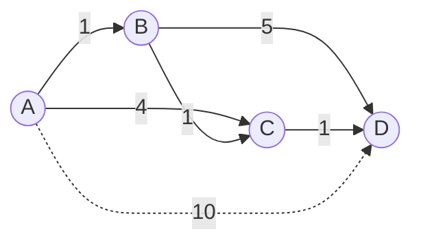

# Dijkstra's Algorithm

**Category:** Graphs

## The problem

A graph with weighted edges doesn't have a single "distance" between two nodes the way a grid
does — the cheapest path might have more hops than a more expensive one. Brute-forcing every
path between a source and every other node is combinatorially hopeless past a handful of nodes.
What's needed is a way to build up the true shortest distance to every node incrementally,
without ever re-examining a node once its shortest distance is known for certain.

## The solution

Greedily settle the closest not-yet-settled node on every step, then relax (potentially lower)
the tentative distance of each of its neighbors through it. Because every edge weight is
non-negative, once a node is settled — its shortest distance is fixed — nothing settled later
could ever offer it a cheaper path, since any such path would have to go through a node that's
farther away than it already is. That single guarantee is the entire correctness argument, and
it's also exactly why this algorithm breaks the moment a negative edge weight is allowed.



| Operation | Cost | Why |
|---|---|---|
| `shortestPathFrom(source)` | O((V+E) log V) | every node is settled once, every edge is relaxed once, each queue operation is O(log V) |
| single relaxation check | O(1) amortized | a map lookup plus a comparison |

## Classic example

[`classic/WeightedGraph`](src/main/java/com/datastructures/graphs/dijkstra/classic/WeightedGraph.java)
is an undirected, non-negative-weight graph stored as a hand-rolled adjacency list, carrying
`shortestPathFrom(source)` — Dijkstra's algorithm — as its core operation. The frontier is a
plain `java.util.PriorityQueue`, a deliberate, documented exception to this repo's usual "no
java.util shortcut" rule: the data structure this module showcases is the graph algorithm
itself — Dijkstra's greedy relaxation strategy — not heap mechanics, which is its own separate
structure with its own (future) dedicated module in this repo's roadmap.
[`WeightedGraphTest`](src/test/java/com/datastructures/graphs/dijkstra/classic/WeightedGraphTest.java)
covers an isolated unreachable node, a node whose shortest distance has to be relaxed downward
more than once (forcing the algorithm to skip a stale, already-settled queue entry), and a
worse alternate path that must *not* overwrite an already-better known distance.

## Applied example: interbank settlement routing

[`applied/InterbankSettlementRouter`](src/main/java/com/datastructures/graphs/dijkstra/applied/InterbankSettlementRouter.java)
routes a settlement across correspondent-bank rails — PIX, TED, and Boleto-style hops, each
carrying its own fee — instead of assuming a single fixed path or the fewest hops. Moving funds
from a source account to a destination rarely happens over one direct rail: it hops through
intermediate correspondent accounts, and the cheapest chain of hops isn't always the one with
the fewest hops or the cheapest first step. Modeling every known rail as a weighted edge and
running Dijkstra from the source account finds the minimum-total-fee route in one pass.
[`InterbankSettlementRouterTest`](src/test/java/com/datastructures/graphs/dijkstra/applied/InterbankSettlementRouterTest.java)
covers a case where a two-hop correspondent route beats a more expensive direct rail, and a case
where no known chain of rails reaches the destination at all.

## Benchmark

```bash
./gradlew :graphs:dijkstra:jmh
```

Real run (JMH 1.37, JDK 26.0.2, 2 warmup + 3 measurement iterations, 1 fork). A random connected
graph, edge density held at roughly 4 edges per node as node count scales up, so V and E grow
together:

| `shortestPathFrom` cost | nodes=100 (~400 edges) | nodes=1,000 (~4,000 edges) | nodes=10,000 (~40,000 edges) |
|---|---:|---:|---:|
| ns/op | 34,839.05 ns | 640,390.84 ns | 18,694,286.03 ns |

Cost grows noticeably faster than the node count alone (100x nodes -> ~536x slower), which
tracks with what's actually being measured: both V and E scale together here (edge density held
at ~4 per node), so the workload itself grows faster than V, and the lazy-deletion priority
queue used here (no decrease-key; a relaxed node gets a fresh queue entry instead) means the
queue can hold on the order of E entries rather than V, pushing the real constant closer to
O(E log E) than the idealized O((V+E) log V). Either way, the shape is unmistakably far
better-than-quadratic and worse-than-linear — exactly the "smarter than brute force, not free"
territory this algorithm is supposed to occupy.

## When not to use it

- Any edge weight can be negative? Dijkstra's greedy "once settled, never revisited" argument
  breaks immediately — Bellman-Ford (tolerates negative weights, detects negative cycles) is the
  correct tool instead, at a higher O(V·E) cost.
- Need the shortest path between *every* pair of nodes, not just from one source? Running this
  once per node costs O(V·(V+E) log V); an all-pairs algorithm like Floyd-Warshall (O(V^3), but
  with no per-run priority-queue overhead) usually wins once most pairs are needed anyway.
- Unweighted graph (every edge effectively costs the same)? A plain BFS finds the shortest path
  in O(V+E) with no priority queue needed at all — this repo's future Graph (BFS/DFS) module is
  the right fit for that narrower case.

## Test coverage

100% instruction coverage, 100% branch coverage (JaCoCo). Reproduce it yourself:

```bash
./gradlew :graphs:dijkstra:jacocoTestReport
```

Report at `graphs/dijkstra/build/reports/jacoco/test/html/index.html`.
