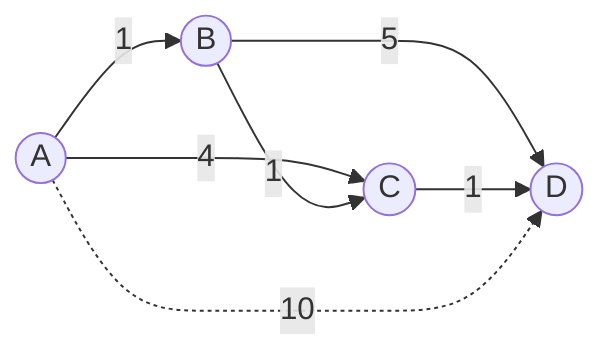

# Dijkstra's Algorithm

**Categoria:** Graphs

## O problema

Um grafo com arestas ponderadas não tem uma única "distância" entre dois nós da forma como uma grade tem — o caminho mais barato pode ter mais saltos do que um mais caro. Forçar bruta todos os caminhos entre uma origem e cada outro nó é combinatoriamente inviável além de um punhado de nós. O que é necessário é uma forma de construir incrementalmente a verdadeira menor distância até cada nó, sem nunca reexaminar um nó depois que sua menor distância é conhecida com certeza.

## A solução

A cada passo, finalize gulosamente o nó mais próximo ainda não finalizado, depois relaxe (potencialmente diminua) a distância provisória de cada um de seus vizinhos através dele. Como todo peso de aresta é não negativo, uma vez que um nó é finalizado — sua menor distância está fixada — nada finalizado depois poderia jamais lhe oferecer um caminho mais barato, já que qualquer caminho desses teria que passar por um nó que está mais longe do que ele já está. Essa única garantia é todo o argumento de correção, e é também exatamente por isso que esse algoritmo quebra no momento em que se permite um peso de aresta negativo.



| Operação | Custo | Por quê |
|---|---|---|
| `shortestPathFrom(source)` | O((V+E) log V) | cada nó é finalizado uma vez, cada aresta é relaxada uma vez, cada operação de fila é O(log V) |
| verificação de relaxamento único | O(1) amortizado | uma busca no mapa mais uma comparação |

## Exemplo clássico

[`classic/WeightedGraph`](src/main/java/com/datastructures/graphs/dijkstra/classic/WeightedGraph.java) é um grafo não direcionado, de pesos não negativos, armazenado como uma lista de adjacência feita à mão, tendo `shortestPathFrom(source)` — o algoritmo de Dijkstra — como sua operação central. A fronteira é uma `java.util.PriorityQueue` simples, uma exceção deliberada e documentada à regra usual deste repositório de "sem atalhos do java.util": a estrutura de dados que este módulo demonstra é o próprio algoritmo de grafo — a estratégia de relaxamento guloso de Dijkstra — não a mecânica do heap, que é sua própria estrutura separada, com seu próprio módulo dedicado (futuro) no roteiro deste repositório. [`WeightedGraphTest`](src/test/java/com/datastructures/graphs/dijkstra/classic/WeightedGraphTest.java) cobre um nó isolado inalcançável, um nó cuja menor distância precisa ser relaxada para baixo mais de uma vez (forçando o algoritmo a pular uma entrada de fila obsoleta, já finalizada), e um caminho alternativo pior que *não* deve sobrescrever uma distância já conhecida e melhor.

## Exemplo aplicado: roteamento de liquidação interbancária

[`applied/InterbankSettlementRouter`](src/main/java/com/datastructures/graphs/dijkstra/applied/InterbankSettlementRouter.java) roteia uma liquidação através de trilhos de bancos correspondentes — saltos no estilo PIX, TED e Boleto, cada um com sua própria tarifa — em vez de assumir um único caminho fixo ou o menor número de saltos. Mover fundos de uma conta de origem até um destino raramente acontece por um único trilho direto: passa por contas correspondentes intermediárias, e a cadeia de saltos mais barata nem sempre é a que tem o menor número de saltos ou o primeiro passo mais barato. Modelar cada trilho conhecido como uma aresta ponderada e rodar Dijkstra a partir da conta de origem encontra a rota de tarifa total mínima em uma única passada. [`InterbankSettlementRouterTest`](src/test/java/com/datastructures/graphs/dijkstra/applied/InterbankSettlementRouterTest.java) cobre um caso em que uma rota correspondente de dois saltos supera um trilho direto mais caro, e um caso em que nenhuma cadeia conhecida de trilhos alcança o destino.

## Benchmark

```bash
./gradlew :graphs:dijkstra:jmh
```

Execução real (JMH 1.37, JDK 26.0.2, 2 iterações de aquecimento + 3 iterações de medição, 1 fork). Um grafo conectado aleatório, com densidade de arestas mantida em aproximadamente 4 arestas por nó à medida que a contagem de nós aumenta, de modo que V e E crescem juntos:

| Custo de `shortestPathFrom` | nodes=100 (~400 arestas) | nodes=1,000 (~4,000 arestas) | nodes=10,000 (~40,000 arestas) |
|---|---:|---:|---:|
| ns/op | 34,839.05 ns | 640,390.84 ns | 18,694,286.03 ns |

O custo cresce visivelmente mais rápido do que a contagem de nós sozinha (100x nós -> ~536x mais lento), o que é coerente com o que está de fato sendo medido: tanto V quanto E crescem juntos aqui (densidade de arestas mantida em ~4 por nó), então a carga de trabalho em si cresce mais rápido do que V, e a fila de prioridade com exclusão preguiçosa usada aqui (sem decrease-key; um nó relaxado recebe uma nova entrada de fila em vez disso) faz com que a fila possa conter uma quantidade da ordem de E entradas em vez de V, empurrando a constante real para mais perto de O(E log E) do que o O((V+E) log V) idealizado. De qualquer forma, o formato é inconfundivelmente muito melhor que quadrático e pior que linear — exatamente o território "mais inteligente que força bruta, mas não de graça" que este algoritmo deveria ocupar.

## Quando não usar

- Algum peso de aresta pode ser negativo? O argumento guloso de Dijkstra de "uma vez finalizado, nunca revisitado" quebra imediatamente — Bellman-Ford (tolera pesos negativos, detecta ciclos negativos) é a ferramenta correta nesse caso, a um custo mais alto de O(V·E).
- Precisa do caminho mais curto entre *todos* os pares de nós, não apenas a partir de uma origem? Rodar isso uma vez por nó custa O(V·(V+E) log V); um algoritmo de todos os pares como Floyd-Warshall (O(V^3), mas sem overhead de fila de prioridade por execução) geralmente vence quando a maioria dos pares já é necessária de qualquer forma.
- Grafo não ponderado (toda aresta custa efetivamente o mesmo)? Um BFS simples encontra o caminho mais curto em O(V+E) sem precisar de fila de prioridade alguma — o futuro módulo Graph (BFS/DFS) deste repositório é o ideal para esse caso mais restrito.

## Cobertura de testes

100% de cobertura de instruções, 100% de cobertura de branches (JaCoCo). Reproduza você mesmo:

```bash
./gradlew :graphs:dijkstra:jacocoTestReport
```

Relatório em `graphs/dijkstra/build/reports/jacoco/test/html/index.html`.
