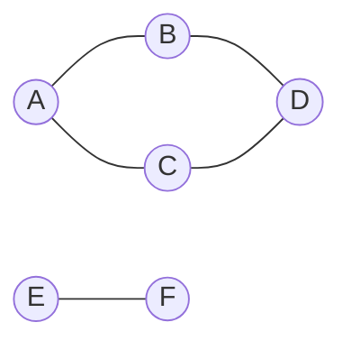

# Graph: BFS & DFS

**Categoría:** Graphs

## El problema

Toda estructura en otra parte de este repositorio responde "encuentra el valor para esta clave" — una hash table, una BST, una B-tree, todas indexan entradas individuales. Ninguna de ellas responde a un tipo diferente de pregunta: dado cómo un conjunto de cosas está conectado entre sí, ¿cuáles de ellas se pueden alcanzar desde un punto de partida dado, siguiendo cuantos saltos sean necesarios? Una [Hash Table](../../hashing/hash-table) puede decirte si la cuenta A tiene una arista directa hacia la cuenta B. No puede decirte si la cuenta A está conectada con la cuenta F a través de tres cuentas intermedias, porque esa es una pregunta sobre la *forma* de un grafo de relaciones, no sobre una única clave.

## La solución

Modela las relaciones como una lista de adyacencia — `Map<T, List<T>>` — donde la lista de cada clave es todo lo que está directamente conectado a ella, y recórrela sistemáticamente para que ningún vértice alcanzable se pierda y ninguno se visite dos veces. Este módulo implementa los dos órdenes clásicos de recorrido:

- **BFS** (primero en anchura): visita todo lo que está a un salto de distancia, luego todo lo que está a dos saltos, y así sucesivamente, usando una cola FIFO. Los vértices se marcan como visitados en el momento en que se *encolan*, no cuando se desencolan — como dos vecinos diferentes pueden apuntar al mismo vértice aún no visitado, marcar solo al desencolar permitiría que se encolara dos veces y apareciera dos veces en el resultado.
- **DFS** (búsqueda en profundidad): va tan profundo como sea posible por un camino antes de retroceder, usando una pila. Esta implementación es iterativa, con una `Deque` explícita usada como pila, deliberadamente no recursiva — una DFS recursiva se lee de forma más natural, pero cada llamada recursiva consume un frame de pila nativo de la JVM, así que un grafo suficientemente grande o profundo (una larga cadena de cuentas vinculadas, por ejemplo) corre el riesgo de un `StackOverflowError`, algo que una pila explícita alojada en el heap simplemente no puede alcanzar.

Ambas descubren exactamente el mismo *conjunto* de vértices alcanzables desde un punto de partida dado — solo el orden difiere — y ambas lo hacen en `O(V + E)`: cada vértice se visita una vez, y cada arista se examina como máximo dos veces (una vez desde cada extremo).



Al iniciar un recorrido desde `A` arriba: BFS visita `A, B, C, D` (un salto, luego dos); DFS visita `A, B, D, C` (hasta el final de un camino, luego retrocede). Ninguna de las dos llega jamás a `E` ni a `F` — son un componente conexo separado, inalcanzable desde `A` sin importar qué recorrido se use.

| Operación | Costo | Por qué |
|---|---|---|
| `addEdge` / `addVertex` | O(1) amortizado | agrega a una lista de adyacencia, o inserta una nueva entrada en el mapa |
| `bfs` / `dfs` | O(V + E) | cada vértice alcanzable se visita una vez, cada arista se examina como máximo dos veces |

## Ejemplo clásico

[`classic/Graph`](src/main/java/com/datastructures/graphs/graphbfsdfs/classic/Graph.java) es un grafo no dirigido y no ponderado, construido sobre una lista de adyacencia `Map<T, List<T>>` hecha a mano — `addEdge` enlaza ambas direcciones, y `bfs`/`dfs` devuelven el orden de visita como una `List<T>`. [`GraphTest`](src/test/java/com/datastructures/graphs/graphbfsdfs/classic/GraphTest.java) construye un grafo con un ciclo (de modo que ambos recorridos se vean forzados a descartar un vecino ya visitado al menos una vez) más un componente desconectado (de modo que se verifique que ambos recorridos nunca se adentren en él), y cubre el caso de falla de vértice inicial desconocido tanto para `bfs` como para `dfs`.

## Ejemplo aplicado: recorrido de red AML

[`applied/AmlNetworkTraversal`](src/main/java/com/datastructures/graphs/graphbfsdfs/applied/AmlNetworkTraversal.java) modela las relaciones de transacciones entre cuentas como un grafo para una investigación de compliance de prevención de lavado de dinero: dada una cuenta marcada, el BFS desde ella encuentra cualquier otra cuenta alcanzable a través de cuantos saltos de transacción sean necesarios — el clúster conectado completo potencialmente involucrado en el mismo esquema, no solo las contrapartes directas de la cuenta marcada, algo que una consulta más simple del tipo "con quién transaccionó esta cuenta" pasaría por alto por completo. [`AmlNetworkTraversalTest`](src/test/java/com/datastructures/graphs/graphbfsdfs/applied/AmlNetworkTraversalTest.java) cubre un clúster de múltiples saltos, confirma que las cuentas más cercanas aparecen antes que las más lejanas, y confirma que las cuentas fuera de la red marcada nunca aparecen en el resultado.

## Benchmark

```bash
./gradlew :graphs:graph-bfs-dfs:jmh
```

Ejecución real (JMH 1.37, JDK 26.0.2, 2 iteraciones de calentamiento + 3 iteraciones de medición, 1 fork). La cantidad de vértices y aristas crece junta a una densidad fija (4 aristas agregadas por vértice, con semilla `Random(42)`), así que, si la afirmación de `O(V + E)` se sostiene, el tiempo total de recorrido debería crecer aproximadamente al mismo ritmo que la cantidad de vértices. El `@Setup` de cada ejecución confirmó que el grafo completo permaneció como un único componente conexo en todos los tamaños (tanto BFS como DFS visitaron todos los `V` vértices desde el vértice inicial, en los tres tamaños):

| Benchmark (recorrido completo) | size=1,000 | size=10,000 | size=100,000 |
|---|---:|---:|---:|
| `bfsTraversal` | 240,532 ns | 8.9 ms | 175.0 ms |
| `dfsTraversal` | 336,907 ns | 5.8 ms | 148.4 ms |

Normalizado por vértice, eso es aproximadamente 240-340 ns/vértice en size=1,000, 580-895 ns/vértice en size=10,000, y 1,480-1,750 ns/vértice en size=100,000 — creciendo, pero lejos del crecimiento de ~10x por década que un recorrido `O(V^2)` mostraría con densidad de aristas constante; está bastante por debajo incluso de un orden de magnitud de crecimiento en el costo por vértice a lo largo de dos órdenes de magnitud en la cantidad de vértices, lo cual es consistente con `O(V + E)`. El número por vértice no es perfectamente estable como el de un benchmark verdaderamente O(1) en otra parte de este repositorio, y los intervalos de confianza en size=10,000 y 100,000 son amplios (el ruido de JVM/GC del orden de milisegundos de un solo dígito domina en esa cantidad de iteraciones) — ambos recorridos asignan un nuevo conjunto de visitados y una nueva lista de resultado en cada invocación aquí, así que parte de ese crecimiento es, en realidad, presión de GC/asignación que escala con la huella de heap, no que el propio algoritmo de grafos se vuelva menos lineal.

## Cuándo no usarlo

- ¿Necesitas el *camino más corto ponderado*, no solo alcanzabilidad o la menor cantidad de saltos? El BFS simple solo encuentra caminos más cortos cuando cada arista tiene el mismo peso (como aquí); un grafo ponderado necesita el algoritmo de Dijkstra o similar.
- ¿Necesitas saber solo los pocos vértices alcanzables *más cercanos*, no todo el conjunto alcanzable? Ambos recorridos aquí siempre se ejecutan hasta el final — una variante con salida anticipada (detenerse en cuanto se encuentra un objetivo, o en cuanto se supera un límite de distancia en saltos) desperdiciaría menos trabajo para esa pregunta más acotada.
- Este grafo es solo no dirigido — `addEdge` siempre enlaza ambas direcciones. Las relaciones que son inherentemente de un solo sentido (el dinero que fluye de A a B no implica lo inverso) necesitan un grafo dirigido, algo que este módulo no modela.

## Cobertura de pruebas

100% de cobertura de instrucciones, 100% de cobertura de ramas (JaCoCo). Reprodúcelo tú mismo:

```bash
./gradlew :graphs:graph-bfs-dfs:jacocoTestReport
```

Informe en `graphs/graph-bfs-dfs/build/reports/jacoco/test/html/index.html`.
