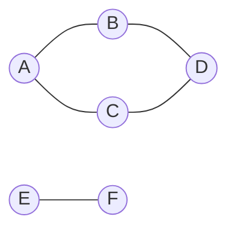

# Graph: BFS & DFS

**Category:** Graphs

## The problem

Every structure elsewhere in this repo answers "find the value for this key" — a hash table, a
BST, a B-tree, all index individual entries. None of them answer a different kind of question:
given how a set of things are connected to each other, which of them can be reached from a given
starting point, following however many hops it takes? A [Hash Table](../../hashing/hash-table)
can tell you whether account A has a direct edge to account B. It cannot tell you whether account
A is connected to account F through three intermediate accounts, because that's a question about
the *shape* of a relationship graph, not about any single key.

## The solution

Model the relationships as an adjacency list — `Map<T, List<T>>` — where each key's list is
everything directly connected to it, and traverse it systematically so no reachable vertex is
missed and none is visited twice. This module implements both classic traversal orders:

- **BFS** (breadth-first): visits everything one hop away, then everything two hops away, and so
  on, using a FIFO queue. Vertices are marked visited the moment they're *enqueued*, not when
  they're dequeued — with two different neighbors able to point at the same not-yet-visited
  vertex, marking only at dequeue time would let it be queued twice and appear twice in the
  result.
- **DFS** (depth-first): goes as deep as possible down one path before backtracking, using a
  stack. This implementation is iterative with an explicit `Deque` used as a stack, deliberately
  not recursive — a recursive DFS reads more naturally, but each recursive call consumes a native
  JVM stack frame, so a large or deep enough graph (a long chain of linked accounts, say) risks a
  `StackOverflowError` that an explicit heap-allocated stack simply cannot hit.

Both discover exactly the same *set* of reachable vertices from a given start — only the order
differs — and both do it in `O(V + E)`: every vertex is visited once, and every edge is examined
at most twice (once from each endpoint).



Starting a traversal from `A` above: BFS visits `A, B, C, D` (one hop, then two); DFS visits
`A, B, D, C` (all the way down one path, then backtracks). Neither ever reaches `E` or `F` —
they're a separate connected component, unreachable from `A` no matter which traversal is used.

| Operation | Cost | Why |
|---|---|---|
| `addEdge` / `addVertex` | O(1) amortized | appends to an adjacency list, or inserts a new map entry |
| `bfs` / `dfs` | O(V + E) | every reachable vertex is visited once, every edge examined at most twice |

## Classic example

[`classic/Graph`](src/main/java/com/datastructures/graphs/graphbfsdfs/classic/Graph.java) is an
undirected, unweighted graph built on a hand-rolled `Map<T, List<T>>` adjacency list —
`addEdge` links both directions, and `bfs`/`dfs` both return the visit order as a `List<T>`.
[`GraphTest`](src/test/java/com/datastructures/graphs/graphbfsdfs/classic/GraphTest.java) builds
a graph with a cycle (so both traversals are forced to discard an already-visited neighbor at
least once) plus a disconnected component (so both traversals are checked to never wander into
it), and covers the unknown-start-vertex failure case for both `bfs` and `dfs`.

## Applied example: AML network traversal

[`applied/AmlNetworkTraversal`](src/main/java/com/datastructures/graphs/graphbfsdfs/applied/AmlNetworkTraversal.java)
models account-to-account transaction relationships as a graph for an anti-money-laundering
compliance investigation: given one flagged account, BFS from it finds every other account
reachable through however many transaction hops — the full connected cluster potentially
involved in the same scheme, not just the flagged account's direct counterparties, which a
simpler "who did this account transact with" query would miss entirely.
[`AmlNetworkTraversalTest`](src/test/java/com/datastructures/graphs/graphbfsdfs/applied/AmlNetworkTraversalTest.java)
covers a multi-hop cluster, confirms closer accounts surface before farther ones, and confirms
accounts outside the flagged network never appear in the result.

## Benchmark

```bash
./gradlew :graphs:graph-bfs-dfs:jmh
```

Real run (JMH 1.37, JDK 26.0.2, 2 warmup + 3 measurement iterations, 1 fork). Vertex and edge
count grow together at a fixed density (4 edges added per vertex, seeded `Random(42)`), so if the
`O(V + E)` claim holds, total traversal time should grow roughly in step with vertex count. Each
run's `@Setup` confirmed the whole graph stayed one connected component at every size (BFS and
DFS both visited all `V` vertices from the start vertex, at all three sizes):

| Benchmark (full traversal) | size=1,000 | size=10,000 | size=100,000 |
|---|---:|---:|---:|
| `bfsTraversal` | 240,532 ns | 8.9 ms | 175.0 ms |
| `dfsTraversal` | 336,907 ns | 5.8 ms | 148.4 ms |

Normalized per vertex, that's roughly 240-340 ns/vertex at size=1,000, 580-895 ns/vertex at
size=10,000, and 1,480-1,750 ns/vertex at size=100,000 — growing, but nowhere near the ~10x-per-
decade growth an `O(V^2)` traversal would show at constant edge density; it's well short of even
one order of magnitude of growth in per-vertex cost across two orders of magnitude of vertex
count, consistent with `O(V + E)`. The per-vertex number isn't perfectly flat the way a true O(1)
benchmark elsewhere in this repo is, and the confidence intervals at size=10,000 and 100,000 are
wide (single-digit-millisecond JVM/GC noise dominates at that iteration count) — both traversals
allocate a fresh visited-set and result list on every single invocation here, so some of that
growth is realistically GC/allocation pressure scaling with heap footprint, not the graph
algorithm itself becoming less linear.

## When not to use it

- Need the *shortest weighted path*, not just reachability or fewest-hops? Plain BFS only finds
  shortest paths when every edge has equal weight (as here); a weighted graph needs Dijkstra's
  algorithm or similar instead.
- Need to know just the *nearest* few reachable vertices, not the entire reachable set? Both
  traversals here always run to completion — an early-exit variant (stop once a target is found,
  or once a hop-distance limit is exceeded) would waste less work for that narrower question.
- This graph is undirected only — `addEdge` always links both directions. Relationships that are
  inherently one-way (money flowing from A to B doesn't imply the reverse) need a directed graph,
  which this module doesn't model.

## Test coverage

100% instruction coverage, 100% branch coverage (JaCoCo). Reproduce it yourself:

```bash
./gradlew :graphs:graph-bfs-dfs:jacocoTestReport
```

Report at `graphs/graph-bfs-dfs/build/reports/jacoco/test/html/index.html`.
