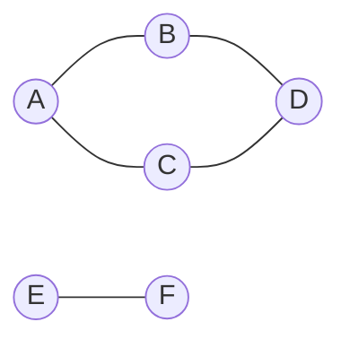

# Graph: BFS & DFS

**Categoria:** Graphs

## O problema

Toda estrutura em outro lugar deste repositório responde "encontre o valor para esta chave" — uma hash table, uma BST, uma B-tree, todas indexam entradas individuais. Nenhuma delas responde a um tipo diferente de pergunta: dado como um conjunto de coisas está conectado entre si, quais delas podem ser alcançadas a partir de um ponto de partida, seguindo quantos saltos forem necessários? Uma [Hash Table](../../hashing/hash-table) pode dizer se a conta A tem uma aresta direta para a conta B. Ela não pode dizer se a conta A está conectada à conta F através de três contas intermediárias, porque essa é uma pergunta sobre a *forma* de um grafo de relacionamentos, não sobre uma única chave.

## A solução

Modele os relacionamentos como uma lista de adjacência — `Map<T, List<T>>` — em que a lista de cada chave é tudo o que está diretamente conectado a ela, e percorra-a sistematicamente para que nenhum vértice alcançável seja perdido e nenhum seja visitado duas vezes. Este módulo implementa as duas ordens clássicas de percurso:

- **BFS** (busca em largura): visita tudo que está a um salto de distância, depois tudo que está a dois saltos, e assim por diante, usando uma fila FIFO. Os vértices são marcados como visitados no momento em que são *enfileirados*, não quando são desenfileirados — como dois vizinhos diferentes podem apontar para o mesmo vértice ainda não visitado, marcar apenas no momento do desenfileiramento permitiria que ele fosse enfileirado duas vezes e aparecesse duas vezes no resultado.
- **DFS** (busca em profundidade): vai o mais fundo possível em um caminho antes de retroceder, usando uma pilha. Esta implementação é iterativa, com uma `Deque` explícita usada como pilha, deliberadamente não recursiva — uma DFS recursiva se lê de forma mais natural, mas cada chamada recursiva consome um frame de pilha nativo da JVM, então um grafo suficientemente grande ou profundo (uma longa cadeia de contas vinculadas, por exemplo) corre o risco de um `StackOverflowError`, algo que uma pilha explícita alocada no heap simplesmente não pode atingir.

Ambas descobrem exatamente o mesmo *conjunto* de vértices alcançáveis a partir de um ponto de partida — apenas a ordem difere — e ambas fazem isso em `O(V + E)`: cada vértice é visitado uma vez, e cada aresta é examinada no máximo duas vezes (uma vez a partir de cada extremidade).



Iniciando um percurso a partir de `A` acima: BFS visita `A, B, C, D` (um salto, depois dois); DFS visita `A, B, D, C` (até o fim de um caminho, depois retrocede). Nenhuma das duas jamais alcança `E` ou `F` — eles são um componente conectado separado, inalcançável a partir de `A` não importa qual percurso seja usado.

| Operação | Custo | Por quê |
|---|---|---|
| `addEdge` / `addVertex` | O(1) amortizado | adiciona a uma lista de adjacência, ou insere uma nova entrada no mapa |
| `bfs` / `dfs` | O(V + E) | cada vértice alcançável é visitado uma vez, cada aresta é examinada no máximo duas vezes |

## Exemplo clássico

[`classic/Graph`](src/main/java/com/datastructures/graphs/graphbfsdfs/classic/Graph.java) é um grafo não direcionado e não ponderado, construído sobre uma lista de adjacência `Map<T, List<T>>` feita à mão — `addEdge` liga as duas direções, e `bfs`/`dfs` retornam a ordem de visita como uma `List<T>`. [`GraphTest`](src/test/java/com/datastructures/graphs/graphbfsdfs/classic/GraphTest.java) constrói um grafo com um ciclo (de modo que ambos os percursos sejam forçados a descartar um vizinho já visitado pelo menos uma vez) mais um componente desconectado (de modo que ambos os percursos sejam verificados para nunca entrar nele), e cobre o caso de falha de vértice inicial desconhecido tanto para `bfs` quanto para `dfs`.

## Exemplo aplicado: percurso de rede AML

[`applied/AmlNetworkTraversal`](src/main/java/com/datastructures/graphs/graphbfsdfs/applied/AmlNetworkTraversal.java) modela relações de transação entre contas como um grafo para uma investigação de compliance de prevenção à lavagem de dinheiro: dada uma conta sinalizada, o BFS a partir dela encontra toda outra conta alcançável através de quantos saltos de transação forem necessários — o cluster conectado completo potencialmente envolvido no mesmo esquema, não apenas as contrapartes diretas da conta sinalizada, o que uma consulta mais simples do tipo "com quem esta conta transacionou" deixaria passar por completo. [`AmlNetworkTraversalTest`](src/test/java/com/datastructures/graphs/graphbfsdfs/applied/AmlNetworkTraversalTest.java) cobre um cluster de múltiplos saltos, confirma que contas mais próximas aparecem antes das mais distantes, e confirma que contas fora da rede sinalizada nunca aparecem no resultado.

## Benchmark

```bash
./gradlew :graphs:graph-bfs-dfs:jmh
```

Execução real (JMH 1.37, JDK 26.0.2, 2 iterações de aquecimento + 3 iterações de medição, 1 fork). A contagem de vértices e arestas cresce junto em uma densidade fixa (4 arestas adicionadas por vértice, com semente `Random(42)`), então, se a afirmação de `O(V + E)` for válida, o tempo total de percurso deve crescer aproximadamente na mesma proporção que a contagem de vértices. O `@Setup` de cada execução confirmou que o grafo inteiro permaneceu como um único componente conectado em todos os tamanhos (tanto BFS quanto DFS visitaram todos os `V` vértices a partir do vértice inicial, nos três tamanhos):

| Benchmark (percurso completo) | size=1,000 | size=10,000 | size=100,000 |
|---|---:|---:|---:|
| `bfsTraversal` | 240,532 ns | 8.9 ms | 175.0 ms |
| `dfsTraversal` | 336,907 ns | 5.8 ms | 148.4 ms |

Normalizado por vértice, isso é aproximadamente 240-340 ns/vértice em size=1,000, 580-895 ns/vértice em size=10,000, e 1,480-1,750 ns/vértice em size=100,000 — crescendo, mas longe do crescimento de ~10x por década que um percurso `O(V^2)` mostraria com densidade de arestas constante; está bem aquém até de uma ordem de grandeza de crescimento no custo por vértice ao longo de duas ordens de grandeza na contagem de vértices, o que é consistente com `O(V + E)`. O número por vértice não é perfeitamente estável como o de um benchmark verdadeiramente O(1) em outro lugar deste repositório, e os intervalos de confiança em size=10,000 e 100,000 são largos (o ruído de JVM/GC na casa de milissegundos de um único dígito domina nessa contagem de iterações) — ambos os percursos alocam um novo conjunto de visitados e uma nova lista de resultado a cada única invocação aqui, então parte desse crescimento é, realisticamente, pressão de GC/alocação que escala com a pegada de heap, não o próprio algoritmo de grafo se tornando menos linear.

## Quando não usar

- Precisa do *caminho mais curto ponderado*, não apenas de alcançabilidade ou do menor número de saltos? O BFS simples só encontra caminhos mais curtos quando toda aresta tem o mesmo peso (como aqui); um grafo ponderado precisa do algoritmo de Dijkstra ou similar.
- Precisa saber apenas os poucos vértices alcançáveis *mais próximos*, não o conjunto alcançável inteiro? Ambos os percursos aqui sempre rodam até o fim — uma variante com saída antecipada (parar assim que um alvo for encontrado, ou assim que um limite de distância em saltos for excedido) desperdiçaria menos trabalho para essa pergunta mais restrita.
- Este grafo é apenas não direcionado — `addEdge` sempre liga as duas direções. Relacionamentos que são inerentemente de mão única (dinheiro fluindo de A para B não implica o inverso) precisam de um grafo direcionado, o que este módulo não modela.

## Cobertura de testes

100% de cobertura de instruções, 100% de cobertura de branches (JaCoCo). Reproduza você mesmo:

```bash
./gradlew :graphs:graph-bfs-dfs:jacocoTestReport
```

Relatório em `graphs/graph-bfs-dfs/build/reports/jacoco/test/html/index.html`.
