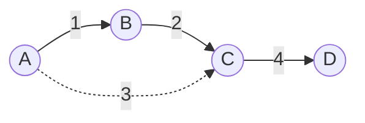

# Minimum Spanning Tree

**Categoría:** Graphs

## El problema

Conectar un conjunto de sitios en una única red — cada sitio alcanzable desde todos los demás — casi nunca requiere construir todos los enlaces posibles. Lo que se necesita es el subconjunto *más barato* de enlaces candidatos que aun así conecte todo, sin incluir ningún enlace redundante (que forme un ciclo). Probar todos los subconjuntos posibles de enlaces es combinatoriamente inviable pasado un puñado de sitios.

## La solución

Ordena todas las aristas candidatas de forma ascendente por peso, y luego recorre la lista ordenada de manera voraz: agrega una arista solo si sus dos extremos aún no están conectados por aristas ya agregadas hasta el momento. Si no, sáltala — agregarla solo cerraría un ciclo, lo cual nunca puede hacer un árbol de expansión más barato, solo le añadiría una arista redundante. "¿Ya conectados?" es exactamente la pregunta que el propio módulo [Union-Find](../union-find) de este repositorio existe para responder en O(1) amortizado casi constante, lo que es lo que mantiene el costo total de este algoritmo dominado por el ordenamiento, en lugar de por las verificaciones de conectividad.



En el diagrama anterior, la arista discontinua A-C (peso 3) se omite: para cuando el algoritmo de Kruskal la considera, A y C ya están conectados a través de B, así que agregarla solo crearía un ciclo.

| Operación | Costo | Por qué |
|---|---|---|
| `computeMst` | O(E log E) | dominado por el ordenamiento de la lista de aristas; la verificación de ciclo mediante union-find en cada arista es casi O(1) amortizado |

## Ejemplo clásico

[`classic/KruskalMinimumSpanningTree`](src/main/java/com/datastructures/graphs/minimumspanningtree/classic/KruskalMinimumSpanningTree.java) implementa el algoritmo de Kruskal desde cero, dependiendo del propio módulo [`graphs:union-find`](../union-find) de este repositorio (`UnionFind`, con compresión de caminos y unión por rango) para la verificación de ciclo en cada arista candidata — una dependencia real de proyecto Gradle (`implementation(project(":graphs:union-find"))` en el `build.gradle.kts` de este módulo), no una copia duplicada de esa lógica. El resultado ([`classic/MinimumSpanningTreeResult`](src/main/java/com/datastructures/graphs/minimumspanningtree/classic/MinimumSpanningTreeResult.java)) informa si el grafo de entrada estaba totalmente conectado: un grafo de entrada desconectado igual obtiene el *bosque* más barato posible, solo que no un único árbol, ya que no existe arista alguna para conectar los componentes separados. [`KruskalMinimumSpanningTreeTest`](src/test/java/com/datastructures/graphs/minimumspanningtree/classic/KruskalMinimumSpanningTreeTest.java) cubre un grafo vacío, un único nodo sin aristas, una arista omitida por cerrar un ciclo, y un grafo de entrada genuinamente desconectado.

## Ejemplo aplicado: planificación de backhaul de torres celulares

[`applied/CellTowerBackhaulPlanner`](src/main/java/com/datastructures/graphs/minimumspanningtree/applied/CellTowerBackhaulPlanner.java) (en un operador de telecomunicaciones) encuentra el conjunto de enlaces de backhaul de costo mínimo que conecta cada torre celular de un despliegue en una sola red — donde el peso de cada enlace candidato es su costo de backhaul (distancia de zanjeo para fibra, equipo de enlace de microondas, condiciones de arrendamiento — lo que domine para ese par) — sin evaluar por fuerza bruta cada topología de red posible. [`CellTowerBackhaulPlannerTest`](src/test/java/com/datastructures/graphs/minimumspanningtree/applied/CellTowerBackhaulPlannerTest.java) cubre la elección de la ruta más barata entre dos rutas redundantes entre las mismas torres, y una torre registrada antes de su estudio de backhaul (aún sin enlaces candidatos), lo que correctamente deja esa torre fuera del alcance de la red planificada.

## Benchmark

```bash
./gradlew :graphs:minimum-spanning-tree:jmh
```

Ejecución real (JMH 1.37, JDK 26.0.2, 2 iteraciones de calentamiento + 3 iteraciones de medición, 1 fork). El tamaño del pool de nodos escala de forma aproximada con la cantidad de aristas (para que el grafo no se vuelva absurdamente denso); la cantidad de aristas es la variable que realmente está bajo prueba:

| Costo de `computeMst` | aristas=1,000 | aristas=10,000 | aristas=100,000 |
|---|---:|---:|---:|
| ns/op | 196,015.16 ns | 2,801,892.07 ns | 59,000,563.29 ns |

Pasar de 1,000 a 10,000 aristas (10x los datos) cuesta cerca de 14.3x más tiempo — cerca del ~13.3x que predice un ordenamiento O(E log E) para ese salto (`10,000·log₂(10,000) ÷ 1,000·log₂(1,000)`). Pasar de 10,000 a 100,000 aristas cuesta cerca de 21.1x más, algo por encima del ~12.5x que predice la misma fórmula para ese paso — el pool de nodos también crece junto con la cantidad de aristas en este benchmark, así que un array de union-find más grande y más trabajo de asignación de `ArrayList`/`HashMap` suman una sobrecarga real, ajena al ordenamiento, en el tamaño más grande. La forma dominante sigue siendo inconfundiblemente el O(E log E) del ordenamiento, no las verificaciones de union-find casi-O(1) amortizado que lo acompañan.

## Cuándo no usarlo

- ¿Necesitas el camino más barato *entre dos nodos específicos*, no una red que conecte todo? Un árbol de expansión mínima minimiza el costo total de la red, no ningún camino individual entre pares — el módulo [Dijkstra](../dijkstra) de este repositorio responde esa pregunta distinta en su lugar.
- ¿El grafo es dirigido, o "más barato" necesita tener en cuenta algo más que un peso de arista estático (capacidad, congestión en vivo)? Kruskal (y Prim, su primo de búsqueda en espacio de estados) asumen un grafo no dirigido de peso fijo; un problema de red de costo mínimo dirigido o sensible a la capacidad necesita un algoritmo completamente distinto (por ejemplo, una formulación de flujo de costo mínimo).
- ¿Solo necesitas comprobar alcanzabilidad, no la red de conexión más barata? Sáltate el ordenamiento por completo y usa directamente el módulo [Union-Find](../union-find) de este repositorio, o un simple BFS/DFS.

## Cobertura de pruebas

100% de cobertura de instrucciones, 100% de cobertura de ramas (JaCoCo). Reprodúcelo tú mismo:

```bash
./gradlew :graphs:minimum-spanning-tree:jacocoTestReport
```

Informe en `graphs/minimum-spanning-tree/build/reports/jacoco/test/html/index.html`.
