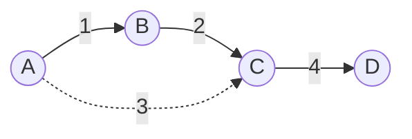

# Minimum Spanning Tree

**Category:** Graphs

## The problem

Connecting a set of sites into a single network — every site reachable from every other one —
almost never needs every possible link built. What's needed is the *cheapest* subset of
candidate links that still connects everything, with no redundant (cycle-forming) link included.
Trying every possible subset of links is combinatorially hopeless past a handful of sites.

## The solution

Sort every candidate edge ascending by weight, then walk the sorted list greedily: add an edge
only if its two endpoints aren't already connected by edges added so far. Skip it otherwise —
adding it would only close a cycle, which can never make a spanning tree cheaper, only add a
redundant edge to it. "Already connected?" is exactly the question this repo's own
[Union-Find](../union-find) module exists to answer near-O(1) amortized, which is what keeps
this algorithm's total cost dominated by the sort rather than by the connectivity checks.



In the diagram above, the dashed A-C edge (weight 3) is skipped: by the time Kruskal's algorithm
considers it, A and C are already connected through B, so adding it would only create a cycle.

| Operation | Cost | Why |
|---|---|---|
| `computeMst` | O(E log E) | dominated by sorting the edge list; the union-find cycle check on each edge is near O(1) amortized |

## Classic example

[`classic/KruskalMinimumSpanningTree`](src/main/java/com/datastructures/graphs/minimumspanningtree/classic/KruskalMinimumSpanningTree.java)
implements Kruskal's algorithm from scratch, depending on this repo's own
[`graphs:union-find`](../union-find) module (`UnionFind`, with path compression and union by
rank) for the cycle check on each candidate edge — a real Gradle project dependency
(`implementation(project(":graphs:union-find"))` in this module's `build.gradle.kts`), not a
duplicated copy of that logic. The result
([`classic/MinimumSpanningTreeResult`](src/main/java/com/datastructures/graphs/minimumspanningtree/classic/MinimumSpanningTreeResult.java))
reports whether the input graph was fully connected: a disconnected input graph still gets the
cheapest possible *forest*, just not a single tree, since no edge exists to bridge the separate
components.
[`KruskalMinimumSpanningTreeTest`](src/test/java/com/datastructures/graphs/minimumspanningtree/classic/KruskalMinimumSpanningTreeTest.java)
covers an empty graph, a single node with no edges, an edge skipped for closing a cycle, and a
genuinely disconnected input graph.

## Applied example: cell tower backhaul planning

[`applied/CellTowerBackhaulPlanner`](src/main/java/com/datastructures/graphs/minimumspanningtree/applied/CellTowerBackhaulPlanner.java)
(telecom) finds the minimum-cost set of backhaul links connecting every cell tower in a
build-out into one network — where each candidate link's weight is its backhaul cost (fiber
trenching distance, microwave-link equipment, lease terms — whatever dominates for that pair) —
without evaluating every possible network topology by brute force.
[`CellTowerBackhaulPlannerTest`](src/test/java/com/datastructures/graphs/minimumspanningtree/applied/CellTowerBackhaulPlannerTest.java)
covers picking the cheaper of two redundant routes between the same towers, and a tower
registered ahead of its backhaul survey (no candidate links yet), which correctly leaves the
planned network unspanned.

## Benchmark

```bash
./gradlew :graphs:minimum-spanning-tree:jmh
```

Real run (JMH 1.37, JDK 26.0.2, 2 warmup + 3 measurement iterations, 1 fork). Node pool size
scales loosely with edge count (so the graph doesn't get absurdly dense); edge count is the
variable actually under test:

| `computeMst` cost | edges=1,000 | edges=10,000 | edges=100,000 |
|---|---:|---:|---:|
| ns/op | 196,015.16 ns | 2,801,892.07 ns | 59,000,563.29 ns |

Going from 1,000 to 10,000 edges (10x the data) costs about 14.3x more time — close to the
~13.3x an O(E log E) sort predicts for that jump (`10,000·log₂(10,000) ÷ 1,000·log₂(1,000)`).
Going from 10,000 to 100,000 edges costs about 21.1x more, somewhat above the ~12.5x the same
formula predicts for that step — the node pool also grows alongside the edge count in this
benchmark, so a larger union-find array and more `ArrayList`/`HashMap` allocation work both
add real, non-sort overhead at the largest size. The dominant shape is still unmistakably the
sort's O(E log E), not the near-O(1)-amortized union-find checks riding along with it.

## When not to use it

- Need the cheapest path *between two specific nodes*, not a network connecting everything? A
  minimum spanning tree minimizes total network cost, not any individual pairwise path — this
  repo's [Dijkstra](../dijkstra) module answers that different question instead.
- The graph is directed, or "cheapest" needs to account for something other than a static edge
  weight (capacity, live congestion)? Kruskal (and Prim's, its state-space-search cousin) assume
  a fixed-weight undirected graph; a directed or capacity-aware minimum-cost network problem
  needs a different algorithm (e.g. a minimum-cost flow formulation) entirely.
- Only need to check reachability, not the cheapest connecting network? Skip the sort entirely
  and use this repo's [Union-Find](../union-find) module directly, or a plain BFS/DFS.

## Test coverage

100% instruction coverage, 100% branch coverage (JaCoCo). Reproduce it yourself:

```bash
./gradlew :graphs:minimum-spanning-tree:jacocoTestReport
```

Report at `graphs/minimum-spanning-tree/build/reports/jacoco/test/html/index.html`.
