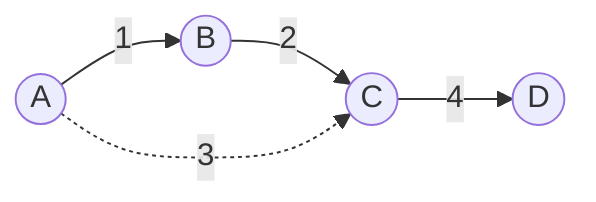

# Minimum Spanning Tree

**Categoria:** Graphs

## O problema

Conectar um conjunto de sites em uma única rede — cada site alcançável a partir de todos os outros — quase nunca exige construir todas as ligações possíveis. O que se precisa é do subconjunto *mais barato* de ligações candidatas que ainda conecte tudo, sem incluir nenhuma ligação redundante (que forme ciclo). Tentar todos os subconjuntos possíveis de ligações é combinatoriamente inviável a partir de um punhado de sites.

## A solução

Ordene todas as arestas candidatas de forma ascendente por peso, e então percorra a lista ordenada de forma gulosa: adicione uma aresta somente se seus dois extremos ainda não estiverem conectados por arestas já adicionadas até então. Caso contrário, pule-a — adicioná-la só fecharia um ciclo, o que nunca pode tornar uma árvore geradora mais barata, apenas adicionar uma aresta redundante a ela. "Já conectados?" é exatamente a pergunta que o próprio módulo [Union-Find](../union-find) deste repositório existe para responder em quase-O(1) amortizado, o que é o que mantém o custo total deste algoritmo dominado pela ordenação, e não pelas verificações de conectividade.



No diagrama acima, a aresta tracejada A-C (peso 3) é pulada: quando o algoritmo de Kruskal a considera, A e C já estão conectados através de B, então adicioná-la só criaria um ciclo.

| Operação | Custo | Por quê |
|---|---|---|
| `computeMst` | O(E log E) | dominado pela ordenação da lista de arestas; a verificação de ciclo via union-find em cada aresta é quase O(1) amortizado |

## Exemplo clássico

[`classic/KruskalMinimumSpanningTree`](src/main/java/com/datastructures/graphs/minimumspanningtree/classic/KruskalMinimumSpanningTree.java) implementa o algoritmo de Kruskal do zero, dependendo do próprio módulo [`graphs:union-find`](../union-find) deste repositório (`UnionFind`, com compressão de caminho e união por rank) para a verificação de ciclo em cada aresta candidata — uma dependência real de projeto Gradle (`implementation(project(":graphs:union-find"))` no `build.gradle.kts` deste módulo), não uma cópia duplicada dessa lógica. O resultado ([`classic/MinimumSpanningTreeResult`](src/main/java/com/datastructures/graphs/minimumspanningtree/classic/MinimumSpanningTreeResult.java)) informa se o grafo de entrada estava totalmente conectado: um grafo de entrada desconectado ainda obtém a *floresta* mais barata possível, só que não uma única árvore, já que não existe aresta para conectar os componentes separados. [`KruskalMinimumSpanningTreeTest`](src/test/java/com/datastructures/graphs/minimumspanningtree/classic/KruskalMinimumSpanningTreeTest.java) cobre um grafo vazio, um único nó sem arestas, uma aresta pulada por fechar um ciclo, e um grafo de entrada genuinamente desconectado.

## Exemplo aplicado: planejamento de backhaul de torres celulares

[`applied/CellTowerBackhaulPlanner`](src/main/java/com/datastructures/graphs/minimumspanningtree/applied/CellTowerBackhaulPlanner.java) (em uma operadora de telecomunicações) encontra o conjunto de ligações de backhaul de custo mínimo que conecta cada torre celular de uma implantação em uma única rede — onde o peso de cada ligação candidata é seu custo de backhaul (distância de abertura de valas para fibra, equipamento de enlace de micro-ondas, condições de locação — o que for dominante para aquele par) — sem avaliar por força bruta todas as topologias de rede possíveis. [`CellTowerBackhaulPlannerTest`](src/test/java/com/datastructures/graphs/minimumspanningtree/applied/CellTowerBackhaulPlannerTest.java) cobre a escolha da rota mais barata entre duas rotas redundantes entre as mesmas torres, e uma torre registrada antes de sua pesquisa de backhaul (ainda sem ligações candidatas), o que corretamente deixa essa torre fora do alcance da rede planejada.

## Benchmark

```bash
./gradlew :graphs:minimum-spanning-tree:jmh
```

Execução real (JMH 1.37, JDK 26.0.2, 2 iterações de aquecimento + 3 iterações de medição, 1 fork). O tamanho do pool de nós escala de forma aproximada com a contagem de arestas (para que o grafo não fique absurdamente denso); a contagem de arestas é a variável de fato sob teste:

| Custo de `computeMst` | arestas=1,000 | arestas=10,000 | arestas=100,000 |
|---|---:|---:|---:|
| ns/op | 196,015.16 ns | 2,801,892.07 ns | 59,000,563.29 ns |

Ir de 1,000 para 10,000 arestas (10x os dados) custa cerca de 14.3x mais tempo — próximo dos ~13.3x que uma ordenação O(E log E) prevê para esse salto (`10,000·log₂(10,000) ÷ 1,000·log₂(1,000)`). Ir de 10,000 para 100,000 arestas custa cerca de 21.1x mais, um pouco acima dos ~12.5x que a mesma fórmula prevê para esse passo — o pool de nós também cresce junto com a contagem de arestas neste benchmark, então um array de union-find maior e mais trabalho de alocação de `ArrayList`/`HashMap` somam uma sobrecarga real, alheia à ordenação, no maior tamanho. A forma dominante ainda é inconfundivelmente o O(E log E) da ordenação, não as verificações de union-find quase-O(1) amortizado que andam junto com ela.

## Quando não usar

- Precisa do caminho mais barato *entre dois nós específicos*, não de uma rede que conecte tudo? Uma árvore geradora mínima minimiza o custo total da rede, não nenhum caminho par-a-par individual — o módulo [Dijkstra](../dijkstra) deste repositório responde a essa pergunta diferente.
- O grafo é direcionado, ou o "mais barato" precisa considerar algo além de um peso de aresta estático (capacidade, congestionamento ao vivo)? Kruskal (e Prim, seu primo de busca em espaço de estados) assumem um grafo não direcionado de peso fixo; um problema de rede de custo mínimo direcionado ou sensível à capacidade precisa de um algoritmo completamente diferente (por exemplo, uma formulação de fluxo de custo mínimo).
- Só precisa verificar alcançabilidade, não a rede de conexão mais barata? Pule a ordenação por completo e use diretamente o módulo [Union-Find](../union-find) deste repositório, ou um BFS/DFS simples.

## Cobertura de testes

100% de cobertura de instruções, 100% de cobertura de branches (JaCoCo). Reproduza você mesmo:

```bash
./gradlew :graphs:minimum-spanning-tree:jacocoTestReport
```

Relatório em `graphs/minimum-spanning-tree/build/reports/jacoco/test/html/index.html`.
