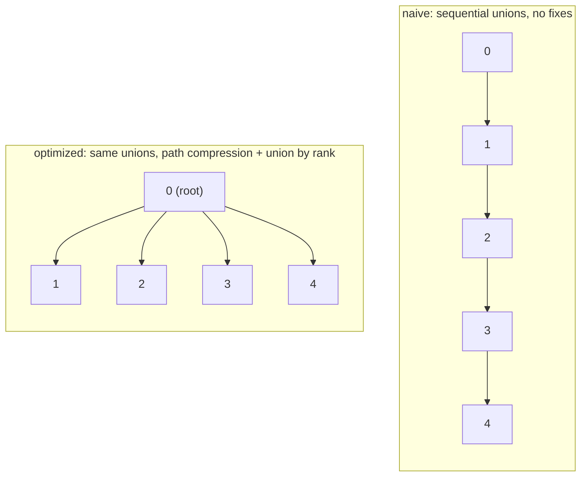

# Union-Find

**Categoría:** Graphs

## El problema

"¿Estas dos cosas están conectadas, directa o transitivamente, dado todo lo que he enlazado hasta ahora?" surge todo el tiempo — y surge de forma incremental, un nuevo enlace descubierto a la vez, no como un grafo completo entregado de una sola vez. Volver a ejecutar un recorrido completo del grafo (BFS/DFS) desde cero en cada nuevo enlace para responder una sola pregunta de conectividad es correcto, pero derrochador: la mayor parte del grafo no ha cambiado entre un enlace y el siguiente.

## La solución

Rastrea conjuntos disjuntos en lugar de un grafo completo. Cada conjunto es un árbol; cada elemento apunta a un padre, y la raíz de un árbol es el representante canónico de ese conjunto. `find` sube hasta la raíz; `union` fusiona dos conjuntos haciendo que una raíz apunte a la otra; `connected` es simplemente "¿estos dos elementos tienen la misma raíz?". Nada de esto necesita almacenar aristas — solo punteros al padre — que es lo que hace que `union` y `connected` sean tan baratos comparados con mantener y volver a recorrer un grafo explícito.

Esa versión simple tiene una debilidad real: nada impide que un árbol crezca en altura. Una secuencia de uniones que siempre adjunta el elemento más nuevo a la misma cadena creciente — union(0,1), union(1,2), union(2,3), ... — produce una línea recta, y `find` en el extremo lejano tiene que recorrer cada salto. Dos correcciones independientes y combinables cierran esa brecha:

- **Compresión de caminos** — mientras `find` sube hasta la raíz, redirige cada nodo por el que pasa directamente a esa raíz. La siguiente búsqueda de cualquiera de esos nodos es entonces un único salto.
- **Unión por rango** — `union` siempre adjunta el árbol más bajo bajo la raíz del árbol más alto, en lugar de adjuntar arbitrariamente, lo que evita que los árboles crezcan en altura desde el principio.

Combinadas, el costo amortizado por operación está acotado por la función de Ackermann inversa — efectivamente una constante pequeña para cualquier tamaño de entrada que pudiera existir en la práctica.



| Operación | Ingenua (sin correcciones) | Optimizada (compresión de caminos + unión por rango) |
|---|---|---|
| `find` / `union` / `connected` | O(n) peor caso | O(α(n)) amortizado — efectivamente O(1) |

## Ejemplo clásico

[`classic/NaiveUnionFind`](src/main/java/com/datastructures/graphs/unionfind/classic/NaiveUnionFind.java) es la estructura de libro de texto sin ninguna de las dos optimizaciones: `union` siempre adjunta la raíz del primer argumento directamente bajo la del segundo, sin considerar la altura del árbol. [`classic/UnionFind`](src/main/java/com/datastructures/graphs/unionfind/classic/UnionFind.java) añade tanto compresión de caminos (en `find`) como unión por rango (en `union`) sobre exactamente la misma API. [`NaiveUnionFindTest`](src/test/java/com/datastructures/graphs/unionfind/classic/NaiveUnionFindTest.java) y [`UnionFindTest`](src/test/java/com/datastructures/graphs/unionfind/classic/UnionFindTest.java) ejercitan ambas una cadena de uniones secuenciales — el peor caso de la versión ingenua —, con la prueba optimizada recorriendo además cada rama de la unión por rango (rango menor se adjunta bajo rango mayor, rangos iguales eligen una raíz y la incrementan, un par ya unido es una operación sin efecto) y la compresión de caminos de `find` en un árbol de múltiples saltos.

## Ejemplo aplicado: detección de clústeres de fraude

[`applied/FraudRingDetector`](src/main/java/com/datastructures/graphs/unionfind/applied/FraudRingDetector.java) une incrementalmente cuentas y las señales identificadoras con las que han sido observadas — una huella digital de dispositivo, un número de teléfono — a medida que esos enlaces se descubren en tiempo real, sin necesidad de recomputación por lotes. Responder "¿estas dos cuentas forman parte del mismo anillo de fraude?" es entonces una única verificación `connected`, incluso cuando las dos cuentas nunca compartieron una señal directamente y solo están enlazadas transitivamente a través de varias cuentas/dispositivos intermedios. [`FraudRingDetectorTest`](src/test/java/com/datastructures/graphs/unionfind/applied/FraudRingDetectorTest.java) cubre enlace directo y transitivo, dos clústeres genuinamente separados, un identificador desconocido en cualquiera de los lados de la verificación, y el exceso de la capacidad de entidades configurada del detector.

## Benchmark

```bash
./gradlew :graphs:union-find:jmh
```

Ejecución real (JMH 1.37, JDK 26.0.2, 2 iteraciones de calentamiento + 3 iteraciones de medición, 1 fork). Ambas estructuras se someten exactamente a la misma secuencia de uniones de peor caso — union(0,1), union(1,2), union(2,3), ... — y luego se mide `find` sobre el mismo elemento del medio:

| Costo de `find` | tamaño=100 | tamaño=1,000 | tamaño=10,000 |
|---|---:|---:|---:|
| ingenua (sin correcciones) | 147.17 ns | 995.29 ns | 8,486.65 ns |
| optimizada (compresión de caminos + unión por rango) | 2.47 ns | 2.57 ns | 2.79 ns |

El costo de la versión ingenua aumenta con el tamaño — aproximadamente el crecimiento que predice un recorrido de cadena O(n), cerca de 58x más lenta en tamaño=10,000 que en tamaño=100. La versión optimizada apenas se mueve a lo largo de ese mismo incremento de tamaño de 100x (2.47ns a 2.79ns, ~13% — dentro del ruido de medición/JIT): el `find` de un único elemento en este benchmark alcanza su peor punto (un camino de 2-3 saltos) ya en la primera llamada y se mantiene efectivamente estable después de eso, ya que la unión por rango por sí sola mantuvo poco profundo el árbol en esta exacta secuencia adversarial de uniones, y la compresión de caminos aplana cualquier profundidad restante. En tamaño=10,000 la estructura ingenua es más de **3,000x más lenta** que la optimizada para la operación idéntica, en la misma secuencia de entrada idéntica — esa brecha es la razón por la que existen ambas optimizaciones clásicas de union-find.

## Cuándo no usarlo

- ¿Necesitas *enumerar* qué elementos hay en un conjunto, o iterar sobre los miembros de un conjunto? Union-find solo responde "¿mismo conjunto o no?" — no tiene noción del contenido ni del tamaño de un conjunto más allá de eso, por diseño.
- ¿Necesitas *deshacer* una unión (dividir un conjunto de vuelta)? La compresión de caminos y la unión por rango hacen que la estructura del árbol pierda información sobre el orden original de las uniones — esta estructura está construida para fusión en una sola dirección, no para eliminación o rollback.
- ¿Tienes el grafo completo de antemano y necesitas caminos más cortos reales u orden de recorrido, no solo conectividad? Un recorrido de grafo real (BFS/DFS, o el módulo [Dijkstra](../dijkstra) de este repositorio) es la herramienta correcta — union-find descarta deliberadamente la información de aristas para mantenerse tan barato.

## Cobertura de pruebas

100% de cobertura de instrucciones, 100% de cobertura de ramas (JaCoCo). Reprodúcelo tú mismo:

```bash
./gradlew :graphs:union-find:jacocoTestReport
```

Informe en `graphs/union-find/build/reports/jacoco/test/html/index.html`.
