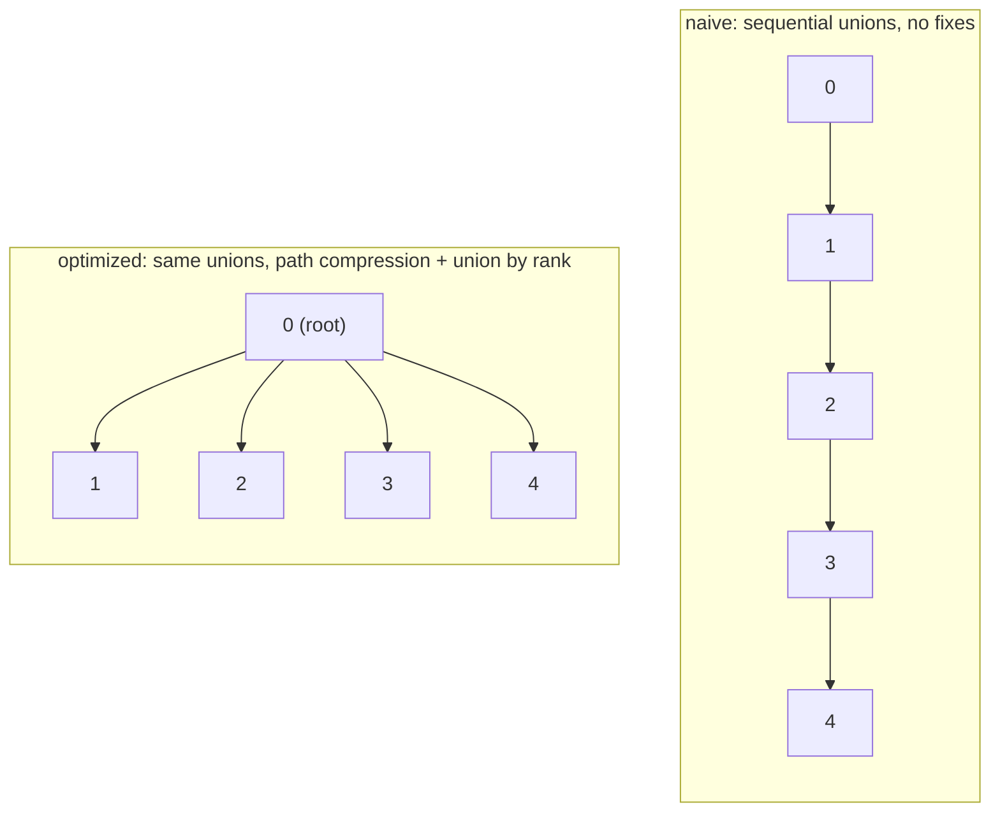

# Union-Find

**Category:** Graphs

## The problem

"Are these two things connected, directly or transitively, given everything I've linked so
far?" comes up constantly — and it comes up incrementally, one new link discovered at a time,
not as a single graph handed over up front. Re-running a full graph traversal (BFS/DFS) from
scratch on every new link to answer one connectivity question is correct but wasteful: most of
the graph hasn't changed between one link and the next.

## The solution

Track disjoint sets instead of a full graph. Each set is a tree; every element points at a
parent, and the root of a tree is that set's canonical representative. `find` walks up to the
root; `union` merges two sets by pointing one root at the other; `connected` is just "do these
two elements have the same root?". None of that needs edges to be stored at all — only parent
pointers — which is what makes `union` and `connected` so cheap compared to maintaining and
re-traversing an explicit graph.

That plain version has a real weakness: nothing stops a tree from growing tall. A sequence of
unions that always attaches the newest element onto the same growing chain — union(0,1),
union(1,2), union(2,3), ... — produces a straight line, and `find` on the far end has to walk
every hop. Two independent, composable fixes close that gap:

- **Path compression** — while `find` walks up to the root, repoint every node it passes
  through directly at that root. The next lookup for any of those nodes is then a single hop.
- **Union by rank** — `union` always attaches the shorter tree under the taller tree's root,
  instead of attaching arbitrarily, which stops trees from growing tall in the first place.

Combined, the amortized cost per operation is bounded by the inverse Ackermann function —
effectively a small constant for any input size that could ever exist in practice.



| Operation | Naive (no fixes) | Optimized (path compression + union by rank) |
|---|---|---|
| `find` / `union` / `connected` | O(n) worst case | O(α(n)) amortized — effectively O(1) |

## Classic example

[`classic/NaiveUnionFind`](src/main/java/com/datastructures/graphs/unionfind/classic/NaiveUnionFind.java)
is the textbook structure with neither optimization: `union` always attaches the first
argument's root directly under the second's, with no regard for tree height.
[`classic/UnionFind`](src/main/java/com/datastructures/graphs/unionfind/classic/UnionFind.java)
adds both path compression (in `find`) and union by rank (in `union`) on top of the exact same
API. [`NaiveUnionFindTest`](src/test/java/com/datastructures/graphs/unionfind/classic/NaiveUnionFindTest.java)
and [`UnionFindTest`](src/test/java/com/datastructures/graphs/unionfind/classic/UnionFindTest.java)
both exercise a sequential-union chain — the naive version's worst case — with the optimized
test additionally walking through every branch of union-by-rank (lower rank attaches under
higher, equal ranks pick a root and increment it, an already-unioned pair is a no-op) and
`find`'s path compression on a multi-hop tree.

## Applied example: fraud-ring cluster detection

[`applied/FraudRingDetector`](src/main/java/com/datastructures/graphs/unionfind/applied/FraudRingDetector.java)
incrementally unions accounts and the identifying signals they've been observed with —
a device fingerprint, a phone number — as those links are discovered in real time, with no batch
recomputation needed. Answering "are these two accounts part of the same fraud ring?" is then a
single `connected` check, even when the two accounts never directly shared a signal and are only
linked transitively through several intermediate accounts/devices.
[`FraudRingDetectorTest`](src/test/java/com/datastructures/graphs/unionfind/applied/FraudRingDetectorTest.java)
covers direct and transitive linkage, two genuinely separate clusters, an unknown identifier on
either side of the check, and exceeding the detector's configured entity capacity.

## Benchmark

```bash
./gradlew :graphs:union-find:jmh
```

Real run (JMH 1.37, JDK 26.0.2, 2 warmup + 3 measurement iterations, 1 fork). Both structures are
put through the exact same worst-case union sequence — union(0,1), union(1,2), union(2,3), ...
— then `find` is measured on the same middle element:

| `find` cost | size=100 | size=1,000 | size=10,000 |
|---|---:|---:|---:|
| naive (no fixes) | 147.17 ns | 995.29 ns | 8,486.65 ns |
| optimized (path compression + union by rank) | 2.47 ns | 2.57 ns | 2.79 ns |

The naive version's cost climbs with size — roughly the growth an O(n) chain walk predicts,
about 58x slower at size=10,000 than at size=100. The optimized version barely moves at all
across that same 100x size increase (2.47ns to 2.79ns, ~13% — within JIT/measurement noise): a
single element's `find` in this benchmark hits its worst point (a 2-3 hop path) on the very
first call and stays effectively flat after that, since union by rank alone kept this exact
adversarial union sequence's tree shallow, and path compression flattens whatever depth remains.
At size=10,000 the naive structure is over **3,000x slower** than the optimized one for the
identical operation, on the identical input sequence — that gap is the entire reason both of
union-find's classic optimizations exist.

## When not to use it

- Need to *enumerate* which elements are in a set, or iterate a set's members? Union-find only
  answers "same set or not" — it has no notion of set contents or size beyond that, by design.
- Need to *undo* a union (split a set back apart)? Path compression and union-by-rank make the
  tree structure lossy with respect to the original union order — this structure is built for
  one-directional merging, not for removal or rollback.
- Have the full graph up front and need actual shortest paths or traversal order, not just
  connectivity? A real graph traversal (BFS/DFS, or this repo's [Dijkstra](../dijkstra) module)
  is the right tool — union-find deliberately throws away edge information to stay this cheap.

## Test coverage

100% instruction coverage, 100% branch coverage (JaCoCo). Reproduce it yourself:

```bash
./gradlew :graphs:union-find:jacocoTestReport
```

Report at `graphs/union-find/build/reports/jacoco/test/html/index.html`.
