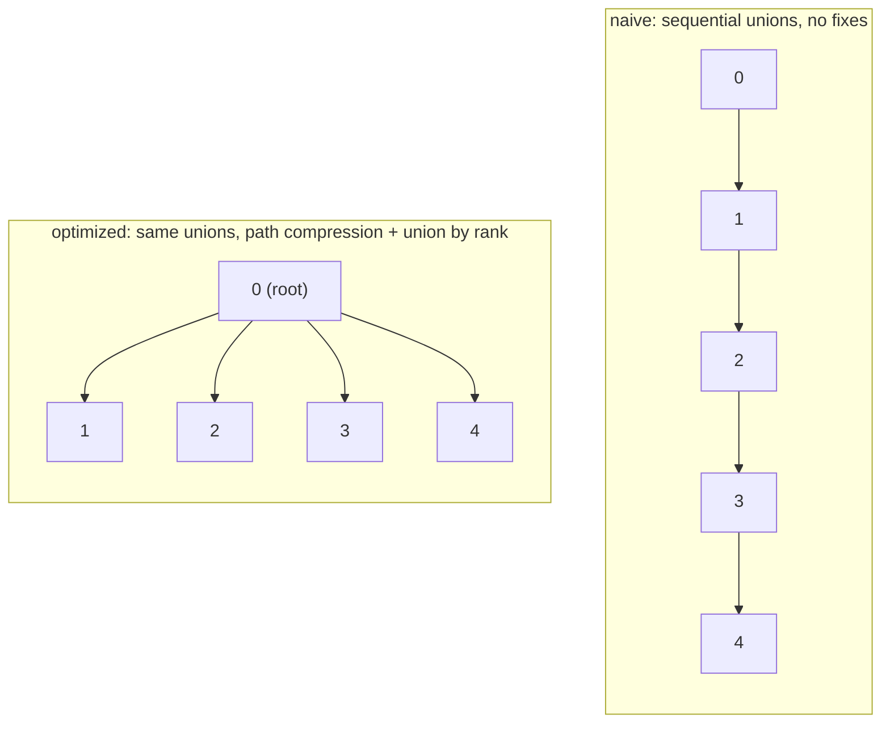

# Union-Find

**Categoria:** Graphs

## O problema

"Estas duas coisas estão conectadas, direta ou transitivamente, dado tudo que já liguei até agora?" surge o tempo todo — e surge de forma incremental, uma nova ligação descoberta por vez, não como um grafo único entregue de uma só vez. Reexecutar uma travessia completa do grafo (BFS/DFS) do zero a cada nova ligação para responder a uma única pergunta de conectividade é correto, mas desperdiçador: a maior parte do grafo não mudou entre uma ligação e a próxima.

## A solução

Rastreie conjuntos disjuntos em vez de um grafo completo. Cada conjunto é uma árvore; todo elemento aponta para um pai, e a raiz de uma árvore é o representante canônico daquele conjunto. `find` sobe até a raiz; `union` mescla dois conjuntos apontando uma raiz para a outra; `connected` é apenas "esses dois elementos têm a mesma raiz?". Nada disso precisa armazenar arestas — apenas ponteiros de pai — o que é o que torna `union` e `connected` tão baratos em comparação a manter e retravessar um grafo explícito.

Essa versão simples tem uma fraqueza real: nada impede que uma árvore cresça em altura. Uma sequência de uniões que sempre anexa o elemento mais novo à mesma cadeia crescente — union(0,1), union(1,2), union(2,3), ... — produz uma linha reta, e `find` na ponta distante precisa percorrer cada salto. Duas correções independentes e combináveis fecham essa lacuna:

- **Compressão de caminho** — enquanto `find` sobe até a raiz, reaponta todo nó pelo qual passa diretamente para essa raiz. A próxima busca por qualquer um desses nós é então um único salto.
- **União por rank** — `union` sempre anexa a árvore mais baixa sob a raiz da árvore mais alta, em vez de anexar arbitrariamente, o que impede as árvores de crescerem em altura desde o início.

Combinadas, o custo amortizado por operação é limitado pela função de Ackermann inversa — efetivamente uma constante pequena para qualquer tamanho de entrada que possa existir na prática.



| Operação | Ingênua (sem correções) | Otimizada (compressão de caminho + união por rank) |
|---|---|---|
| `find` / `union` / `connected` | O(n) pior caso | O(α(n)) amortizado — efetivamente O(1) |

## Exemplo clássico

[`classic/NaiveUnionFind`](src/main/java/com/datastructures/graphs/unionfind/classic/NaiveUnionFind.java) é a estrutura de livro-texto sem nenhuma das duas otimizações: `union` sempre anexa a raiz do primeiro argumento diretamente sob a do segundo, sem considerar a altura da árvore. [`classic/UnionFind`](src/main/java/com/datastructures/graphs/unionfind/classic/UnionFind.java) adiciona tanto compressão de caminho (em `find`) quanto união por rank (em `union`) sobre exatamente a mesma API. [`NaiveUnionFindTest`](src/test/java/com/datastructures/graphs/unionfind/classic/NaiveUnionFindTest.java) e [`UnionFindTest`](src/test/java/com/datastructures/graphs/unionfind/classic/UnionFindTest.java) exercitam ambas uma cadeia de uniões sequenciais — o pior caso da versão ingênua —, com o teste otimizado percorrendo adicionalmente cada ramo da união por rank (rank menor anexa sob rank maior, ranks iguais escolhem uma raiz e a incrementam, um par já unido é uma operação sem efeito) e a compressão de caminho de `find` em uma árvore de múltiplos saltos.

## Exemplo aplicado: detecção de clusters de fraude

[`applied/FraudRingDetector`](src/main/java/com/datastructures/graphs/unionfind/applied/FraudRingDetector.java) une incrementalmente contas e os sinais identificadores com os quais elas foram observadas — uma impressão digital de dispositivo, um número de telefone — à medida que essas ligações são descobertas em tempo real, sem necessidade de recomputação em lote. Responder "essas duas contas fazem parte do mesmo anel de fraude?" é então uma única verificação `connected`, mesmo quando as duas contas nunca compartilharam um sinal diretamente e estão ligadas apenas transitivamente através de várias contas/dispositivos intermediários. [`FraudRingDetectorTest`](src/test/java/com/datastructures/graphs/unionfind/applied/FraudRingDetectorTest.java) cobre ligação direta e transitiva, dois clusters genuinamente separados, um identificador desconhecido em qualquer um dos lados da verificação, e a ultrapassagem da capacidade de entidades configurada do detector.

## Benchmark

```bash
./gradlew :graphs:union-find:jmh
```

Execução real (JMH 1.37, JDK 26.0.2, 2 iterações de aquecimento + 3 iterações de medição, 1 fork). Ambas as estruturas passam pela mesma sequência de uniões de pior caso — union(0,1), union(1,2), union(2,3), ... — e então `find` é medido no mesmo elemento do meio:

| Custo de `find` | tamanho=100 | tamanho=1,000 | tamanho=10,000 |
|---|---:|---:|---:|
| ingênua (sem correções) | 147.17 ns | 995.29 ns | 8,486.65 ns |
| otimizada (compressão de caminho + união por rank) | 2.47 ns | 2.57 ns | 2.79 ns |

O custo da versão ingênua sobe com o tamanho — aproximadamente o crescimento que uma travessia de cadeia O(n) prevê, cerca de 58x mais lenta em tamanho=10,000 do que em tamanho=100. A versão otimizada praticamente não se move ao longo desse mesmo aumento de tamanho de 100x (2.47ns para 2.79ns, ~13% — dentro do ruído de medição/JIT): o `find` de um único elemento neste benchmark atinge seu pior ponto (um caminho de 2-3 saltos) já na primeira chamada e permanece efetivamente estável depois disso, já que a união por rank sozinha manteve a árvore rasa nesta exata sequência adversarial de uniões, e a compressão de caminho achata qualquer profundidade restante. Em tamanho=10,000 a estrutura ingênua é mais de **3,000x mais lenta** que a otimizada para a operação idêntica, na mesma sequência de entrada idêntica — essa diferença é a razão de existirem as duas otimizações clássicas do union-find.

## Quando não usar

- Precisa *enumerar* quais elementos estão em um conjunto, ou iterar pelos membros de um conjunto? O union-find só responde "mesmo conjunto ou não" — ele não tem noção do conteúdo ou do tamanho de um conjunto além disso, por design.
- Precisa *desfazer* uma união (separar um conjunto de volta em dois)? A compressão de caminho e a união por rank fazem a estrutura da árvore perder informação sobre a ordem original das uniões — essa estrutura foi projetada para mesclagem em uma única direção, não para remoção ou rollback.
- Tem o grafo completo disponível de antemão e precisa dos caminhos mais curtos reais ou da ordem de travessia, não apenas de conectividade? Uma travessia de grafo de verdade (BFS/DFS, ou o módulo [Dijkstra](../dijkstra) deste repositório) é a ferramenta certa — o union-find descarta deliberadamente a informação de arestas para se manter tão barato.

## Cobertura de testes

100% de cobertura de instruções, 100% de cobertura de branches (JaCoCo). Reproduza você mesmo:

```bash
./gradlew :graphs:union-find:jacocoTestReport
```

Relatório em `graphs/union-find/build/reports/jacoco/test/html/index.html`.
