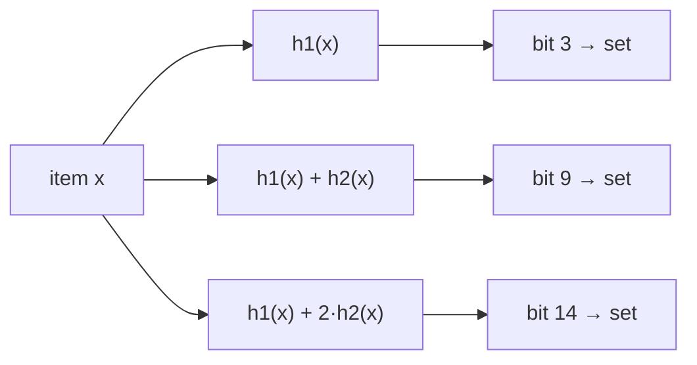

# Bloom Filter

**Categoría:** Hashing

## El problema

El [Hash Table](../hash-table) de este repositorio responde "¿ya vi esta clave?" en O(1)
promedio, pero para eso tiene que almacenar efectivamente cada clave — memoria real
proporcional a n entradas. Algunas verificaciones de pertenencia ocurren con tanta frecuencia,
contra un conjunto tan grande, que incluso ese costo de almacenamiento (o el viaje de ida y
vuelta hasta donde sea que viva el conjunto real) resulta demasiado caro de pagar en cada
verificación — especialmente cuando la abrumadora mayoría de las verificaciones va a devolver
"no".

## La solución

Cambia certeza por espacio: representa el conjunto como un array de bits de tamaño fijo en
lugar de almacenar las claves reales. Agregar un elemento activa `k` bits, cada uno derivado de
un hash distinto del elemento. Verificar la pertenencia solo lee esos mismos `k` bits — si
aunque sea uno de ellos está desactivado, el elemento **definitivamente nunca fue agregado**
(un bit que debería estar activado no puede haberse desactivado solo). Si los `k` bits están
todos activados, el elemento **probablemente fue agregado** — pero otra combinación de otros
elementos podría haber activado, por coincidencia, los mismos `k` bits, así que esto puede ser
un falso positivo. Esa asimetría — nunca un falso negativo, a veces un falso positivo — es todo
el contrato, y es exactamente la forma de una "pre-verificación barata antes de una
verificación más lenta y autoritativa".



| Operación | Costo | Por qué |
|---|---|---|
| `add` | O(k) | activa exactamente `k` bits, independientemente de cuántos elementos ya se agregaron |
| `mightContain` | O(k) | lee a lo sumo `k` bits, independientemente de cuántos elementos ya se agregaron |

Este módulo calcula el tamaño del array de bits `m` y la cantidad de hashes `k` a partir de las
fórmulas estándar, dado un número esperado de inserciones `n` y una tasa objetivo de falso
positivo `p`: `m = -(n·ln p) / (ln 2)²` y `k = (m/n)·ln 2`. Las `k` funciones de hash
"independientes" se derivan de solo dos hashes base mediante double hashing (`h_i(x) = h1(x) +
i·h2(x)`, la construcción estándar de Kirsch-Mitzenmacher), en lugar de calcular `k` algoritmos
de hash genuinamente distintos — `h1` reutiliza la misma dispersión `hashCode() ^ (h >>> 16)`
que usa el módulo Hash Table de este repositorio, y `h2` es una segunda dispersión de
`hashCode()` mezclada mediante un multiplicador impar distinto, lo bastante independiente en la
práctica sin necesitar un segundo algoritmo de hash real.

## Ejemplo clásico

[`classic/BloomFilter`](src/main/java/com/datastructures/hashing/bloomfilter/classic/BloomFilter.java)
está respaldado por un `long[]` usado como bitset — sin biblioteca externa de Bloom filter.
`add` y `mightContain` están implementados a mano alrededor del esquema de double hashing de
arriba; las fórmulas de dimensionamiento del array de bits se calculan una sola vez en el
constructor a partir de `expectedInsertions` y `falsePositiveRate`.
[`BloomFilterTest`](src/test/java/com/datastructures/hashing/bloomfilter/classic/BloomFilterTest.java)
verifica directamente la garantía de nunca tener un falso negativo (todo elemento agregado
siempre reporta `mightContain == true`), y verifica por separado que un elemento nunca agregado
reporte `false` contra un filtro generosamente dimensionado, donde una colisión espuria es
despreciable — una aserción determinista sobre una estructura probabilística, no una aserción
inestable (flaky).

## Ejemplo aplicado: pre-verificación de lista de bloqueo de fraude

[`applied/FraudBlocklistPreCheck`](src/main/java/com/datastructures/hashing/bloomfilter/applied/FraudBlocklistPreCheck.java)
envuelve un `BloomFilter<String>` de CPFs/IDs de cuenta conocidos como fraudulentos.
`mightBeBlocked(id)` primero hace la verificación O(k) del Bloom filter; si devuelve `false`,
quien llama puede saltarse por completo un viaje de ida y vuelta real a la base de datos/servicio
— esa respuesta tiene garantía de ser correcta. Si devuelve `true`, quien llama todavía tiene
que confirmar contra la fuente de verdad real, ya que podría ser un falso positivo — la
pre-verificación solo ahorra trabajo en el camino negativo, nunca reemplaza la verificación
autoritativa. Esta asimetría está documentada directamente en el método y reflejada en las
pruebas.
[`FraudBlocklistPreCheckTest`](src/test/java/com/datastructures/hashing/bloomfilter/applied/FraudBlocklistPreCheckTest.java)
cubre un ID limpio que puede omitirse con seguridad, un ID bloqueado que siempre se marca, y un
ID bloqueado que no marca espuriamente a un ID limpio no relacionado.

## Benchmark

```bash
./gradlew :hashing:bloom-filter:jmh
```

Ejecución real en esta máquina (JMH 1.37, JDK 26.0.2, 2 iteraciones de calentamiento + 3 de
medición, 1 fork). Misma verificación de pertenencia, mismos tamaños crecientes — un Bloom
filter contra un recorrido lineal ingenuo con `ArrayList<String>.contains`, la línea base
honesta de "sin Bloom filter":

| Costo de `mightContain`/`contains` | size=100 | size=10,000 | size=100,000 |
|---|---:|---:|---:|
| Bloom filter (`mightContain`) | 92.17 ns | 94.68 ns | 90.53 ns |
| recorrido lineal ingenuo (`ArrayList.contains`) | 257.13 ns | 31,031.13 ns | 360,640.71 ns |

El Bloom filter se mantiene estable en ~90–95 ns sin importar cuántos IDs se hayan agregado —
O(k), confirmado independiente de n. El recorrido ingenuo, en cambio, crece en lockstep con la
lista: ~121x más lento al pasar de size=100 a size=10,000 (un aumento de 100x en el tamaño) y
~12x más lento otra vez al pasar de size=10,000 a size=100,000 (un aumento de 10x en el tamaño)
— el costo O(n) de verificar cada elemento a mano. En size=100,000, el recorrido ingenuo ya es
**~3,985x más lento** que el Bloom filter para exactamente la misma pregunta de pertenencia.

## Cuándo no usarlo

- ¿Necesitas recuperar efectivamente los valores almacenados, o enumerar qué hay en el
  conjunto? Un Bloom filter solo responde "esto podría estar en el conjunto" — nunca almacena
  ni devuelve los elementos en sí. El [Hash Table](../hash-table) de este repositorio es la
  opción adecuada cuando necesitas recuperar el valor, no solo un sí/no.
- ¿Necesitas cero falsos positivos (es decir, una respuesta autoritativa y exacta)? Todo el
  ahorro de espacio de un Bloom filter viene de ser probabilístico — una tasa de falso positivo
  es una promesa, no un error, siempre que quien llama (como en el ejemplo aplicado aquí)
  reconfirme antes de actuar sobre un `true`.
- ¿Necesitas eliminar elementos? El `BloomFilter` de este módulo solo admite
  `add`/`mightContain` — un bit puede ser compartido por las posiciones de hash de varios
  elementos, así que borrar los bits de un elemento podría hacer desaparecer silenciosamente a
  otro elemento. La eliminación eficiente en espacio necesita una variante con conteo (un
  pequeño contador por bit en lugar de un único bit), lo cual queda fuera del alcance aquí.

## Cobertura de pruebas

100% de cobertura de instrucciones, 100% de cobertura de ramas (JaCoCo). Reprodúcelo tú mismo:

```bash
./gradlew :hashing:bloom-filter:jacocoTestReport
```

Reporte en `hashing/bloom-filter/build/reports/jacoco/test/html/index.html`.
