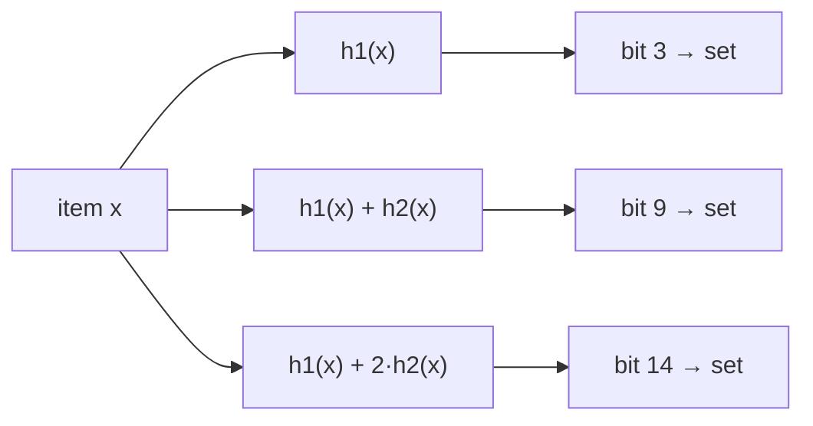

# Bloom Filter

**Category:** Hashing

## The problem

This repo's [Hash Table](../hash-table) answers "have I seen this key?" in average O(1), but it
has to actually store every key to do it — real memory proportional to n entries. Some
membership checks happen so often, against a set so large, that even that storage cost (or the
round trip to wherever the real set lives) is too expensive to pay on every check — especially
when the overwhelming majority of checks are going to come back "no."

## The solution

Trade certainty for space: represent the set as a fixed-size bit array instead of storing the
actual keys. Adding an item sets `k` bits, each derived from a different hash of the item.
Checking membership only ever reads those same `k` bits — if even one of them is unset, the item
was **definitely never added** (a bit that should be set can't have un-set itself). If all `k`
are set, the item **was probably added** — but another combination of other items could have
coincidentally set the same `k` bits, so this can be a false positive. That asymmetry — never a
false negative, sometimes a false positive — is the entire contract, and it's exactly the shape
of "cheap pre-check before a slower, authoritative check."



| Operation | Cost | Why |
|---|---|---|
| `add` | O(k) | sets exactly `k` bits, independent of how many items were already added |
| `mightContain` | O(k) | reads at most `k` bits, independent of how many items were already added |

This module computes bit-array size `m` and hash count `k` from the standard formulas given an
expected insertion count `n` and a target false-positive rate `p`: `m = -(n·ln p) / (ln 2)²` and
`k = (m/n)·ln 2`. The `k` "independent" hash functions are derived from just two base hashes via
double hashing (`h_i(x) = h1(x) + i·h2(x)`, the standard Kirsch-Mitzenmacher construction) rather
than computing `k` genuinely different hash algorithms — `h1` reuses the same
`hashCode() ^ (h >>> 16)` spread this repo's Hash Table module uses, and `h2` is a second spread
of `hashCode()` mixed through a different odd multiplier, independent enough in practice without
needing a real second hash algorithm.

## Classic example

[`classic/BloomFilter`](src/main/java/com/datastructures/hashing/bloomfilter/classic/BloomFilter.java)
is backed by a `long[]` used as a bitset — no external Bloom filter library. `add` and
`mightContain` are hand-rolled around the double-hashing scheme above; the bit-array sizing
formulas are computed once in the constructor from `expectedInsertions` and `falsePositiveRate`.
[`BloomFilterTest`](src/test/java/com/datastructures/hashing/bloomfilter/classic/BloomFilterTest.java)
asserts the never-false-negative guarantee directly (every added item always reports
`mightContain == true`), and separately asserts a never-added item reports `false` against a
generously-sized filter where a spurious collision is negligible — a deterministic assertion
about a probabilistic structure, not a flaky one.

## Applied example: insurer/fraud platform fraud blocklist pre-check

[`applied/FraudBlocklistPreCheck`](src/main/java/com/datastructures/hashing/bloomfilter/applied/FraudBlocklistPreCheck.java)
wraps a `BloomFilter<String>` of known-fraudulent CPFs/account IDs. `mightBeBlocked(id)` does the
O(k) Bloom check first; if it returns `false`, the caller can skip a real DB/service round trip
entirely — that answer is guaranteed correct. If it returns `true`, the caller still has to
confirm against the real source of truth, since it could be a false positive — the pre-check
only ever saves work on the negative path, it never replaces the authoritative check. This
asymmetry is documented directly on the method and reflected in the tests.
[`FraudBlocklistPreCheckTest`](src/test/java/com/datastructures/hashing/bloomfilter/applied/FraudBlocklistPreCheckTest.java)
covers a clean ID being safely skippable, a blocked ID always being flagged, and one blocked ID
not spuriously flagging an unrelated clean one.

## Benchmark

```bash
./gradlew :hashing:bloom-filter:jmh
```

Real run on this machine (JMH 1.37, JDK 26.0.2, 2 warmup + 3 measurement iterations, 1 fork). Same
membership check, same growing sizes — a Bloom filter against a naive `ArrayList<String>.contains`
linear scan, the honest "no Bloom filter" baseline:

| `mightContain`/`contains` cost | size=100 | size=10,000 | size=100,000 |
|---|---:|---:|---:|
| Bloom filter (`mightContain`) | 92.17 ns | 94.68 ns | 90.53 ns |
| naive linear scan (`ArrayList.contains`) | 257.13 ns | 31,031.13 ns | 360,640.71 ns |

The Bloom filter stays flat at ~90–95 ns regardless of how many IDs were added — O(k), confirmed
independent of n. The naive scan instead grows in lockstep with the list: ~121x slower going
from size=100 to size=10,000 (a 100x size increase) and ~12x slower again going from size=10,000
to size=100,000 (a 10x size increase) — the O(n) cost of checking every element by hand. By
size=100,000, the naive scan is already **~3,985x slower** than the Bloom filter for the exact
same membership question.

## When not to use it

- Need to actually retrieve the stored values, or enumerate what's in the set? A Bloom filter
  only ever answers "might this be in the set" — it never stores or returns the items
  themselves. This repo's [Hash Table](../hash-table) is the fit when you need the value back,
  not just a yes/no.
- Need zero false positives (i.e., an authoritative, exact answer)? A Bloom filter's entire
  space savings come from being probabilistic — a false positive rate is a promise, not a bug,
  as long as the caller (like the applied example here) reconfirms before acting on `true`.
- Need to remove items? This module's `BloomFilter` supports only `add`/`mightContain` — a bit
  can be shared by multiple items' hash positions, so clearing one item's bits could silently
  make another item disappear. Space-efficient removal needs a counting variant (a small counter
  per bit instead of a single bit), which is out of scope here.

## Test coverage

100% instruction coverage, 100% branch coverage (JaCoCo). Reproduce it yourself:

```bash
./gradlew :hashing:bloom-filter:jacocoTestReport
```

Report at `hashing/bloom-filter/build/reports/jacoco/test/html/index.html`.
