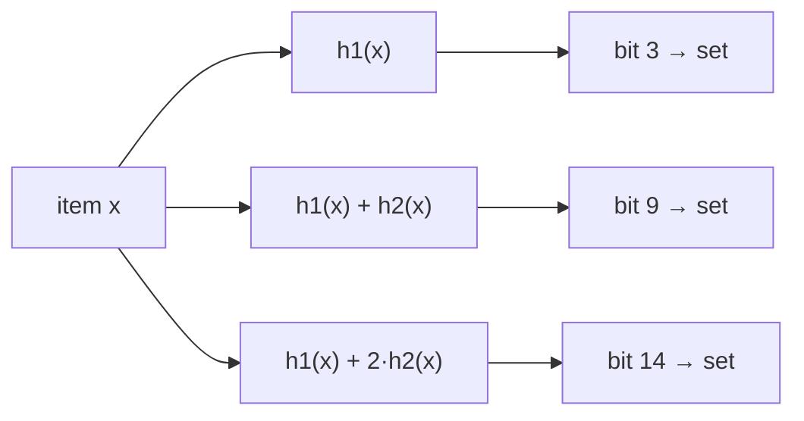

# Bloom Filter

**Categoria:** Hashing

## O problema

O [Hash Table](../hash-table) deste repositório responde "já vi essa chave?" em O(1) médio, mas
para isso precisa efetivamente armazenar cada chave — memória real proporcional a n entradas.
Algumas verificações de pertencimento acontecem com tanta frequência, contra um conjunto tão
grande, que até esse custo de armazenamento (ou a ida e volta até onde quer que o conjunto real
viva) fica caro demais para pagar em cada verificação — especialmente quando a esmagadora
maioria das verificações vai retornar "não".

## A solução

Troque certeza por espaço: represente o conjunto como um array de bits de tamanho fixo em vez
de armazenar as chaves de verdade. Adicionar um item liga `k` bits, cada um derivado de um hash
diferente do item. Verificar pertencimento só lê esses mesmos `k` bits — se sequer um deles
estiver desligado, o item **definitivamente nunca foi adicionado** (um bit que deveria estar
ligado não pode ter se desligado sozinho). Se todos os `k` estiverem ligados, o item
**provavelmente foi adicionado** — mas outra combinação de outros itens pode ter, por
coincidência, ligado os mesmos `k` bits, então isso pode ser um falso positivo. Essa assimetria
— nunca um falso negativo, às vezes um falso positivo — é todo o contrato, e é exatamente o
formato de "pré-verificação barata antes de uma verificação mais lenta e autoritativa".



| Operação | Custo | Por quê |
|---|---|---|
| `add` | O(k) | liga exatamente `k` bits, independentemente de quantos itens já foram adicionados |
| `mightContain` | O(k) | lê no máximo `k` bits, independentemente de quantos itens já foram adicionados |

Este módulo calcula o tamanho do array de bits `m` e a quantidade de hashes `k` a partir das
fórmulas padrão, dado um número esperado de inserções `n` e uma taxa alvo de falso positivo
`p`: `m = -(n·ln p) / (ln 2)²` e `k = (m/n)·ln 2`. As `k` funções de hash "independentes" são
derivadas de apenas dois hashes base via double hashing (`h_i(x) = h1(x) + i·h2(x)`, a
construção padrão de Kirsch-Mitzenmacher), em vez de calcular `k` algoritmos de hash
genuinamente diferentes — `h1` reaproveita o mesmo espalhamento `hashCode() ^ (h >>> 16)` que o
módulo Hash Table deste repositório usa, e `h2` é um segundo espalhamento de `hashCode()`
misturado por um multiplicador ímpar diferente, independente o suficiente na prática sem
precisar de um segundo algoritmo de hash de verdade.

## Exemplo clássico

[`classic/BloomFilter`](src/main/java/com/datastructures/hashing/bloomfilter/classic/BloomFilter.java)
é apoiado por um `long[]` usado como bitset — sem biblioteca externa de Bloom filter. `add` e
`mightContain` são implementados à mão em torno do esquema de double hashing acima; as fórmulas
de dimensionamento do array de bits são calculadas uma vez no construtor a partir de
`expectedInsertions` e `falsePositiveRate`.
[`BloomFilterTest`](src/test/java/com/datastructures/hashing/bloomfilter/classic/BloomFilterTest.java)
verifica diretamente a garantia de nunca ter falso negativo (todo item adicionado sempre reporta
`mightContain == true`), e verifica separadamente que um item nunca adicionado reporta `false`
contra um filtro generosamente dimensionado, onde uma colisão espúria é desprezível — uma
asserção determinística sobre uma estrutura probabilística, não uma asserção instável (flaky).

## Exemplo aplicado: pré-verificação de lista de bloqueio de fraude

[`applied/FraudBlocklistPreCheck`](src/main/java/com/datastructures/hashing/bloomfilter/applied/FraudBlocklistPreCheck.java)
encapsula um `BloomFilter<String>` de CPFs/IDs de conta conhecidamente fraudulentos.
`mightBeBlocked(id)` faz primeiro a verificação O(k) do Bloom filter; se retornar `false`, quem
chamou pode pular por completo uma ida e volta real ao banco/serviço — essa resposta tem
garantia de estar correta. Se retornar `true`, quem chamou ainda precisa confirmar contra a
fonte de verdade real, já que pode ser um falso positivo — a pré-verificação só economiza
trabalho no caminho negativo, nunca substitui a verificação autoritativa. Essa assimetria está
documentada diretamente no método e refletida nos testes.
[`FraudBlocklistPreCheckTest`](src/test/java/com/datastructures/hashing/bloomfilter/applied/FraudBlocklistPreCheckTest.java)
cobre um ID limpo podendo ser ignorado com segurança, um ID bloqueado sempre sendo sinalizado, e
um ID bloqueado não sinalizando espuriamente um ID limpo não relacionado.

## Benchmark

```bash
./gradlew :hashing:bloom-filter:jmh
```

Execução real nesta máquina (JMH 1.37, JDK 26.0.2, 2 iterações de aquecimento + 3 de medição, 1
fork). Mesma verificação de pertencimento, mesmos tamanhos crescentes — um Bloom filter contra
uma varredura linear ingênua com `ArrayList<String>.contains`, a linha de base honesta de "sem
Bloom filter":

| Custo de `mightContain`/`contains` | size=100 | size=10,000 | size=100,000 |
|---|---:|---:|---:|
| Bloom filter (`mightContain`) | 92.17 ns | 94.68 ns | 90.53 ns |
| varredura linear ingênua (`ArrayList.contains`) | 257.13 ns | 31,031.13 ns | 360,640.71 ns |

O Bloom filter se mantém estável em ~90–95 ns independentemente de quantos IDs foram
adicionados — O(k), confirmado independente de n. Já a varredura ingênua cresce em lockstep com
a lista: ~121x mais lenta ao ir de size=100 para size=10,000 (um aumento de 100x no tamanho) e
mais ~12x mais lenta ao ir de size=10,000 para size=100,000 (um aumento de 10x no tamanho) — o
custo O(n) de verificar cada elemento manualmente. Em size=100,000, a varredura ingênua já é
**~3,985x mais lenta** que o Bloom filter para exatamente a mesma pergunta de pertencimento.

## Quando não usar

- Precisa efetivamente recuperar os valores armazenados, ou enumerar o que está no conjunto? Um
  Bloom filter só responde "isso pode estar no conjunto" — ele nunca armazena ou devolve os
  próprios itens. O [Hash Table](../hash-table) deste repositório é o mais adequado quando você
  precisa do valor de volta, não apenas de um sim/não.
- Precisa de zero falsos positivos (ou seja, uma resposta autoritativa e exata)? Toda a economia
  de espaço de um Bloom filter vem de ser probabilístico — uma taxa de falso positivo é uma
  promessa, não um bug, desde que quem chamou (como no exemplo aplicado aqui) reconfirme antes
  de agir sobre um `true`.
- Precisa remover itens? O `BloomFilter` deste módulo só suporta `add`/`mightContain` — um bit
  pode ser compartilhado pelas posições de hash de vários itens, então limpar os bits de um
  item poderia silenciosamente fazer outro item desaparecer. Remoção eficiente em espaço exige
  uma variante com contagem (um pequeno contador por bit em vez de um único bit), o que está
  fora do escopo aqui.

## Cobertura de testes

100% de cobertura de instruções, 100% de cobertura de branches (JaCoCo). Reproduza você mesmo:

```bash
./gradlew :hashing:bloom-filter:jacocoTestReport
```

Relatório em `hashing/bloom-filter/build/reports/jacoco/test/html/index.html`.
