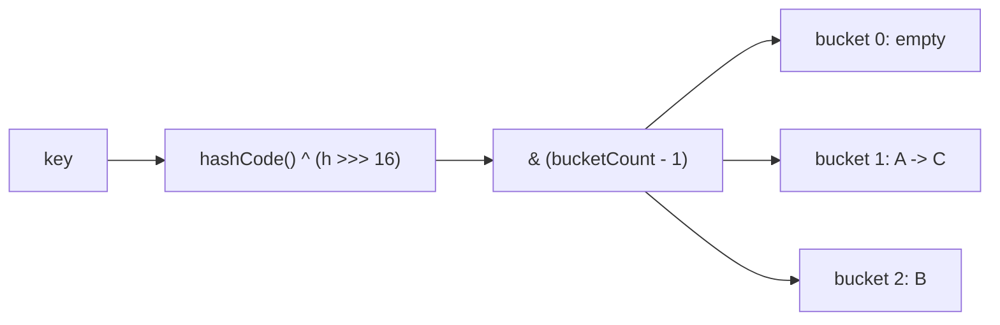

# Hash Table

**Categoría:** Hashing

## El problema

Buscar un valor por clave en una lista o array significa recorrer — O(n) en el peor caso, y
también en promedio si la clave pudiera estar en cualquier lugar. A medida que el conjunto de
datos crece, ese recorrido se vuelve proporcionalmente más lento. Lo que hace falta es una
forma de saltar directamente a, aproximadamente, dónde vive el valor de una clave, sin recorrer
lo que vino antes.

## La solución

Calcula un hash numérico a partir de la clave, redúcelo a un índice dentro de un array de
buckets de tamaño fijo, y almacena la entrada ahí. Dos claves distintas pueden generar hash
hacia el mismo bucket (una colisión); esta tabla resuelve eso con **encadenamiento separado
(separate chaining)** — cada bucket contiene una pequeña cadena enlazada de entradas, y una
búsqueda recorre solo esa cadena, no toda la tabla. El O(1) promedio de búsqueda se mantiene
mientras las cadenas sigan siendo cortas, por lo que la tabla duplica su cantidad de buckets y
rehace el hash de todo en cuanto el factor de carga (entradas ÷ buckets) supera 0.75 — eso
mantiene la longitud promedio de la cadena acotada sin importar cuánto crezca la tabla.



| Operación | Promedio | Peor caso | Por qué ocurre el peor caso |
|---|---|---|---|
| `get` / `put` / `remove` | O(1) | O(n) | toda clave colisiona en el mismo bucket |
| resize (activado internamente) | O(n) | O(n) | cada entrada recibe un nuevo hash hacia la nueva tabla |

## Ejemplo clásico

[`classic/HashTable`](src/main/java/com/datastructures/hashing/hashtable/classic/HashTable.java)
implementa encadenamiento separado desde cero — sin `java.util.HashMap` por debajo. Distribuye
las claves con el mismo truco `hashCode() ^ (h >>> 16)` que usa `HashMap` (plegando los bits
altos hacia abajo para que una tabla de tamaño potencia de dos, que solo mira los bits bajos,
no colapse en el mismo bucket hashes que solo difieren en los bits altos), y redimensiona
duplicando el tamaño en cuanto el factor de carga supera 0.75.
[`HashTableTest`](src/test/java/com/datastructures/hashing/hashtable/classic/HashTableTest.java)
fuerza colisiones reales con una clave cuyo `hashCode()` es constante, y verifica que cada
entrada sobreviva a un redimensionamiento.

## Ejemplo aplicado: caché de clave de idempotencia de PIX

[`applied/IdempotencyKeyCache`](src/main/java/com/datastructures/hashing/hashtable/applied/IdempotencyKeyCache.java)
es la pre-verificación en memoria que un gateway de pagos ejecuta antes de que una transacción
PIX llegue a la base de datos, donde una restricción de unicidad sobre la clave de idempotencia
es la verdadera fuente de verdad. Una verificación "¿ya vi esta clave?" con O(1) promedio evita
un viaje de ida y vuelta para el caso común: un cliente reintentando la misma solicitud segundos
después. La tabla no tiene orden, así que `evictOlderThan` — expirar entradas antiguas — es
necesariamente un recorrido completo O(n); una caché de producción que necesitara desalojo
barato combinaría una tabla hash con una lista doblemente enlazada entrelazada entre las
entradas (la combinación clásica de caché LRU), que es el trade-off que este módulo hace visible
en lugar de ocultar.
[`IdempotencyKeyCacheTest`](src/test/java/com/datastructures/hashing/hashtable/applied/IdempotencyKeyCacheTest.java)
cubre la detección de duplicados y el desalojo basado en tiempo con un reloj controlable.

## Benchmark

```bash
./gradlew :hashing:hash-table:jmh
```

Ejecución real (JMH 1.37, JDK 26.0.2, 2 iteraciones de calentamiento + 3 de medición, 1 fork).
Dos conjuntos de claves de los mismos tamaños: uno con hash normal, otro diseñado para que toda
clave colisione en el bucket 0.

| Costo de `get` | size=100 | size=10,000 | size=100,000 |
|---|---:|---:|---:|
| hashing uniforme | 3.79 ns | 3.65 ns | 3.77 ns |
| todas las claves colisionando en un bucket | 133.8 ns | 29,083.8 ns | 179,652.8 ns |

El hashing uniforme se mantiene estable sin importar el tamaño — O(1), confirmado. El conjunto
de claves colisionantes queda aproximadamente 200x más lento al pasar de 100 a 10,000 claves
(un aumento de 100x en el tamaño), que es exactamente el aspecto de un recorrido lineal de
cadena O(n) cuando todas las claves viven en el mismo bucket. Esta es también la razón, en el
mundo real, por la que un `hashCode()` de mala calidad o predecible por un atacante es una
preocupación de corrección *y* de denegación de servicio, no solo un detalle de rendimiento.

## Cuándo no usarlo

- ¿Necesitas recorrido ordenado, consultas por rango, o búsquedas de "clave más cercana"
  (floor/ceiling)? Una hash table no tiene orden por construcción — mira el módulo
  [Binary Search Tree](../../trees/binary-search-tree) de este repositorio.
- ¿Necesitas una garantía de peor caso (no solo de caso promedio) O(log n)? Un árbol balanceado
  acota el peor caso; el peor caso de una hash table es O(n), aunque sea poco frecuente en la
  práctica.
- Las claves con un `hashCode()` de baja calidad (o uno que un adversario pueda predecir y
  atacar) degradan hacia el benchmark de colisión de arriba — esta es una clase real de ataque
  (hash-flooding DoS), no una preocupación teórica.

## Cobertura de pruebas

100% de cobertura de instrucciones, 100% de cobertura de ramas (JaCoCo). Reprodúcelo tú mismo:

```bash
./gradlew :hashing:hash-table:jacocoTestReport
```

Reporte en `hashing/hash-table/build/reports/jacoco/test/html/index.html`.
