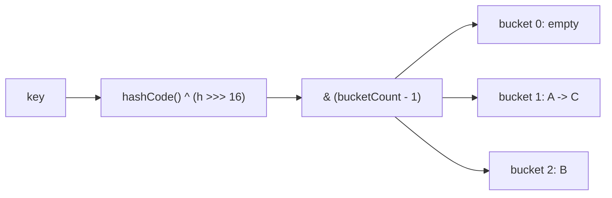

# Hash Table

**Category:** Hashing

## The problem

Looking up a value by key in a list or array means scanning — O(n) in the worst case, and on
average too if the key could be anywhere. As the dataset grows, that scan gets proportionally
slower. What's needed is a way to jump straight to roughly where a key's value lives, without
scanning what came before it.

## The solution

Compute a numeric hash from the key, fold it down to an index into a fixed-size bucket array,
and store the entry there. Two different keys can hash to the same bucket (a collision); this
table resolves that with **separate chaining** — each bucket holds a small linked chain of
entries, and a lookup walks only that chain, not the whole table. Average O(1) lookup holds as
long as chains stay short, which is why the table doubles its bucket count and rehashes
everything once the load factor (entries ÷ buckets) crosses 0.75 — that keeps the average
chain length bounded regardless of how large the table grows.



| Operation | Average | Worst case | Why the worst case happens |
|---|---|---|---|
| `get` / `put` / `remove` | O(1) | O(n) | every key collides into the same bucket |
| resize (triggered internally) | O(n) | O(n) | every entry gets rehashed into the new table |

## Classic example

[`classic/HashTable`](src/main/java/com/datastructures/hashing/hashtable/classic/HashTable.java)
implements separate chaining from scratch — no `java.util.HashMap` underneath. It spreads keys
with the same `hashCode() ^ (h >>> 16)` trick `HashMap` uses (folding the high bits down so a
power-of-two-sized table, which only looks at the low bits, doesn't collapse hashes that only
differ up high into the same bucket), and resizes by doubling once the load factor exceeds
0.75. [`HashTableTest`](src/test/java/com/datastructures/hashing/hashtable/classic/HashTableTest.java)
forces real collisions with a key whose `hashCode()` is constant, and verifies every entry
survives a resize.

## Applied example: PIX idempotency-key cache

[`applied/IdempotencyKeyCache`](src/main/java/com/datastructures/hashing/hashtable/applied/IdempotencyKeyCache.java)
is the in-memory pre-check a payment gateway runs before a PIX transaction hits the database,
where a unique constraint on the idempotency key is the real source of truth. An O(1) average
"have I seen this key?" check avoids a round trip for the common case: a client retrying the
same request seconds apart. The table has no ordering, so `evictOlderThan` — expiring old
entries — is necessarily an O(n) full scan; a production cache that needed cheap eviction
would pair a hash table with a doubly linked list threaded through the entries (the classic
LRU-cache combination), which is the trade-off this module makes visible rather than hides.
[`IdempotencyKeyCacheTest`](src/test/java/com/datastructures/hashing/hashtable/applied/IdempotencyKeyCacheTest.java)
covers duplicate detection and time-based eviction with a controllable clock.

## Benchmark

```bash
./gradlew :hashing:hash-table:jmh
```

Real run (JMH 1.37, JDK 26.0.2, 2 warmup + 3 measurement iterations, 1 fork). Two key sets of
the same sizes: one hashed normally, one engineered so every key collides into bucket 0.

| `get` cost | size=100 | size=10,000 | size=100,000 |
|---|---:|---:|---:|
| uniform hashing | 3.79 ns | 3.65 ns | 3.77 ns |
| every key colliding in one bucket | 133.8 ns | 29,083.8 ns | 179,652.8 ns |

Uniform hashing stays flat regardless of size — O(1), confirmed. The colliding key set gets
roughly 200x slower going from 100 to 10,000 keys (a 100x size increase), which is exactly what
an O(n) linear chain scan looks like once every key lives in the same bucket. This is also the
real-world reason a poor or attacker-predictable `hashCode()` is a correctness *and* a
denial-of-service concern, not just a performance nitpick.

## When not to use it

- Need ordered traversal, range queries, or "closest key" (floor/ceiling) lookups? A hash
  table has no ordering by construction — see this repo's
  [Binary Search Tree](../../trees/binary-search-tree) module.
- Need a worst-case guarantee (not just average-case) O(log n)? A balanced tree bounds the
  worst case; a hash table's worst case is O(n) even if it's rare in practice.
- Keys with a poor-quality `hashCode()` (or one an adversary can predict and target) degrade
  toward the collision benchmark above — this is a real attack class (hash-flooding DoS), not
  a theoretical concern.

## Test coverage

100% instruction coverage, 100% branch coverage (JaCoCo). Reproduce it yourself:

```bash
./gradlew :hashing:hash-table:jacocoTestReport
```

Report at `hashing/hash-table/build/reports/jacoco/test/html/index.html`.
