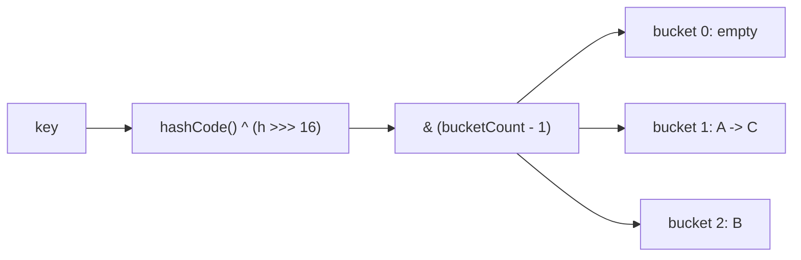

# Hash Table

**Categoria:** Hashing

## O problema

Buscar um valor por chave em uma lista ou array significa varrer — O(n) no pior caso, e também na média se a chave pudesse estar em qualquer lugar. Conforme o conjunto de dados cresce, essa varredura fica proporcionalmente mais lenta. O que se precisa é de uma forma de pular direto para, aproximadamente, onde o valor de uma chave vive, sem varrer o que veio antes dela.

## A solução

Calcule um hash numérico a partir da chave, reduza-o a um índice em um array de buckets de tamanho fixo, e armazene a entrada ali. Duas chaves diferentes podem gerar hash para o mesmo bucket (uma colisão); esta tabela resolve isso com **encadeamento separado (separate chaining)** — cada bucket contém uma pequena cadeia encadeada de entradas, e uma busca percorre apenas essa cadeia, não a tabela inteira. O O(1) médio de busca se mantém enquanto as cadeias permanecerem curtas, e é por isso que a tabela dobra sua contagem de buckets e refaz o hash de tudo assim que o fator de carga (entradas ÷ buckets) ultrapassa 0.75 — isso mantém o comprimento médio da cadeia limitado independentemente de quanto a tabela cresça.



| Operação | Média | Pior caso | Por que o pior caso acontece |
|---|---|---|---|
| `get` / `put` / `remove` | O(1) | O(n) | toda chave colide no mesmo bucket |
| resize (disparado internamente) | O(n) | O(n) | cada entrada tem seu hash refeito na nova tabela |

## Exemplo clássico

[`classic/HashTable`](src/main/java/com/datastructures/hashing/hashtable/classic/HashTable.java)
implementa encadeamento separado do zero — sem `java.util.HashMap` por baixo. Ele espalha as
chaves com o mesmo truque `hashCode() ^ (h >>> 16)` que o `HashMap` usa (dobrando os bits altos
para baixo para que uma tabela de tamanho potência de dois, que olha apenas para os bits baixos,
não colapse no mesmo bucket hashes que diferem só nos bits altos), e redimensiona dobrando de
tamanho assim que o fator de carga ultrapassa 0.75.
[`HashTableTest`](src/test/java/com/datastructures/hashing/hashtable/classic/HashTableTest.java)
força colisões reais com uma chave cujo `hashCode()` é constante, e verifica que toda entrada
sobrevive a um redimensionamento.

## Exemplo aplicado: cache de chave de idempotência do PIX

[`applied/IdempotencyKeyCache`](src/main/java/com/datastructures/hashing/hashtable/applied/IdempotencyKeyCache.java)
é a pré-verificação em memória que um gateway de pagamento executa antes de uma transação PIX
chegar ao banco de dados, onde uma constraint de unicidade sobre a chave de idempotência é a
real fonte de verdade. Uma verificação "já vi essa chave?" com O(1) médio evita uma ida ao banco
no caso comum: um cliente reenviando a mesma requisição segundos depois. A tabela não tem
ordenação, então `evictOlderThan` — expirar entradas antigas — é necessariamente uma varredura
completa O(n); um cache de produção que precisasse de remoção barata combinaria uma tabela hash
com uma lista duplamente encadeada entrelaçada pelas entradas (a combinação clássica de cache
LRU), que é o trade-off que este módulo deixa visível em vez de esconder.
[`IdempotencyKeyCacheTest`](src/test/java/com/datastructures/hashing/hashtable/applied/IdempotencyKeyCacheTest.java)
cobre detecção de duplicatas e remoção baseada em tempo com um clock controlável.

## Benchmark

```bash
./gradlew :hashing:hash-table:jmh
```

Execução real (JMH 1.37, JDK 26.0.2, 2 iterações de aquecimento + 3 de medição, 1 fork). Dois
conjuntos de chaves dos mesmos tamanhos: um com hash normal, outro projetado para que toda
chave colida no bucket 0.

| Custo de `get` | size=100 | size=10,000 | size=100,000 |
|---|---:|---:|---:|
| hashing uniforme | 3.79 ns | 3.65 ns | 3.77 ns |
| toda chave colidindo em um bucket | 133.8 ns | 29,083.8 ns | 179,652.8 ns |

O hashing uniforme se mantém estável independentemente do tamanho — O(1), confirmado. O
conjunto de chaves colidentes fica cerca de 200x mais lento ao ir de 100 para 10,000 chaves (um
aumento de 100x no tamanho), que é exatamente a cara de uma varredura linear de cadeia O(n)
quando toda chave vive no mesmo bucket. Esse é também o motivo, no mundo real, pelo qual um
`hashCode()` de má qualidade ou previsível por um atacante é uma preocupação de corretude *e*
de negação de serviço, não apenas um detalhe de performance.

## Quando não usar

- Precisa de percurso ordenado, consultas por intervalo, ou buscas de "chave mais próxima"
  (floor/ceiling)? Uma hash table não tem ordenação por construção — veja o módulo
  [Binary Search Tree](../../trees/binary-search-tree) deste repositório.
- Precisa de uma garantia de pior caso (não só de caso médio) O(log n)? Uma árvore balanceada
  limita o pior caso; o pior caso de uma hash table é O(n), mesmo que raro na prática.
- Chaves com um `hashCode()` de baixa qualidade (ou um que um adversário consiga prever e
  mirar) degradam em direção ao benchmark de colisão acima — essa é uma classe real de ataque
  (hash-flooding DoS), não uma preocupação teórica.

## Cobertura de testes

100% de cobertura de instruções, 100% de cobertura de branches (JaCoCo). Reproduza você mesmo:

```bash
./gradlew :hashing:hash-table:jacocoTestReport
```

Relatório em `hashing/hash-table/build/reports/jacoco/test/html/index.html`.
