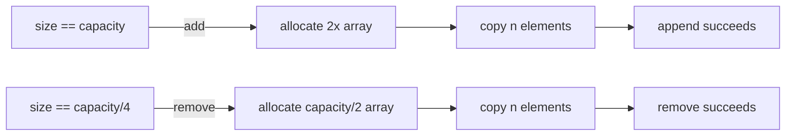

# Dynamic Array

**Categoría:** Linear

## El problema

Un array común de Java tiene tamaño fijo desde su creación. La mayoría de los casos de uso
reales no conoce el tamaño final de antemano — los registros llegan uno a la vez desde un
archivo, una cola, una solicitud. Asignar capacidad "suficiente" implica o bien sobreestimar
(memoria desperdiciada) o subestimar (un desbordamiento que hay que manejar a mano: asignar un
array más grande, copiar cada elemento, y seguir).

## La solución

Envuelve un array crudo y hazlo crecer automáticamente: cuando un `add` desbordaría el array
subyacente, asigna un nuevo array con el doble de capacidad, copia todo hacia él, y sigue
agregando. Un único redimensionamiento es O(n), pero ocurre exponencialmente con menos
frecuencia a medida que el array crece, así que el costo *promedio* por `add` a lo largo de
muchos appends — el costo amortizado — se mantiene en O(1). La reducción refleja esta misma
lógica: cuando la ocupación cae a un cuarto de la capacidad, se reduce a la mitad, para que una
carga de trabajo de llenar-y-vaciar no oscile redimensionando en cada remoción cerca de uno de
esos límites.



| Operación | Costo | Por qué |
|---|---|---|
| `get(index)` / `set(index, v)` | O(1) | desplazamiento directo en el array |
| `add(v)` (append) | O(1) amortizado | duplicar la capacidad mantiene la frecuencia de redimensionamiento exponencialmente pequeña |
| `remove(index)` | O(n) | desplaza cada elemento después de `index` una posición a la izquierda |
| iteración | O(n) | recorrido contiguo, favorable a la caché |

## Ejemplo clásico

[`classic/DynamicArray`](src/main/java/com/datastructures/linear/dynamicarray/classic/DynamicArray.java)
está construido sobre un `Object[]` crudo, no sobre `java.util.ArrayList` — `add`, `get`, `set`,
`remove` e `Iterable<T>` están todos implementados a mano, incluyendo la política de
crecimiento por duplicación y reducción por cuarto.
[`DynamicArrayTest`](src/test/java/com/datastructures/linear/dynamicarray/classic/DynamicArrayTest.java)
cubre el crecimiento más allá de la capacidad inicial, la reducción tras vaciarse, el acceso
fuera de límites, y el agotamiento del iterador.

## Ejemplo aplicado: búfer de registros por lotes

[`applied/BatchRecordBuffer`](src/main/java/com/datastructures/linear/dynamicarray/applied/BatchRecordBuffer.java)
almacena temporalmente filas de [`PolicyBatchRecord`](src/main/java/com/datastructures/linear/dynamicarray/applied/PolicyBatchRecord.java)
a medida que llegan desde una extracción por lotes de primas de seguro, y luego las distribuye
a workers paralelos en bloques de tamaño fijo mediante `drainInChunksOf`. Es exactamente la
forma que enfrenta un pipeline de lotes a gran escala (3M+ filas/día en una gran aseguradora):
la ingesta es puro append, y el vaciado es un único recorrido masivo — el diseño contiguo de un
array dinámico sirve mejor a ambos casos que lo haría una linked list.
[`BatchRecordBufferTest`](src/test/java/com/datastructures/linear/dynamicarray/applied/BatchRecordBufferTest.java)
cubre límites de bloques pares/impares y el caso de búfer vacío.

## Benchmark

```bash
./gradlew :linear:dynamic-array:jmh
```

Ejecución real en esta máquina (JMH 1.37, JDK 26.0.2, 2 iteraciones de warmup + 3 de medición, 1 fork):

| Benchmark | size=100 | size=10,000 | size=1,000,000 |
|---|---:|---:|---:|
| `append` (total para N appends) | 611 ns | 75,047 ns | 75.6 ms |
| `get` (lectura indexada única) | 2.50 ns | 2.44 ns | 2.46 ns |

`get` se mantiene estable en ~2.4–2.5 ns sin importar el tamaño — la afirmación de O(1),
falsable y confirmada. El costo *total* de `append` escala de forma aproximadamente lineal con
el tamaño (≈6–7.5 ns/elemento en 100 y 10,000), que es lo que se ve como "O(1) amortizado por
elemento" cuando se observa en conjunto; la fila de 1,000,000 tuvo una iteración que coincidió
con un redimensionamiento grande y sesgó el promedio hacia arriba, lo cual es el resultado
honesto y sin suavizar de que un redimensionamiento de array por duplicación efectivamente
ocurrió a mitad del benchmark, no un error de medición.

## Cuándo no usarlo

- Inserción/remoción frecuente al **inicio** o en el medio: toda operación de ese tipo es
  O(n) aquí. Una linked list doblemente enlazada (o un búfer circular estilo `ArrayDeque` para
  el caso de solo el inicio) es la opción más adecuada.
- Si el tamaño máximo se conoce exactamente de antemano y nunca cambia, un array fijo común
  evita por completo el mecanismo de redimensionamiento.
- ¿Necesitas consultas por rango o búsquedas ordenadas de floor/ceiling por clave? Consulta el
  módulo [Binary Search Tree](../../trees/binary-search-tree) de este repositorio.

## Cobertura de pruebas

100% de cobertura de instrucciones, 100% de cobertura de ramas (JaCoCo). Reprodúcelo tú mismo:

```bash
./gradlew :linear:dynamic-array:jacocoTestReport
```

Informe en `linear/dynamic-array/build/reports/jacoco/test/html/index.html`.
