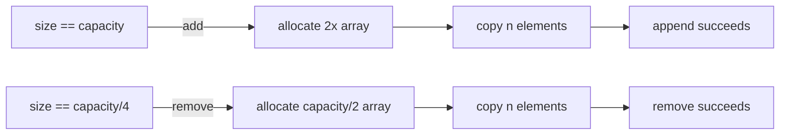

# Dynamic Array

**Category:** Linear

## The problem

A plain Java array is fixed-size at creation. Most real use cases don't know the final size
up front — records arrive one at a time from a file, a queue, a request. Allocating "enough"
capacity means either guessing too high (wasted memory) or too low (an overflow you have to
handle by hand: allocate a bigger array, copy every element across, keep going).

## The solution

Wrap a raw array and grow it automatically: when an `add` would overflow the backing array,
allocate a new array at double the capacity, copy everything across, and keep appending. A
single resize is O(n), but it happens exponentially less often as the array grows, so the
*average* cost per `add` across many appends — the amortized cost — stays O(1). Shrinking
mirrors this: once occupancy drops to a quarter of capacity, halve it, so a fill-then-drain
workload doesn't thrash by resizing at every single removal near one boundary.



| Operation | Cost | Why |
|---|---|---|
| `get(index)` / `set(index, v)` | O(1) | direct array offset |
| `add(v)` (append) | O(1) amortized | doubling keeps resize frequency exponentially small |
| `remove(index)` | O(n) | shifts every element after `index` left by one |
| iteration | O(n) | contiguous, cache-friendly scan |

## Classic example

[`classic/DynamicArray`](src/main/java/com/datastructures/linear/dynamicarray/classic/DynamicArray.java)
is built on a raw `Object[]`, not `java.util.ArrayList` — `add`, `get`, `set`, `remove`, and
`Iterable<T>` are all hand-rolled, including the doubling growth and quartering shrink policy.
[`DynamicArrayTest`](src/test/java/com/datastructures/linear/dynamicarray/classic/DynamicArrayTest.java)
covers growth past the initial capacity, shrink-after-drain, out-of-bounds access, and iterator
exhaustion.

## Applied example: batch record buffer

[`applied/BatchRecordBuffer`](src/main/java/com/datastructures/linear/dynamicarray/applied/BatchRecordBuffer.java)
stages [`PolicyBatchRecord`](src/main/java/com/datastructures/linear/dynamicarray/applied/PolicyBatchRecord.java)
rows as they arrive from an insurance-premium batch extraction, then hands them out to parallel
workers in fixed-size chunks via `drainInChunksOf`. This is exactly the shape a large batch
pipeline (3M+ rows/day at a large insurer) runs into: ingestion is pure append, and draining is a single
bulk scan — a dynamic array's contiguous layout serves both better than a linked list would.
[`BatchRecordBufferTest`](src/test/java/com/datastructures/linear/dynamicarray/applied/BatchRecordBufferTest.java)
covers even/uneven chunk boundaries and the empty-buffer case.

## Benchmark

```bash
./gradlew :linear:dynamic-array:jmh
```

Real run on this machine (JMH 1.37, JDK 26.0.2, 2 warmup + 3 measurement iterations, 1 fork):

| Benchmark | size=100 | size=10,000 | size=1,000,000 |
|---|---:|---:|---:|
| `append` (total for N appends) | 611 ns | 75,047 ns | 75.6 ms |
| `get` (single indexed read) | 2.50 ns | 2.44 ns | 2.46 ns |

`get` stays flat at ~2.4–2.5 ns regardless of size — the O(1) claim, falsifiable and confirmed.
`append`'s *total* cost scales roughly linearly with size (≈6–7.5 ns/element at 100 and
10,000), which is what "amortized O(1) per element" looks like in aggregate; the 1,000,000 row
had one iteration land on a large resize and skews the average up, which is the honest,
unsmoothed result of a doubling-array resize actually happening mid-benchmark, not a
measurement error.

## When not to use it

- Frequent insertion/removal at the **front** or middle: every such operation is O(n) here.
  A doubly linked list (or an `ArrayDeque`-style circular buffer for the front-only case) is
  the better fit.
- If the maximum size is known exactly up front and never changes, a plain fixed array skips
  the resize machinery entirely.
- Need range queries or ordered floor/ceiling lookups by key? See this repo's
  [Binary Search Tree](../../trees/binary-search-tree) module instead.

## Test coverage

100% instruction coverage, 100% branch coverage (JaCoCo). Reproduce it yourself:

```bash
./gradlew :linear:dynamic-array:jacocoTestReport
```

Report at `linear/dynamic-array/build/reports/jacoco/test/html/index.html`.
