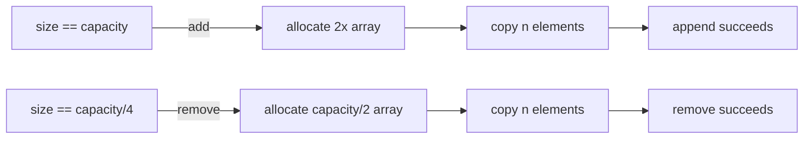

# Dynamic Array

**Categoria:** Linear

## O problema

Um array comum em Java tem tamanho fixo desde a criação. A maioria dos casos de uso reais não
sabe o tamanho final de antemão — os registros chegam um a um, vindos de um arquivo, uma fila,
uma requisição. Alocar capacidade "suficiente" significa ou estimar demais (memória
desperdiçada) ou de menos (um overflow que você precisa tratar na mão: alocar um array maior,
copiar cada elemento para ele, e continuar).

## A solução

Envolva um array bruto e faça-o crescer automaticamente: quando um `add` ultrapassaria a
capacidade do array subjacente, aloque um novo array com o dobro da capacidade, copie tudo para
ele, e continue adicionando. Um único redimensionamento é O(n), mas ele acontece
exponencialmente com menos frequência à medida que o array cresce, então o custo *médio* por
`add` ao longo de muitos appends — o custo amortizado — permanece O(1). O encolhimento espelha
essa lógica: quando a ocupação cai para um quarto da capacidade, ela é reduzida à metade, para
que uma carga de trabalho de preencher-depois-esvaziar não fique oscilando, redimensionando a
cada remoção perto de um desses limites.



| Operação | Custo | Por quê |
|---|---|---|
| `get(index)` / `set(index, v)` | O(1) | offset direto no array |
| `add(v)` (append) | O(1) amortizado | dobrar a capacidade mantém a frequência de redimensionamento exponencialmente pequena |
| `remove(index)` | O(n) | desloca cada elemento após `index` uma posição para a esquerda |
| iteração | O(n) | varredura contígua, amigável ao cache |

## Exemplo clássico

[`classic/DynamicArray`](src/main/java/com/datastructures/linear/dynamicarray/classic/DynamicArray.java)
é construído sobre um `Object[]` bruto, não sobre `java.util.ArrayList` — `add`, `get`, `set`,
`remove` e `Iterable<T>` são todos implementados à mão, incluindo a política de crescimento por
duplicação e encolhimento por quarto.
[`DynamicArrayTest`](src/test/java/com/datastructures/linear/dynamicarray/classic/DynamicArrayTest.java)
cobre o crescimento além da capacidade inicial, o encolhimento após esvaziamento, acesso fora
dos limites, e o esgotamento do iterador.

## Exemplo aplicado: buffer de registros em lote

[`applied/BatchRecordBuffer`](src/main/java/com/datastructures/linear/dynamicarray/applied/BatchRecordBuffer.java)
armazena temporariamente linhas de [`PolicyBatchRecord`](src/main/java/com/datastructures/linear/dynamicarray/applied/PolicyBatchRecord.java)
conforme elas chegam de uma extração em lote de prêmios de seguro, e depois as distribui para
workers paralelos em blocos de tamanho fixo via `drainInChunksOf`. É exatamente o formato que um
pipeline de lote de grande porte (3M+ linhas/dia numa grande seguradora) enfrenta: a ingestão é
puro append, e o esvaziamento é uma única varredura em massa — o layout contíguo de um array
dinâmico atende melhor a ambos do que uma linked list atenderia.
[`BatchRecordBufferTest`](src/test/java/com/datastructures/linear/dynamicarray/applied/BatchRecordBufferTest.java)
cobre limites de blocos pares/ímpares e o caso de buffer vazio.

## Benchmark

```bash
./gradlew :linear:dynamic-array:jmh
```

Execução real nesta máquina (JMH 1.37, JDK 26.0.2, 2 iterações de warmup + 3 de medição, 1 fork):

| Benchmark | size=100 | size=10,000 | size=1,000,000 |
|---|---:|---:|---:|
| `append` (total para N appends) | 611 ns | 75,047 ns | 75.6 ms |
| `get` (leitura indexada única) | 2.50 ns | 2.44 ns | 2.46 ns |

`get` se mantém estável em ~2.4–2.5 ns independentemente do tamanho — a afirmação de O(1),
falseável e confirmada. O custo *total* de `append` escala de forma aproximadamente linear com
o tamanho (≈6–7.5 ns/elemento em 100 e 10,000), que é o que "O(1) amortizado por elemento"
parece quando visto em conjunto; a linha de 1,000,000 teve uma iteração que coincidiu com um
redimensionamento grande e distorceu a média para cima, o que é o resultado honesto e não
suavizado de um redimensionamento de array por duplicação de fato acontecendo no meio do
benchmark, não um erro de medição.

## Quando não usar

- Inserção/remoção frequente no **início** ou no meio: toda operação desse tipo é O(n) aqui.
  Uma linked list duplamente encadeada (ou um buffer circular estilo `ArrayDeque` para o caso
  de só mexer no início) é a escolha melhor.
- Se o tamanho máximo é conhecido exatamente de antemão e nunca muda, um array fixo comum evita
  por completo o mecanismo de redimensionamento.
- Precisa de consultas por intervalo ou buscas ordenadas de floor/ceiling por chave? Veja o
  módulo [Binary Search Tree](../../trees/binary-search-tree) deste repositório.

## Cobertura de testes

100% de cobertura de instruções, 100% de cobertura de branches (JaCoCo). Reproduza você mesmo:

```bash
./gradlew :linear:dynamic-array:jacocoTestReport
```

Relatório em `linear/dynamic-array/build/reports/jacoco/test/html/index.html`.
