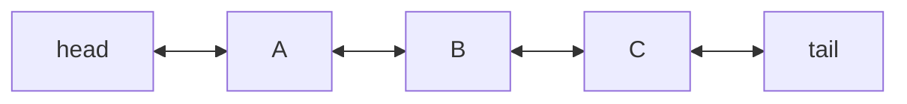

# Linked List

**Categoría:** Linear

## El problema

Un array dinámico ofrece acceso indexado O(1), pero insertar en el medio cuesta O(n): cada
elemento después del punto de inserción tiene que desplazarse una posición. Cuando la operación
que una aplicación realmente hace con más frecuencia es "inserta aquí, al lado de algo para lo
que ya tengo una referencia" — y no "indexa en la posición N" — el costo de desplazamiento de
un array es puro overhead.

## La solución

Almacena cada elemento en su propio nodo, manteniendo un puntero tanto al nodo anterior como
al siguiente. Insertar un nuevo nodo junto a uno existente es entonces solo un puñado de
reasignaciones de punteros — nada más en la lista tiene que moverse, porque la posición de
ningún otro elemento está definida en relación a un índice. El costo de eso: no hay forma de
saltar directamente a la "posición N", así que el acceso indexado tiene que recorrer la lista
desde la cabeza, un enlace a la vez.



| Operación | Costo | Por qué |
|---|---|---|
| `addFirst` / `addLast` | O(1) | solo reconecta el puntero de head/tail |
| `insertAfter(node, v)` / `remove(node)` | O(1) | reconecta a los vecinos de un nodo que ya tienes |
| `get(index)` | O(n) | sin acceso aleatorio — hay que recorrer desde la cabeza |

## Ejemplo clásico

[`classic/LinkedList`](src/main/java/com/datastructures/linear/linkedlist/classic/LinkedList.java)
es una lista doblemente enlazada construida sobre objetos `Node<T>` hechos a mano — sin
`java.util.LinkedList`. `addFirst`, `addLast`, `insertAfter` y `remove(Node)` son todos O(1);
`get(index)` es la única vía de escape O(n), mantenida solo para que el benchmark de abajo
tenga algo con qué contrastar.
[`LinkedListTest`](src/test/java/com/datastructures/linear/linkedlist/classic/LinkedListTest.java)
cubre cada combinación de inserción/desconexión (head, tail, medio, y el caso de un solo
elemento, donde un nodo es simultáneamente head y tail).

## Ejemplo aplicado: etapas del flujo de siniestros de seguro

[`applied/ClaimWorkflow`](src/main/java/com/datastructures/linear/linkedlist/applied/ClaimWorkflow.java)
modela el pipeline de procesamiento de un siniestro de seguro (en una gran aseguradora) como
una cadena de nodos [`ClaimStage`](src/main/java/com/datastructures/linear/linkedlist/applied/ClaimStage.java):
recepción, verificación de documentos, evaluación, pago. Un siniestro de alto valor puede
necesitar una etapa extra de "revisión manual" insertada justo después de la verificación de
documentos — con una lista respaldada por array eso desplaza cada etapa después del punto de
inserción; aquí es una sola inserción, sin importar cuántas etapas vengan después.
[`ClaimWorkflowTest`](src/test/java/com/datastructures/linear/linkedlist/applied/ClaimWorkflowTest.java)
cubre la inserción a mitad del pipeline, el append después de la última etapa, y el caso de
falla por nombre de etapa desconocido.

## Benchmark

```bash
./gradlew :linear:linked-list:jmh
```

Ejecución real (JMH 1.37, JDK 26.0.2, 2 iteraciones de warmup + 3 de medición, 1 fork) — la
imagen especular del benchmark de dynamic-array:

| Benchmark | size=100 | size=10,000 | size=100,000 |
|---|---:|---:|---:|
| `insertAfterKnownAnchor` | 116.5 ns | 119.6 ns | 116.1 ns |
| `getMiddleElement` (lectura indexada) | 42.5 ns | 8,203.3 ns | 78,680.1 ns |

La inserción en un anchor conocido se mantiene estable alrededor de 116–120ns, sin importar si
la lista tiene 100 o 100,000 elementos — O(1), confirmado. El acceso indexado, en cambio, crece
casi proporcionalmente al tamaño (~100x más lento en size=10,000 que en size=100, ~10x más
lento de nuevo en size=100,000 que en size=10,000) — el costo O(n) de recorrer desde la cabeza,
hecho visible.

## Cuándo no usarlo

- ¿Necesitas acceso indexado, búsqueda binaria o iteración masiva favorable a la caché? Un
  [Dynamic Array](../dynamic-array) gana en los tres frentes — consulta el benchmark de ese
  módulo para ver los números especulares.
- `insertAfter`/`remove` solo son O(1) si ya tienes la referencia al `Node`. Encontrar *cuál*
  nodo usar como referencia para insertar (por valor o por búsqueda) sigue siendo O(n) aquí —
  el `findNode` del ejemplo aplicado es honesto sobre ese costo, solo que esa no es la operación
  de la que trata este módulo.
- ¿Patrón de acceso aleatorio con índices impredecibles, sin referencias de nodo estables para
  reutilizar? El overhead de puntero por nodo y el pointer-chasing (poco favorable a la caché, a
  diferencia del diseño contiguo de un array) hacen que esto encaje peor de lo que parece sobre
  el papel.

## Cobertura de pruebas

100% de cobertura de instrucciones, 100% de cobertura de ramas (JaCoCo). Reprodúcelo tú mismo:

```bash
./gradlew :linear:linked-list:jacocoTestReport
```

Informe en `linear/linked-list/build/reports/jacoco/test/html/index.html`.
