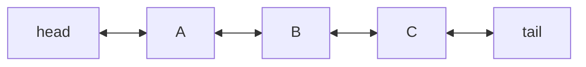

# Linked List

**Category:** Linear

## The problem

A dynamic array gives O(1) indexed access, but inserting into the middle costs O(n): every
element after the insertion point has to shift over by one. When the operation an application
actually does most is "insert here, next to something I already have a reference to" — not
"index into position N" — an array's shifting cost is pure overhead.

## The solution

Store each element in its own node, holding a pointer to both the previous and the next node.
Splicing a new node in next to an existing one is then just a handful of pointer reassignments
— nothing else in the list has to move, because nothing else's position is defined relative to
an index. The cost of that: there's no way to jump to "position N" directly, so indexed access
has to walk from the head one link at a time.



| Operation | Cost | Why |
|---|---|---|
| `addFirst` / `addLast` | O(1) | just relinks the head/tail pointer |
| `insertAfter(node, v)` / `remove(node)` | O(1) | relinks the neighbors of a node you already hold |
| `get(index)` | O(n) | no random access — has to walk from the head |

## Classic example

[`classic/LinkedList`](src/main/java/com/datastructures/linear/linkedlist/classic/LinkedList.java)
is a doubly linked list built on hand-rolled `Node<T>` objects — no `java.util.LinkedList`.
`addFirst`, `addLast`, `insertAfter`, and `remove(Node)` are all O(1); `get(index)` is the one
O(n) escape hatch, kept only so the benchmark below has something to contrast against.
[`LinkedListTest`](src/test/java/com/datastructures/linear/linkedlist/classic/LinkedListTest.java)
covers every splice/unlink combination (head, tail, middle, and the single-element case where a
node is simultaneously head and tail).

## Applied example: insurance claim workflow stages

[`applied/ClaimWorkflow`](src/main/java/com/datastructures/linear/linkedlist/applied/ClaimWorkflow.java)
models an insurance claim's processing pipeline (insurer) as a chain of
[`ClaimStage`](src/main/java/com/datastructures/linear/linkedlist/applied/ClaimStage.java)
nodes: intake, document verification, assessment, payout. A high-value claim might need an
extra "manual review" stage inserted right after document verification — with an array-backed
list that shifts every stage after the insertion point; here it's one splice, regardless of how
many stages come after it. [`ClaimWorkflowTest`](src/test/java/com/datastructures/linear/linkedlist/applied/ClaimWorkflowTest.java)
covers inserting mid-pipeline, appending after the last stage, and the unknown-stage-name
failure case.

## Benchmark

```bash
./gradlew :linear:linked-list:jmh
```

Real run (JMH 1.37, JDK 26.0.2, 2 warmup + 3 measurement iterations, 1 fork) — the mirror image
of the dynamic-array benchmark:

| Benchmark | size=100 | size=10,000 | size=100,000 |
|---|---:|---:|---:|
| `insertAfterKnownAnchor` | 116.5 ns | 119.6 ns | 116.1 ns |
| `getMiddleElement` (indexed read) | 42.5 ns | 8,203.3 ns | 78,680.1 ns |

Insertion at a known anchor stays flat around 116–120ns regardless of whether the list holds
100 or 100,000 elements — O(1), confirmed. Indexed access instead grows roughly in step with
size (~100x slower at size=10,000 than at size=100, ~10x slower again at size=100,000 than at
size=10,000) — the O(n) walk-from-the-head cost, made visible.

## When not to use it

- Need indexed access, binary search, or cache-friendly bulk iteration? A
  [Dynamic Array](../dynamic-array) wins on all three — see that module's benchmark for the
  mirror-image numbers.
- `insertAfter`/`remove` are only O(1) if you already hold the `Node` reference. Finding *which*
  node to splice next to (by value or by search) is still O(n) here — the applied example's
  `findNode` is honest about that cost, it just isn't the operation this module is about.
- Random access pattern with unpredictable indices, no stable node references to reuse? The
  per-node pointer overhead and pointer-chasing (cache-unfriendly, unlike an array's contiguous
  layout) make this a worse fit than it looks on paper.

## Test coverage

100% instruction coverage, 100% branch coverage (JaCoCo). Reproduce it yourself:

```bash
./gradlew :linear:linked-list:jacocoTestReport
```

Report at `linear/linked-list/build/reports/jacoco/test/html/index.html`.
