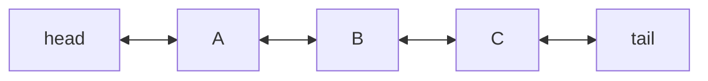

# Linked List

**Categoria:** Linear

## O problema

Um array dinâmico oferece acesso indexado O(1), mas inserir no meio custa O(n): todo elemento
depois do ponto de inserção precisa deslocar uma posição. Quando a operação que uma aplicação
realmente mais faz é "insira aqui, ao lado de algo para o qual eu já tenho uma referência" — e
não "indexe na posição N" — o custo de deslocamento de um array é puro overhead.

## A solução

Armazene cada elemento em seu próprio nó, mantendo um ponteiro tanto para o nó anterior quanto
para o próximo. Encaixar um novo nó ao lado de um já existente é então apenas um punhado de
reatribuições de ponteiro — nada mais na lista precisa se mover, porque a posição de nenhum
outro elemento é definida em relação a um índice. O custo disso: não há como pular direto para
a "posição N", então o acesso indexado precisa percorrer a lista a partir da cabeça, um link de
cada vez.



| Operação | Custo | Por quê |
|---|---|---|
| `addFirst` / `addLast` | O(1) | apenas reconecta o ponteiro de head/tail |
| `insertAfter(node, v)` / `remove(node)` | O(1) | reconecta os vizinhos de um nó que você já possui |
| `get(index)` | O(n) | sem acesso aleatório — precisa percorrer a partir da cabeça |

## Exemplo clássico

[`classic/LinkedList`](src/main/java/com/datastructures/linear/linkedlist/classic/LinkedList.java)
é uma lista duplamente encadeada construída sobre objetos `Node<T>` feitos à mão — sem
`java.util.LinkedList`. `addFirst`, `addLast`, `insertAfter` e `remove(Node)` são todos O(1);
`get(index)` é a única válvula de escape O(n), mantida apenas para que o benchmark abaixo tenha
algo com que comparar.
[`LinkedListTest`](src/test/java/com/datastructures/linear/linkedlist/classic/LinkedListTest.java)
cobre toda combinação de encaixe/desencaixe (head, tail, meio, e o caso de elemento único, em
que um nó é simultaneamente head e tail).

## Exemplo aplicado: etapas do fluxo de sinistros de seguro

[`applied/ClaimWorkflow`](src/main/java/com/datastructures/linear/linkedlist/applied/ClaimWorkflow.java)
modela o pipeline de processamento de um sinistro de seguro (numa grande seguradora) como uma
cadeia de nós [`ClaimStage`](src/main/java/com/datastructures/linear/linkedlist/applied/ClaimStage.java):
abertura, verificação de documentos, avaliação, pagamento. Um sinistro de alto valor pode
precisar de uma etapa extra de "revisão manual" inserida logo após a verificação de documentos
— com uma lista baseada em array isso desloca toda etapa depois do ponto de inserção; aqui é um
único encaixe, não importa quantas etapas venham depois.
[`ClaimWorkflowTest`](src/test/java/com/datastructures/linear/linkedlist/applied/ClaimWorkflowTest.java)
cobre a inserção no meio do pipeline, o append após a última etapa, e o caso de falha por nome
de etapa desconhecido.

## Benchmark

```bash
./gradlew :linear:linked-list:jmh
```

Execução real (JMH 1.37, JDK 26.0.2, 2 iterações de warmup + 3 de medição, 1 fork) — a imagem
espelhada do benchmark do dynamic-array:

| Benchmark | size=100 | size=10,000 | size=100,000 |
|---|---:|---:|---:|
| `insertAfterKnownAnchor` | 116.5 ns | 119.6 ns | 116.1 ns |
| `getMiddleElement` (leitura indexada) | 42.5 ns | 8,203.3 ns | 78,680.1 ns |

A inserção num anchor conhecido se mantém estável em torno de 116–120ns, não importa se a
lista tem 100 ou 100,000 elementos — O(1), confirmado. O acesso indexado, por outro lado,
cresce quase proporcionalmente ao tamanho (~100x mais lento em size=10,000 do que em size=100,
~10x mais lento de novo em size=100,000 do que em size=10,000) — o custo O(n) de percorrer a
partir da cabeça, tornado visível.

## Quando não usar

- Precisa de acesso indexado, busca binária ou iteração em massa amigável ao cache? Um
  [Dynamic Array](../dynamic-array) vence nos três quesitos — veja o benchmark daquele módulo
  para os números espelhados.
- `insertAfter`/`remove` só são O(1) se você já possui a referência ao `Node`. Encontrar *qual*
  nó usar como referência para o encaixe (por valor ou por busca) ainda é O(n) aqui — o
  `findNode` do exemplo aplicado é honesto sobre esse custo, só que essa não é a operação sobre
  a qual este módulo trata.
- Padrão de acesso aleatório com índices imprevisíveis, sem referências de nó estáveis para
  reaproveitar? O overhead de ponteiro por nó e o pointer-chasing (pouco amigável ao cache,
  diferente do layout contíguo de um array) tornam isso um encaixe pior do que parece no papel.

## Cobertura de testes

100% de cobertura de instruções, 100% de cobertura de branches (JaCoCo). Reproduza você mesmo:

```bash
./gradlew :linear:linked-list:jacocoTestReport
```

Relatório em `linear/linked-list/build/reports/jacoco/test/html/index.html`.
