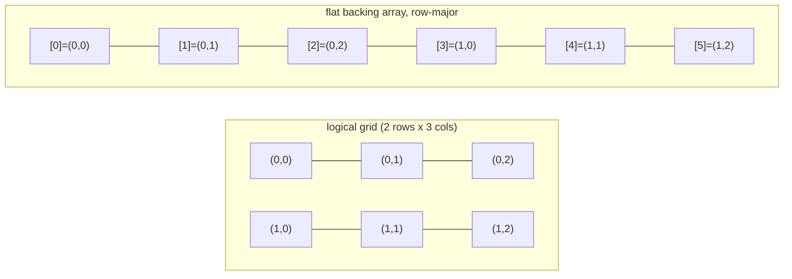

# Matrix

**Categoría:** Linear

## El problema

El `T[][]` nativo de Java en realidad no es una única estructura 2D — es un array de referencias
a arrays de fila asignados de forma independiente. Nada garantiza que esas filas queden una al
lado de la otra en memoria, cada fila es su propio objeto en el heap con su propia cabecera, y
nada impide que las filas tengan longitudes distintas (un array "jagged"/irregular), lo cual a
veces es deseado, pero muchas veces es solo una trampa cuando lo que realmente se necesita es una
grilla de forma fija, con diseño de memoria y costo de acceso predecibles.

## La solución

Respalda toda la grilla con un único array 1D plano, y calcula el índice plano de `(row, col)`
con aritmética row-major: `index = row * cols + col`. Esa única asignación garantiza que toda la
matriz sea un bloque contiguo de memoria, lo que convierte a `get`/`set` en aritmética directa —
y, igual de importante, hace que el *orden* del recorrido sea un costo real y medible: recorrer
el array en el mismo orden en que está dispuesto (row-major) se mantiene favorable para la caché,
mientras que recorrerlo en el orden "incorrecto" (column-major, saltando `cols` posiciones en
cada paso) no lo es, aunque ambos visiten exactamente las mismas celdas, exactamente la misma
cantidad de veces.



| Operación | Costo | Por qué |
|---|---|---|
| `get(row, col)` / `set(row, col, value)` | O(1) | aritmética directa sobre el array plano subyacente |
| recorrido completo, row-major (mismo orden de almacenamiento) | O(rows·cols), favorable a la caché | recorrido secuencial de un único array contiguo |
| recorrido completo, column-major | O(rows·cols), desfavorable a la caché | misma cantidad de elementos, pero salta `cols` posiciones en cada paso |

## Ejemplo clásico

[`classic/Matrix`](src/main/java/com/datastructures/linear/matrix/classic/Matrix.java) está
respaldado por un único `Object[]` de tamaño `rows * cols` — sin `T[][]` de Java. `get`/`set`
calculan el índice plano con la misma fórmula row-major, y ambos verifican los límites de fila y
columna de forma independiente antes de tocar el array.
[`MatrixTest`](src/test/java/com/datastructures/linear/matrix/classic/MatrixTest.java) cubre el
ciclo completo de get/set, que las celdas permanezcan independientes entre filas y columnas (la
verificación directa de que la aritmética de índices no está accidentalmente transpuesta o
superpuesta), cada combinación de fila/columna fuera de rango tanto para `get` como para `set`, y
las dos protecciones del constructor contra dimensiones no positivas.

## Ejemplo aplicado: grilla de tarificación de primas de seguros

[`applied/PremiumRatingGrid`](src/main/java/com/datastructures/linear/matrix/applied/PremiumRatingGrid.java)
modela una tabla actuarial de tarificación exactamente con la forma en que ya se publica: las
filas son rangos de edad, las columnas son zonas de riesgo, y cada celda guarda el multiplicador
de tarifa que la suscripción aplica para esa combinación. Resolver el multiplicador de una
cotización se convierte entonces en una única búsqueda indexada O(1) —
`multiplierFor(ageBracket, riskZone)` — en lugar de una cadena de verificaciones de rango o una
lista de reglas recorrida linealmente. Consultar una celda que nunca fue registrada falla de
forma explícita (`IllegalStateException`) en lugar de devolver silenciosamente un multiplicador
por defecto que podría subvaluar una póliza.
[`PremiumRatingGridTest`](src/test/java/com/datastructures/linear/matrix/applied/PremiumRatingGridTest.java)
cubre el ciclo completo de un multiplicador, independencia entre celdas, el caso de falla de
celda no definida, un multiplicador no positivo rechazado, y una búsqueda fuera de rango
propagando la verificación de límites subyacente.

## Benchmark

```bash
./gradlew :linear:matrix:jmh
```

Ejecución real en esta máquina (JMH 1.37, JDK 26.0.2, 2 iteraciones de calentamiento + 3 de
medición, 1 fork). Recorrido completo (suma de todas las celdas) de una matriz cuadrada, en orden
row-major (mismo orden de almacenamiento del array subyacente) vs. orden column-major (misma
cantidad de elementos, saltando `dimension` posiciones en cada paso):

| Costo del recorrido completo | dimension=100 (10 mil celdas) | dimension=500 (250 mil celdas) | dimension=1000 (1 millón de celdas) |
|---|---:|---:|---:|
| row-major | 9,06 µs | 292,60 µs | 1.711,45 µs |
| column-major | 16,17 µs | 1.494,50 µs | 26.936,84 µs |

Misma cantidad de elementos, misma operación, ambos órdenes — la brecha es puramente un efecto
del patrón de acceso a memoria. En el tamaño más pequeño (10 mil celdas, lo bastante pequeño como
para caber cómodamente en caché sin importar el orden), column-major es solo ~1,8x más lento. Esa
brecha se abre marcadamente a medida que crece la matriz: ~5,1x más lento en 250 mil celdas,
~15,7x más lento en 1 millón de celdas — exactamente la forma que produce un efecto de localidad
de caché en cuanto el conjunto de trabajo deja de caber en caché y los saltos de `dimension`
posiciones de column-major empiezan a fallar líneas de caché que el recorrido secuencial de
row-major nunca falla. El intervalo de confianza en dimension=500 es amplio (ruido de JVM/GC del
orden de milisegundos de un solo dígito en esa cantidad de iteraciones) — la tendencia creciente
a lo largo de los tres tamaños es la señal confiable aquí, no ningún número aislado.

## Cuándo no usarlo

- ¿Necesitas una estructura jagged/irregular donde las filas tengan longitudes distintas, o
  necesitas agregar o quitar filas/columnas después de construida? Esta Matrix tiene forma fija
  por diseño — una `List<List<T>>` (o simplemente una nueva Matrix con otro tamaño) encaja mejor
  para filas de longitud variable.
- ¿El conjunto de trabajo es lo bastante pequeño como para caber siempre cómodamente en caché sin
  importar el orden de acceso? El benchmark de arriba muestra que la brecha row-vs-column es real
  pero modesta hasta que la matriz supera la caché — menos de 2x en dimension=100, no vale la
  pena reestructurar código por eso.
- ¿Necesitas almacenamiento genuinamente disperso — una grilla lógica enorme donde casi toda
  celda está vacía? Esta Matrix asigna todas las celdas por adelantado (`rows * cols`
  posiciones), sin importar cuántas estén realmente definidas. Una representación dispersa (por
  ejemplo, una hash table indexada por `(row, col)`) cambia el acceso denso O(1) de esta Matrix
  por memoria proporcional a la cantidad de celdas no vacías, en lugar de la grilla completa.

## Cobertura de pruebas

100% de cobertura de instrucciones, 100% de cobertura de ramas (JaCoCo). Reprodúcelo tú mismo:

```bash
./gradlew :linear:matrix:jacocoTestReport
```

Informe en `linear/matrix/build/reports/jacoco/test/html/index.html`.
