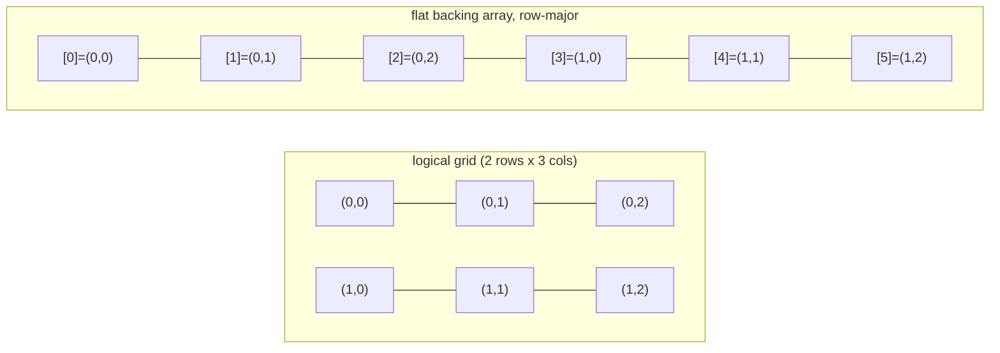

# Matrix

**Category:** Linear

## The problem

Java's native `T[][]` isn't really one 2D structure — it's an array of references to
independently-allocated 1D row arrays. Nothing guarantees those rows sit next to each other in
memory, each row is its own heap object with its own header, and nothing stops rows from having
different lengths (a "jagged" array), which is sometimes wanted but often just a footgun when
what's actually needed is a fixed-shape grid with predictable memory layout and predictable
access cost.

## The solution

Back the whole grid with a single flat 1D array, and compute the flat index for `(row, col)`
with row-major arithmetic: `index = row * cols + col`. That single allocation guarantees the
entire matrix is one contiguous memory block, which turns `get`/`set` into direct arithmetic —
and, just as importantly, makes traversal *order* a real, measurable cost: scanning the array in
the same order it's laid out (row-major) stays cache-friendly, while scanning it in the "wrong"
order (column-major, jumping `cols` slots every step) is not, even though both visit the exact
same cells the exact same number of times.



| Operation | Cost | Why |
|---|---|---|
| `get(row, col)` / `set(row, col, value)` | O(1) | direct arithmetic into the flat backing array |
| full traversal, row-major (matches storage order) | O(rows·cols), cache-friendly | sequential scan of one contiguous array |
| full traversal, column-major | O(rows·cols), cache-unfriendly | same element count, but jumps `cols` slots every step |

## Classic example

[`classic/Matrix`](src/main/java/com/datastructures/linear/matrix/classic/Matrix.java) is backed
by a single `Object[]` sized `rows * cols` — no Java `T[][]`. `get`/`set` both compute the flat
index with the same row-major formula, and both bounds-check row and column independently before
touching the array. [`MatrixTest`](src/test/java/com/datastructures/linear/matrix/classic/MatrixTest.java)
covers get/set round-tripping, that cells stay independent across rows and columns (the direct
check that the index arithmetic isn't accidentally transposed or overlapping), every out-of-bounds
row/column combination for both `get` and `set`, and both non-positive-dimension constructor
guards.

## Applied example: insurance premium-rating grid

[`applied/PremiumRatingGrid`](src/main/java/com/datastructures/linear/matrix/applied/PremiumRatingGrid.java)
models an actuarial rating table exactly the shape it's already published in: rows are age
brackets, columns are risk zones, and each cell holds the rate multiplier underwriting applies
for that combination. Resolving a quote's multiplier is then a single O(1) indexed lookup —
`multiplierFor(ageBracket, riskZone)` — instead of a chain of range checks or a linearly-scanned
rule list. Querying a cell that was never registered fails loudly (`IllegalStateException`)
rather than silently returning a default multiplier that could under-price a policy.
[`PremiumRatingGridTest`](src/test/java/com/datastructures/linear/matrix/applied/PremiumRatingGridTest.java)
covers round-tripping a multiplier, independence across cells, the unset-cell failure case, a
rejected non-positive multiplier, and an out-of-range lookup propagating the underlying bounds
check.

## Benchmark

```bash
./gradlew :linear:matrix:jmh
```

Real run on this machine (JMH 1.37, JDK 26.0.2, 2 warmup + 3 measurement iterations, 1 fork).
Full traversal (sum every cell) of a square matrix, row-major order (matches the backing array's
storage order) vs. column-major order (identical element count, jumps `dimension` slots per
step):

| Full-traversal cost | dimension=100 (10K cells) | dimension=500 (250K cells) | dimension=1000 (1M cells) |
|---|---:|---:|---:|
| row-major | 9.06 µs | 292.60 µs | 1,711.45 µs |
| column-major | 16.17 µs | 1,494.50 µs | 26,936.84 µs |

Same element count, same operation, both orders — the gap is purely a memory-access-pattern
effect. At the smallest size (10K cells, small enough to sit comfortably in cache regardless of
order) column-major is only ~1.8x slower. That gap widens sharply as the matrix grows: ~5.1x
slower at 250K cells, ~15.7x slower at 1M cells — exactly the shape a cache-locality effect
produces once the working set stops fitting in cache and column-major's `dimension`-slot jumps
start missing cache lines that row-major's sequential scan never does. The confidence interval at
dimension=500 is wide (single-digit-millisecond JVM/GC noise at this iteration count) — the
widening trend across all three sizes is the reliable signal here, not any one number in
isolation.

## When not to use it

- Need a jagged/ragged structure where rows have different lengths, or need to add or remove
  rows/columns after construction? This Matrix is fixed-shape by design — a `List<List<T>>` (or
  simply a fresh, differently-sized Matrix) fits variable-length rows better.
- Working set small enough to always fit comfortably in cache regardless of access order? The
  benchmark above shows the row-vs-column gap is real but modest until the matrix outgrows
  cache — under 2x at dimension=100, not worth restructuring code around.
- Need genuinely sparse storage — a huge logical grid where almost every cell is empty? This
  Matrix allocates every cell up front (`rows * cols` slots) regardless of how many are actually
  set. A sparse representation (e.g. a hash table keyed by `(row, col)`) trades this Matrix's O(1)
  dense access for memory proportional to the number of non-empty cells instead of the full grid.

## Test coverage

100% instruction coverage, 100% branch coverage (JaCoCo). Reproduce it yourself:

```bash
./gradlew :linear:matrix:jacocoTestReport
```

Report at `linear/matrix/build/reports/jacoco/test/html/index.html`.
