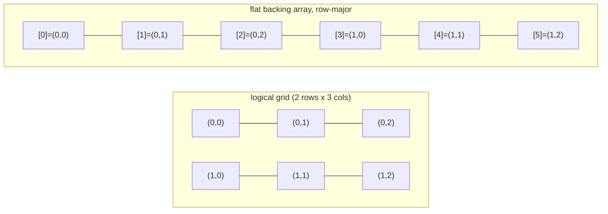

# Matrix

**Categoria:** Linear

## O problema

O `T[][]` nativo do Java não é de fato uma única estrutura 2D — é um array de referências para
arrays de linha alocados de forma independente. Nada garante que essas linhas fiquem lado a lado
na memória, cada linha é seu próprio objeto no heap com seu próprio cabeçalho, e nada impede que
as linhas tenham tamanhos diferentes (um array "jagged"/irregular), o que às vezes é desejado,
mas muitas vezes é só uma pegadinha quando o que se precisa de verdade é uma grade de formato
fixo, com layout de memória e custo de acesso previsíveis.

## A solução

Apoie a grade inteira em um único array 1D plano, e calcule o índice plano de `(row, col)` com
aritmética row-major: `index = row * cols + col`. Essa única alocação garante que a matriz
inteira seja um bloco contíguo de memória, o que transforma `get`/`set` em aritmética direta — e,
igualmente importante, torna a *ordem* do percurso um custo real e mensurável: percorrer o array
na mesma ordem em que ele está disposto (row-major) permanece favorável ao cache, enquanto
percorrê-lo na ordem "errada" (column-major, pulando `cols` posições a cada passo) não é, mesmo
que ambos visitem exatamente as mesmas células, exatamente o mesmo número de vezes.



| Operação | Custo | Por quê |
|---|---|---|
| `get(row, col)` / `set(row, col, value)` | O(1) | aritmética direta no array plano subjacente |
| percurso completo, row-major (mesma ordem do armazenamento) | O(rows·cols), favorável ao cache | varredura sequencial de um único array contíguo |
| percurso completo, column-major | O(rows·cols), desfavorável ao cache | mesma quantidade de elementos, mas pula `cols` posições a cada passo |

## Exemplo clássico

[`classic/Matrix`](src/main/java/com/datastructures/linear/matrix/classic/Matrix.java) é apoiado
por um único `Object[]` de tamanho `rows * cols` — sem `T[][]` do Java. `get`/`set` calculam o
índice plano com a mesma fórmula row-major, e ambos verificam limites de linha e coluna de forma
independente antes de tocar o array.
[`MatrixTest`](src/test/java/com/datastructures/linear/matrix/classic/MatrixTest.java) cobre o
ciclo completo de get/set, que as células permanecem independentes entre linhas e colunas (a
verificação direta de que a aritmética de índice não está acidentalmente transposta ou se
sobrepondo), toda combinação de linha/coluna fora dos limites tanto para `get` quanto para `set`,
e as duas proteções do construtor contra dimensões não positivas.

## Exemplo aplicado: grade de tarifação de prêmio de seguro

[`applied/PremiumRatingGrid`](src/main/java/com/datastructures/linear/matrix/applied/PremiumRatingGrid.java)
modela uma tabela atuarial de tarifação exatamente no formato em que ela já é publicada: as
linhas são faixas etárias, as colunas são zonas de risco, e cada célula guarda o multiplicador de
taxa que a subscrição aplica para aquela combinação. Resolver o multiplicador de uma cotação vira
então uma única busca indexada O(1) — `multiplierFor(ageBracket, riskZone)` — em vez de uma
cadeia de verificações de intervalo ou uma lista de regras varrida linearmente. Consultar uma
célula que nunca foi registrada falha de forma escancarada (`IllegalStateException`) em vez de
silenciosamente retornar um multiplicador padrão que poderia subprecificar uma apólice.
[`PremiumRatingGridTest`](src/test/java/com/datastructures/linear/matrix/applied/PremiumRatingGridTest.java)
cobre o ciclo completo de um multiplicador, independência entre células, o caso de falha de
célula não definida, um multiplicador não positivo rejeitado, e uma busca fora do intervalo
propagando a verificação de limites subjacente.

## Benchmark

```bash
./gradlew :linear:matrix:jmh
```

Execução real nesta máquina (JMH 1.37, JDK 26.0.2, 2 iterações de aquecimento + 3 de medição, 1
fork). Percurso completo (soma de todas as células) de uma matriz quadrada, em ordem row-major
(mesma ordem de armazenamento do array subjacente) vs. ordem column-major (mesma quantidade de
elementos, pulando `dimension` posições a cada passo):

| Custo do percurso completo | dimension=100 (10 mil células) | dimension=500 (250 mil células) | dimension=1000 (1 milhão de células) |
|---|---:|---:|---:|
| row-major | 9,06 µs | 292,60 µs | 1.711,45 µs |
| column-major | 16,17 µs | 1.494,50 µs | 26.936,84 µs |

Mesma quantidade de elementos, mesma operação, as duas ordens — a diferença é puramente um efeito
do padrão de acesso à memória. No menor tamanho (10 mil células, pequeno o suficiente para caber
confortavelmente no cache independentemente da ordem), column-major é só ~1,8x mais lento. Essa
diferença se abre bruscamente conforme a matriz cresce: ~5,1x mais lento em 250 mil células,
~15,7x mais lento em 1 milhão de células — exatamente o formato que um efeito de localidade de
cache produz assim que o working set deixa de caber no cache e os saltos de `dimension` posições
do column-major começam a errar linhas de cache que a varredura sequencial do row-major nunca
erra. O intervalo de confiança em dimension=500 é largo (ruído de JVM/GC na casa de milissegundos
de um único dígito nessa contagem de iterações) — a tendência de abertura ao longo dos três
tamanhos é o sinal confiável aqui, não qualquer número isolado.

## Quando não usar

- Precisa de uma estrutura jagged/irregular em que as linhas têm tamanhos diferentes, ou precisa
  adicionar/remover linhas ou colunas depois de construída? Esta Matrix tem formato fixo por
  design — uma `List<List<T>>` (ou simplesmente uma nova Matrix com outro tamanho) se encaixa
  melhor para linhas de tamanho variável.
- O working set é pequeno o suficiente para sempre caber confortavelmente no cache
  independentemente da ordem de acesso? O benchmark acima mostra que a diferença
  row-vs-column é real, mas modesta até a matriz ultrapassar o cache — menos de 2x em
  dimension=100, não compensa reestruturar código por causa disso.
- Precisa de armazenamento genuinamente esparso — uma grade lógica enorme em que quase toda
  célula está vazia? Esta Matrix aloca todas as células antecipadamente (`rows * cols` posições),
  independentemente de quantas realmente estão definidas. Uma representação esparsa (por exemplo,
  uma hash table indexada por `(row, col)`) troca o acesso denso O(1) desta Matrix por memória
  proporcional ao número de células não vazias, em vez da grade inteira.

## Cobertura de testes

100% de cobertura de instruções, 100% de cobertura de branches (JaCoCo). Reproduza você mesmo:

```bash
./gradlew :linear:matrix:jacocoTestReport
```

Relatório em `linear/matrix/build/reports/jacoco/test/html/index.html`.
