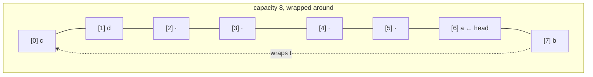

# Queue / Deque

**Categoría:** Linear

## El problema

Un array común (o el propio [Dynamic Array](../dynamic-array) de este repositorio) solo es
eficiente en un extremo: agregar al final es O(1) amortizado, pero quitar o insertar al
*inicio* es O(n), porque cada elemento restante tiene que desplazarse. Algunas cargas de
trabajo reales realmente necesitan ambos extremos — procesamiento FIFO que también necesita,
ocasionalmente, saltarse la fila — y desplazar todo el búfer en cada operación del inicio no es
aceptable una vez que el búfer crece.

## La solución

Mantén un array crudo como un **búfer circular**: en lugar de siempre empezar los datos
activos en el índice 0, lleva un cursor `head` y un `size`, y deja que el final lógico dé la
vuelta por el final del array de regreso al inicio mediante aritmética modular. Agregar o
quitar en cualquiera de los extremos entonces solo toca un slot y mueve un cursor — sin
desplazamiento, sin importar a qué extremo apunte la operación. El crecimiento sigue duplicando
la capacidad de la misma forma que lo hacen los módulos Dynamic Array y Stack de este
repositorio, pero un redimensionamiento aquí tiene un paso extra: los elementos activos no
están necesariamente dispuestos de forma contigua desde el índice 0 (un búfer lleno y que ya
dio la vuelta puede tener su frente lógico en cualquier lugar), así que crecer requiere recorrer
el búfer en orden lógico empezando en `head` y copiarlo a un array nuevo comenzando en el
índice 0.



| Operación | Costo | Por qué |
|---|---|---|
| `addFirst` / `addLast` | O(1) amortizado | escribe en un slot, mueve un cursor; duplicar la capacidad mantiene la frecuencia de redimensionamiento exponencialmente pequeña |
| `removeFirst` / `removeLast` | O(1) | lo mismo — un slot, un cursor, sin desplazamiento |
| `peekFirst` / `peekLast` | O(1) | lectura directa de índice en `head` o en el índice derivado de la tail |

## Ejemplo clásico

[`classic/ArrayDeque`](src/main/java/com/datastructures/linear/queuedeque/classic/ArrayDeque.java)
está construido sobre un `Object[]` crudo usado como búfer circular — sin
`java.util.ArrayDeque`. `addFirst`, `addLast`, `removeFirst`, `removeLast`, `peekFirst` y
`peekLast` están todos implementados a mano alrededor de un cursor `head` y aritmética modular
de índices, en lugar del desplazamiento que el Dynamic Array de este repositorio necesita para
las operaciones del inicio.
[`ArrayDequeTest`](src/test/java/com/datastructures/linear/queuedeque/classic/ArrayDequeTest.java)
cubre específicamente el crecimiento mientras el búfer ha dado la vuelta alrededor del final
del array subyacente (head lejos del índice 0), verificando que la copia en orden lógico del
redimensionamiento no desordene el orden de los elementos.

## Ejemplo aplicado: triaje de tickets de soporte de telecomunicaciones

[`applied/SupportTicketQueue`](src/main/java/com/datastructures/linear/queuedeque/applied/SupportTicketQueue.java)
modela una cola de soporte al cliente: un [`SupportTicket`](src/main/java/com/datastructures/linear/queuedeque/applied/SupportTicket.java)
normal se une al final de la fila mediante `addLast` (FIFO), pero un ticket VIP salta
directamente al inicio mediante `addFirst`, y un agente siempre toma el siguiente ticket a
atender mediante `removeFirst`. Tanto el encolado normal como el fast-track VIP son O(1) — una
escalación nunca tiene que desplazar ni reescanear lo que ya está esperando, simplemente se
convierte en el nuevo frente.
[`SupportTicketQueueTest`](src/test/java/com/datastructures/linear/queuedeque/applied/SupportTicketQueueTest.java)
cubre el orden FIFO normal, un ticket VIP saltando por delante de tickets normales que ya
esperaban, y un segundo VIP saltando por delante del primero.

## Benchmark

```bash
./gradlew :linear:queue-deque:jmh
```

Ejecución real en esta máquina (JMH 1.37, JDK 26.0.2, 2 iteraciones de warmup + 3 de medición,
1 fork). Cada llamada medida quita el elemento del frente de una estructura recién poblada con
exactamente `size` elementos — la reconstrucción se excluye del tiempo medido, solo cuenta la
única llamada a `removeFirst`/`remove(0)`:

| Costo de `removeFirst()` | size=100 | size=10,000 | size=100,000 |
|---|---:|---:|---:|
| deque circular (`ArrayDeque.removeFirst`) | 13.09 ns | 12.00 ns | 12.83 ns |
| array simple (`DynamicArray.remove(0)`) | 30.51 ns | 1,442.95 ns | 18,585.58 ns |

El deque circular se mantiene estable en ~12–13 ns sin importar el tamaño — la afirmación de
O(1), falsable y confirmada. `DynamicArray.remove(0)`, en cambio, sube marcadamente: ~47x más
lento al pasar de size=100 a size=10,000 (un aumento de 100x en el tamaño) y ~13x más lento de
nuevo al pasar de size=10,000 a size=100,000 (un aumento de 10x en el tamaño) — ruidoso en el
extremo pequeño, donde el overhead fijo por llamada aún domina, pero creciendo inconfundiblemente
al mismo ritmo que el tamaño, que es exactamente lo que se ve como "desplazar cada elemento
restante una posición a la izquierda" una vez que ese overhead deja de ser el cuello de
botella.

## Cuándo no usarlo

- ¿Necesitas acceso indexado por posición (`get(i)`), no solo los dos extremos? Esta
  estructura simplemente no expone eso — consulta el [Dynamic Array](../dynamic-array) de este
  repositorio para acceso indexado O(1), o [Linked List](../linked-list) para insertar en O(1)
  en cualquier lugar dada una referencia de nodo.
- ¿Necesitas mirar o quitar algo que no sea el frente o el fondo — el medio de la cola, o por
  valor? Fuera de alcance por diseño; un deque solo toca sus dos extremos.
- ¿Solo necesitas un extremo (LIFO puro o FIFO puro, nunca ambos)? [Stack](../stack) es una
  opción más acotada y un poco más simple para LIFO puro.

## Cobertura de pruebas

100% de cobertura de instrucciones, 100% de cobertura de ramas (JaCoCo). Reprodúcelo tú mismo:

```bash
./gradlew :linear:queue-deque:jacocoTestReport
```

Informe en `linear/queue-deque/build/reports/jacoco/test/html/index.html`.
