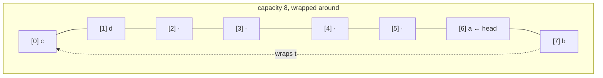

# Queue / Deque

**Category:** Linear

## The problem

A plain array (or this repo's own [Dynamic Array](../dynamic-array)) is only efficient at one
end: appending at the back is O(1) amortized, but removing or inserting at the *front* is O(n)
because every remaining element has to shift over. Some real workloads genuinely need both ends
— FIFO processing that also needs to occasionally jump the line — and shifting the whole buffer
on every front operation isn't acceptable once the buffer gets large.

## The solution

Keep a raw array as a **circular buffer**: instead of always starting the live data at index 0,
track a `head` cursor and a `size`, and let the logical tail wrap around the end of the array
back to the beginning via modular arithmetic. Adding or removing at either end then only ever
touches one slot and moves one cursor — no shifting, regardless of which end the operation
targets. Growth still doubles capacity the same way this repo's Dynamic Array and Stack modules
do, but a resize here has one extra step: the live elements aren't necessarily laid out
contiguously from index 0 (a full, wrapped-around buffer can have its logical front anywhere),
so growing has to walk the buffer in logical order starting at `head` and copy it into a fresh
array starting at index 0.



| Operation | Cost | Why |
|---|---|---|
| `addFirst` / `addLast` | O(1) amortized | writes one slot, moves one cursor; doubling keeps resize frequency exponentially small |
| `removeFirst` / `removeLast` | O(1) | same — one slot, one cursor, no shifting |
| `peekFirst` / `peekLast` | O(1) | direct index read at `head` or the derived tail index |

## Classic example

[`classic/ArrayDeque`](src/main/java/com/datastructures/linear/queuedeque/classic/ArrayDeque.java)
is built on a raw `Object[]` used as a circular buffer — no `java.util.ArrayDeque`. `addFirst`,
`addLast`, `removeFirst`, `removeLast`, `peekFirst`, and `peekLast` are all hand-rolled around a
`head` cursor and modular-arithmetic index math instead of the shifting this repo's Dynamic
Array needs for front operations.
[`ArrayDequeTest`](src/test/java/com/datastructures/linear/queuedeque/classic/ArrayDequeTest.java)
specifically covers growth while the buffer is wrapped around the end of the backing array (head
away from index 0), verifying the resize's logical-order copy doesn't scramble element order.

## Applied example: telecom support ticket triage

[`applied/SupportTicketQueue`](src/main/java/com/datastructures/linear/queuedeque/applied/SupportTicketQueue.java)
models a customer support queue: a normal
[`SupportTicket`](src/main/java/com/datastructures/linear/queuedeque/applied/SupportTicket.java)
joins the back of the line via `addLast` (FIFO), but a VIP ticket jumps straight to the front via
`addFirst`, and an agent always pulls the next ticket to handle via `removeFirst`. Both the
normal enqueue and the VIP fast-track are O(1) — an escalation never has to shift or rescan
whatever's already waiting, it just becomes the new front.
[`SupportTicketQueueTest`](src/test/java/com/datastructures/linear/queuedeque/applied/SupportTicketQueueTest.java)
covers plain FIFO order, a VIP ticket jumping ahead of already-waiting normal tickets, and a
second VIP jumping ahead of the first.

## Benchmark

```bash
./gradlew :linear:queue-deque:jmh
```

Real run on this machine (JMH 1.37, JDK 26.0.2, 2 warmup + 3 measurement iterations, 1 fork).
Each measured call removes the front element of a freshly-populated structure of exactly `size`
elements — the rebuild is excluded from the timing, only the one `removeFirst`/`remove(0)` call
counts:

| `removeFirst()` cost | size=100 | size=10,000 | size=100,000 |
|---|---:|---:|---:|
| circular deque (`ArrayDeque.removeFirst`) | 13.09 ns | 12.00 ns | 12.83 ns |
| plain array (`DynamicArray.remove(0)`) | 30.51 ns | 1,442.95 ns | 18,585.58 ns |

The circular deque stays flat at ~12–13 ns regardless of size — the O(1) claim, falsifiable and
confirmed. `DynamicArray.remove(0)` instead climbs sharply: ~47x slower going from size=100 to
size=10,000 (a 100x size increase) and ~13x slower again going from size=10,000 to size=100,000
(a 10x size increase) — noisy at the small end where fixed per-call overhead still dominates, but
unmistakably growing in step with size, which is exactly what "shift every remaining element
left by one" looks like once that overhead stops being the bottleneck.

## When not to use it

- Need indexed access by position (`get(i)`), not just the two ends? This structure doesn't
  expose that at all — see this repo's [Dynamic Array](../dynamic-array) for O(1) indexed
  access, or [Linked List](../linked-list) for O(1) splicing anywhere given a node reference.
- Need to peek or remove anything other than the front or back — the middle of the queue, or by
  value? Out of scope by design; a deque only ever touches its two ends.
- Only ever need one end (pure LIFO or pure FIFO, never both)? [Stack](../stack) is a narrower,
  slightly simpler fit for pure LIFO.

## Test coverage

100% instruction coverage, 100% branch coverage (JaCoCo). Reproduce it yourself:

```bash
./gradlew :linear:queue-deque:jacocoTestReport
```

Report at `linear/queue-deque/build/reports/jacoco/test/html/index.html`.
