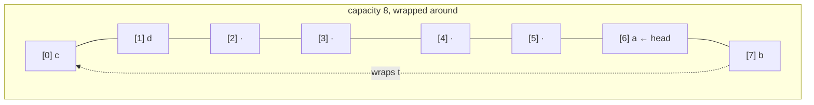

# Queue / Deque

**Categoria:** Linear

## O problema

Um array comum (ou o próprio [Dynamic Array](../dynamic-array) deste repositório) só é
eficiente numa ponta: adicionar no final é O(1) amortizado, mas remover ou inserir no *início*
é O(n), porque todo elemento restante precisa deslocar. Algumas cargas de trabalho reais
realmente precisam das duas pontas — processamento FIFO que também precisa, ocasionalmente,
furar a fila — e deslocar o buffer inteiro a cada operação no início não é aceitável assim que
o buffer cresce.

## A solução

Mantenha um array bruto como um **buffer circular**: em vez de sempre começar os dados ativos
no índice 0, acompanhe um cursor `head` e um `size`, e deixe que o final lógico dê a volta pelo
fim do array de volta ao início via aritmética modular. Adicionar ou remover em qualquer ponta
então sempre toca apenas um slot e move um cursor — sem deslocamento, não importa a qual ponta
a operação se destina. O crescimento ainda dobra a capacidade da mesma forma que os módulos
Dynamic Array e Stack deste repositório fazem, mas um redimensionamento aqui tem um passo a
mais: os elementos ativos não estão necessariamente dispostos contiguamente a partir do índice
0 (um buffer cheio e que deu a volta pode ter sua frente lógica em qualquer lugar), então
crescer precisa percorrer o buffer em ordem lógica a partir de `head` e copiá-lo para um array
novo começando no índice 0.



| Operação | Custo | Por quê |
|---|---|---|
| `addFirst` / `addLast` | O(1) amortizado | escreve em um slot, move um cursor; dobrar a capacidade mantém a frequência de redimensionamento exponencialmente pequena |
| `removeFirst` / `removeLast` | O(1) | o mesmo — um slot, um cursor, sem deslocamento |
| `peekFirst` / `peekLast` | O(1) | leitura direta de índice em `head` ou no índice derivado da tail |

## Exemplo clássico

[`classic/ArrayDeque`](src/main/java/com/datastructures/linear/queuedeque/classic/ArrayDeque.java)
é construído sobre um `Object[]` bruto usado como buffer circular — sem
`java.util.ArrayDeque`. `addFirst`, `addLast`, `removeFirst`, `removeLast`, `peekFirst` e
`peekLast` são todos implementados à mão em torno de um cursor `head` e de aritmética modular de
índices, em vez do deslocamento que o Dynamic Array deste repositório precisa para operações no
início.
[`ArrayDequeTest`](src/test/java/com/datastructures/linear/queuedeque/classic/ArrayDequeTest.java)
cobre especificamente o crescimento enquanto o buffer está com a volta dada em torno do fim do
array subjacente (head longe do índice 0), verificando que a cópia em ordem lógica do
redimensionamento não embaralha a ordem dos elementos.

## Exemplo aplicado: triagem de tickets de suporte de telecom

[`applied/SupportTicketQueue`](src/main/java/com/datastructures/linear/queuedeque/applied/SupportTicketQueue.java)
modela uma fila de suporte ao cliente: um [`SupportTicket`](src/main/java/com/datastructures/linear/queuedeque/applied/SupportTicket.java)
normal entra no fim da fila via `addLast` (FIFO), mas um ticket VIP pula direto para o início
via `addFirst`, e um agente sempre retira o próximo ticket a atender via `removeFirst`. Tanto o
enfileiramento normal quanto o fast-track VIP são O(1) — uma escalação nunca precisa deslocar
ou reescanear o que já está esperando, ela simplesmente se torna a nova frente.
[`SupportTicketQueueTest`](src/test/java/com/datastructures/linear/queuedeque/applied/SupportTicketQueueTest.java)
cobre a ordem FIFO comum, um ticket VIP furando a fila à frente de tickets normais já
esperando, e um segundo VIP furando a fila à frente do primeiro.

## Benchmark

```bash
./gradlew :linear:queue-deque:jmh
```

Execução real nesta máquina (JMH 1.37, JDK 26.0.2, 2 iterações de warmup + 3 de medição, 1
fork). Cada chamada medida remove o elemento da frente de uma estrutura recém-populada com
exatamente `size` elementos — a reconstrução é excluída da medição de tempo, só a única chamada
de `removeFirst`/`remove(0)` conta:

| Custo de `removeFirst()` | size=100 | size=10,000 | size=100,000 |
|---|---:|---:|---:|
| deque circular (`ArrayDeque.removeFirst`) | 13.09 ns | 12.00 ns | 12.83 ns |
| array comum (`DynamicArray.remove(0)`) | 30.51 ns | 1,442.95 ns | 18,585.58 ns |

O deque circular se mantém estável em ~12–13 ns independentemente do tamanho — a afirmação de
O(1), falseável e confirmada. `DynamicArray.remove(0)`, por outro lado, sobe acentuadamente:
~47x mais lento ao ir de size=100 para size=10,000 (um aumento de 100x no tamanho) e ~13x mais
lento de novo ao ir de size=10,000 para size=100,000 (um aumento de 10x no tamanho) — ruidoso na
ponta pequena, onde o overhead fixo por chamada ainda domina, mas crescendo inconfundivelmente
em conjunto com o tamanho, que é exatamente a cara de "deslocar cada elemento restante uma
posição para a esquerda" assim que esse overhead deixa de ser o gargalo.

## Quando não usar

- Precisa de acesso indexado por posição (`get(i)`), não só das duas pontas? Esta estrutura
  simplesmente não expõe isso — veja o [Dynamic Array](../dynamic-array) deste repositório para
  acesso indexado O(1), ou [Linked List](../linked-list) para encaixe O(1) em qualquer lugar
  dada uma referência de nó.
- Precisa olhar ou remover qualquer coisa que não seja a frente ou o fim — o meio da fila, ou
  por valor? Fora do escopo por design; um deque só toca suas duas pontas.
- Só precisa de uma ponta (LIFO puro ou FIFO puro, nunca ambos)? O [Stack](../stack) é um
  encaixe mais restrito e um pouco mais simples para LIFO puro.

## Cobertura de testes

100% de cobertura de instruções, 100% de cobertura de branches (JaCoCo). Reproduza você mesmo:

```bash
./gradlew :linear:queue-deque:jacocoTestReport
```

Relatório em `linear/queue-deque/build/reports/jacoco/test/html/index.html`.
