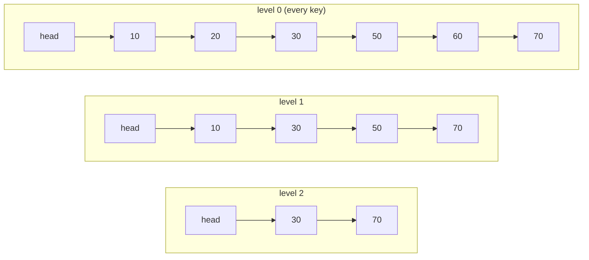

# Skip List

**Categoría:** Linear

## El problema

El [Binary Search Tree](../../trees/binary-search-tree) de este repositorio logra búsqueda O(log n) y recorrido ordenado, pero solo cuando el orden de inserción coopera — una entrada ordenada o adversarial lo degenera a una cadena O(n), y corregir eso estructuralmente implica rotaciones y control de balanceo (rebalanceo en cada inserción). ¿Existe una forma más simple de lograr búsqueda, inserción y eliminación ordenadas con O(log n) esperado, sin ninguna lógica de rotación?

## La solución

Apila varias listas enlazadas una sobre otra. El nivel 0 es una lista enlazada ordenada simple que contiene todas las claves. Cada nivel por encima contiene un subconjunto aleatorio de las claves del nivel de abajo — aproximadamente la mitad, en promedio — de modo que una búsqueda puede comenzar en el nivel más alto y "saltar" grandes tramos de la lista, bajando un nivel solo cuando el siguiente nodo del nivel actual sobrepasaría la clave buscada. La estructura surge de un lanzamiento de moneda hecho una vez por nodo insertado (`p = 0.5`: participar en un nivel más, o detenerse) — nunca de rotar algo después del hecho. En promedio, ese lanzamiento de moneda entrega el mismo costo de búsqueda logarítmico que a un árbol balanceado le cuesta mucho más trabajo lograr.



| Operación | Esperado | Por qué |
|---|---|---|
| `get` / `put` / `remove` / `contains` | O(log n) | cada nivel saltado reduce aproximadamente a la mitad el espacio de búsqueda restante, la misma forma que la altura de un árbol balanceado |
| `firstKey` | O(1) | el sucesor de nivel 0 de la sentinela head siempre es la clave más pequeña |

## Ejemplo clásico

[`classic/SkipList`](src/main/java/com/datastructures/linear/skiplist/classic/SkipList.java) es una lista enlazada en capas construida desde cero — sin `java.util.concurrent.ConcurrentSkipListMap`. Un nodo sentinela head mantiene un array de punteros `forward` dimensionado para un nivel máximo limitado (16); el array `forward` de cada nodo insertado se dimensiona según el nivel que determinó su lanzamiento de moneda (`p = 0.5` por nivel extra, vía `ThreadLocalRandom`). Nada aquí rota ni rebalancea — la forma `O(log n)` emerge estadísticamente de muchos lanzamientos de moneda independientes, no de ningún control por operación.
[`SkipListTest`](src/test/java/com/datastructures/linear/skiplist/classic/SkipListTest.java) no fija la semilla del `Random` ni hace aserciones sobre la estructura exacta de niveles (ambas cosas son explícitamente lo incorrecto para probar en una estructura probabilística); en cambio, inserta 500 claves en orden aleatorio, lo que alcanza ambos resultados del lanzamiento de moneda — el nivel de un nodo creciendo más allá de 1, y un nodo permaneciendo en el nivel 1 — con probabilidad abrumadora, y luego hace aserciones puramente sobre corrección funcional: toda clave es recuperable, `remove` desconecta correctamente un nodo en cada nivel en el que participaba, y el nivel general de la lista se reduce correctamente a medida que se eliminan los nodos más altos.

## Ejemplo aplicado: ventana deslizante de limitación de tasa

[`applied/RateLimitWindow`](src/main/java/com/datastructures/linear/skiplist/applied/RateLimitWindow.java) es un índice ordenado para una ventana deslizante de limitación de tasa, indexado por timestamp de la solicitud (epoch millis) → cantidad de solicitudes, respaldado directamente por `SkipList<Long, Integer>`. Este es un contraste deliberado con el `IdempotencyKeyCache#evictOlderThan` del módulo [Hash Table](../../hashing/hash-table) de este repositorio — lee esa clase primero. Una hash table no tiene orden, así que expirar sus entradas antiguas es honestamente un recorrido completo O(n); no tiene una opción mejor disponible. Aquí, `evictOlderThan` en cambio recorre el propio orden ascendente de claves de la skip list: `firstKey()` es O(1) (la clave más pequeña siempre es el sucesor de nivel 0 de la sentinela) y cada `remove` es O(log n), así que expirar `k` timestamps vencidos cuesta **O(k log n)**, no O(n) sobre cada timestamp que aún está en la ventana — el orden de la skip list es lo que hace eso posible, y una hash table estructuralmente no puede ofrecerlo.
[`RateLimitWindowTest`](src/test/java/com/datastructures/linear/skiplist/applied/RateLimitWindowTest.java) cubre solicitudes repetidas en el mismo timestamp, una expiración parcial que solo elimina timestamps vencidos, un corte anterior a todos los timestamps (sin efecto), y un corte que vacía toda la ventana.

## Benchmark

```bash
./gradlew :linear:skip-list:jmh
```

Ejecución real en esta máquina (JMH 1.37, JDK 26.0.2, 2 iteraciones de calentamiento + 3 de medición, 1 fork). Mismo estilo que el benchmark del módulo Binary Search Tree: un único `get` contra una estructura ya poblada de cada tamaño.

| Costo de `get` | size=100 | size=10,000 | size=100,000 |
|---|---:|---:|---:|
| skip list | 35.94 ns | 120.49 ns | 164.57 ns |

Pasar de size=100 a size=10,000 (un aumento de 100x en los datos) hace que `get` sea solo ~3.4x más lento; pasar de size=10,000 a size=100,000 (un aumento adicional de 10x) lo hace solo ~1.4x más lento — multiplicadores decrecientes para el mismo crecimiento proporcional en los datos, la firma de un escalado sublineal, similar al logarítmico. Para comparar, `log2` crece exactamente con esa misma forma de multiplicador decreciente (`log2(100)` ≈ 6.6, `log2(10,000)` ≈ 13.3, `log2(100,000)` ≈ 16.6 — aproximadamente 2x y luego aproximadamente 1.25x). Ni plano (el caso promedio O(1) de una hash table) ni lineal (un recorrido completo) — exactamente la forma O(log n) que se supone debe producir la estructura de niveles basada en lanzamientos de moneda.

## Cuándo no usarlo

- ¿Necesitas una garantía O(log n) de peor caso (no solo del caso esperado)? La forma de esta estructura es estadística — una secuencia adversarial o patológicamente desafortunada de lanzamientos de moneda (no el orden de inserción, a diferencia de un BST desbalanceado) podría en principio degradarla, aunque eso es exponencialmente improbable en la práctica. Una estructura con rebalanceo determinístico ofrece un límite real de peor caso en lugar de uno probabilístico.
- ¿Solo necesitas búsqueda por coincidencia exacta, nunca orden, rango o consultas de clave más cercana? El [Hash Table](../../hashing/hash-table) de este repositorio ofrece O(1) promedio en lugar de O(log n) esperado para esa necesidad más acotada.
- ¿Estás limitado en memoria y cada byte cuenta? Cada nodo lleva un array de punteros `forward` dimensionado según el nivel que le tocó en su lanzamiento de moneda — una sobrecarga real, aunque modesta, por nodo, más allá del único puntero `next` de una lista enlazada simple común.

## Cobertura de pruebas

100% de cobertura de instrucciones, 100% de cobertura de ramas (JaCoCo). Reprodúcelo tú mismo:

```bash
./gradlew :linear:skip-list:jacocoTestReport
```

Informe en `linear/skip-list/build/reports/jacoco/test/html/index.html`.
