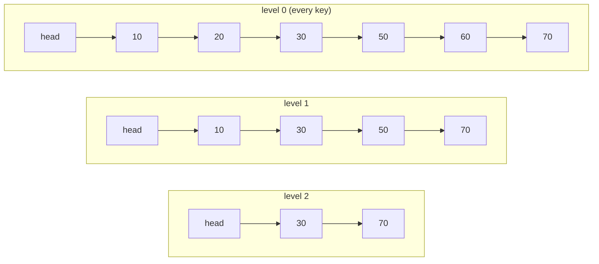

# Skip List

**Category:** Linear

## The problem

This repo's [Binary Search Tree](../../trees/binary-search-tree) gets O(log n) search and
ordered traversal, but only when insertion order cooperates — sorted or adversarial input
degenerates it into an O(n) chain, and fixing that structurally means rotations and balance
bookkeeping (rebalancing on every insert). Is there a simpler way to get expected O(log n)
ordered search, insert, and delete without any rotation logic at all?

## The solution

Stack multiple linked lists on top of each other. Level 0 is a plain sorted linked list holding
every key. Each level above it holds a random subset of the keys below it — roughly half, on
average — so a search can start at the top level and "skip" over large stretches of the list,
dropping down a level only when the next node at the current level would overshoot the target
key. Structure comes from a coin flip made once per inserted node (`p = 0.5`: participate in one
more level, or stop) — never from rotating anything after the fact. On average, that coin flip
gives the same logarithmic search cost a balanced tree works much harder for.



| Operation | Expected | Why |
|---|---|---|
| `get` / `put` / `remove` / `contains` | O(log n) | each level skipped roughly halves the remaining search space, same shape as a balanced tree's height |
| `firstKey` | O(1) | the sentinel head's level-0 successor is always the smallest key |

## Classic example

[`classic/SkipList`](src/main/java/com/datastructures/linear/skiplist/classic/SkipList.java) is
a from-scratch layered linked list — no `java.util.concurrent.ConcurrentSkipListMap`. A sentinel
head node holds a `forward` pointer array sized to a capped max level (16); each inserted node's
own `forward` array is sized to whatever level its coin flip landed on
(`p = 0.5` per extra level, via `ThreadLocalRandom`). Nothing here rotates or rebalances — the
`O(log n)` shape emerges statistically from many independent coin flips, not from any
per-operation bookkeeping.
[`SkipListTest`](src/test/java/com/datastructures/linear/skiplist/classic/SkipListTest.java)
doesn't seed the `Random` or assert on the exact level structure (both are explicitly the wrong
thing to test for a probabilistic structure); instead it inserts 500 keys in shuffled order,
which hits both outcomes of the coin flip — a node's level growing past 1, and a node staying at
level 1 — with overwhelming probability, and then asserts purely on functional correctness:
every key is retrievable, `remove` correctly unlinks a node at every level it participated in,
and the list's overall level correctly shrinks back down as the tallest nodes are removed.

## Applied example: sliding rate-limiter window

[`applied/RateLimitWindow`](src/main/java/com/datastructures/linear/skiplist/applied/RateLimitWindow.java)
is an ordered index for a sliding rate-limiter window, keyed by request timestamp (epoch millis)
→ request count, backed directly by `SkipList<Long, Integer>`. This is a deliberate contrast
with this repo's [Hash Table](../../hashing/hash-table) module's
`IdempotencyKeyCache#evictOlderThan` — read that class first. A hash table has no ordering, so
expiring its old entries is an honest O(n) full scan; there's no better option available to it.
Here, `evictOlderThan` instead walks the skip list's own ascending key order: `firstKey()` is
O(1) (the smallest key is always the sentinel's level-0 successor) and each `remove` is
O(log n), so evicting `k` expired timestamps costs **O(k log n)**, not O(n) over every timestamp
still in the window — the skip list's ordering is what makes that possible, and a hash table
structurally cannot offer it.
[`RateLimitWindowTest`](src/test/java/com/datastructures/linear/skiplist/applied/RateLimitWindowTest.java)
covers repeated requests at the same timestamp, a partial eviction that only removes expired
timestamps, a cutoff before every timestamp (no-op), and a cutoff that drains the whole window.

## Benchmark

```bash
./gradlew :linear:skip-list:jmh
```

Real run on this machine (JMH 1.37, JDK 26.0.2, 2 warmup + 3 measurement iterations, 1 fork).
Same style as the Binary Search Tree module's benchmark: a single `get` against an
already-populated structure of each size.

| `get` cost | size=100 | size=10,000 | size=100,000 |
|---|---:|---:|---:|
| skip list | 35.94 ns | 120.49 ns | 164.57 ns |

Going from size=100 to size=10,000 (a 100x increase in data) makes `get` only ~3.4x slower;
going from size=10,000 to size=100,000 (a further 10x increase) makes it only ~1.4x slower —
shrinking multipliers for the same proportional growth in data, the signature of sub-linear,
log-like scaling. For comparison, `log2` grows by exactly that same shrinking-multiplier shape
(`log2(100)` ≈ 6.6, `log2(10,000)` ≈ 13.3, `log2(100,000)` ≈ 16.6 — roughly 2x then roughly
1.25x). Neither flat (a hash table's O(1) average case) nor linear (a full scan) — exactly the
O(log n) shape the coin-flip-based level structure is supposed to produce.

## When not to use it

- Need a worst-case (not just expected-case) O(log n) guarantee? This structure's shape is
  statistical — an adversarial or pathologically unlucky sequence of coin flips (not insertion
  order, unlike an unbalanced BST) could in principle degrade it, though that's exponentially
  unlikely in practice. A structure with deterministic rebalancing gives an actual worst-case
  bound instead of a probabilistic one.
- Only need exact-match lookup, never ordering, range, or nearest-key queries? This repo's
  [Hash Table](../../hashing/hash-table) gives average O(1) instead of expected O(log n) for
  that narrower need.
- Memory-constrained and every byte counts? Each node carries a `forward` pointer array sized to
  its coin-flipped level — real but modest overhead per node beyond a plain singly linked list's
  single `next` pointer.

## Test coverage

100% instruction coverage, 100% branch coverage (JaCoCo). Reproduce it yourself:

```bash
./gradlew :linear:skip-list:jacocoTestReport
```

Report at `linear/skip-list/build/reports/jacoco/test/html/index.html`.
