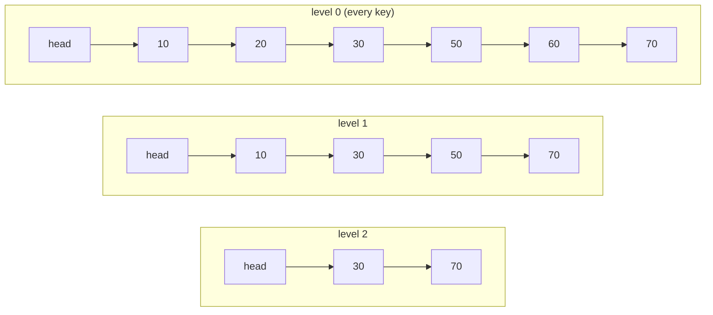

# Skip List

**Categoria:** Linear

## O problema

O [Binary Search Tree](../../trees/binary-search-tree) deste repositório consegue busca O(log n) e travessia ordenada, mas apenas quando a ordem de inserção coopera — entradas ordenadas ou adversariais o degeneram para uma cadeia O(n), e corrigir isso estruturalmente significa rotações e controle de balanceamento (rebalanceamento a cada inserção). Existe uma forma mais simples de obter busca, inserção e remoção ordenadas com O(log n) esperado, sem nenhuma lógica de rotação?

## A solução

Empilhe várias listas ligadas umas sobre as outras. O nível 0 é uma lista ligada ordenada simples, contendo todas as chaves. Cada nível acima dele contém um subconjunto aleatório das chaves do nível abaixo — aproximadamente metade, em média — de forma que uma busca pode começar no nível mais alto e "pular" grandes trechos da lista, descendo um nível apenas quando o próximo nó do nível atual ultrapassaria a chave-alvo. A estrutura vem de um lançamento de moeda feito uma vez por nó inserido (`p = 0.5`: participar de mais um nível, ou parar) — nunca de rotacionar algo posteriormente. Em média, esse lançamento de moeda entrega o mesmo custo de busca logarítmico que uma árvore balanceada precisa trabalhar muito mais para alcançar.



| Operação | Esperado | Por quê |
|---|---|---|
| `get` / `put` / `remove` / `contains` | O(log n) | cada nível pulado reduz aproximadamente pela metade o espaço de busca restante, o mesmo formato da altura de uma árvore balanceada |
| `firstKey` | O(1) | o sucessor de nível 0 da sentinela head é sempre a menor chave |

## Exemplo clássico

[`classic/SkipList`](src/main/java/com/datastructures/linear/skiplist/classic/SkipList.java) é uma lista ligada em camadas construída do zero — sem `java.util.concurrent.ConcurrentSkipListMap`. Um nó sentinela head mantém um array de ponteiros `forward` dimensionado para um nível máximo limitado (16); o array `forward` de cada nó inserido é dimensionado para o nível que seu lançamento de moeda determinou (`p = 0.5` por nível extra, via `ThreadLocalRandom`). Nada aqui rotaciona ou rebalanceia — o formato `O(log n)` emerge estatisticamente de muitos lançamentos de moeda independentes, não de nenhum controle por operação.
[`SkipListTest`](src/test/java/com/datastructures/linear/skiplist/classic/SkipListTest.java) não fixa a semente do `Random` nem faz asserções sobre a estrutura exata de níveis (ambos são explicitamente o tipo errado de coisa a testar em uma estrutura probabilística); em vez disso, insere 500 chaves em ordem embaralhada, o que atinge os dois resultados possíveis do lançamento de moeda — o nível de um nó crescendo além de 1, e um nó permanecendo no nível 1 — com probabilidade esmagadora, e então faz asserções puramente sobre correção funcional: toda chave é recuperável, `remove` desconecta corretamente um nó em cada nível em que ele participava, e o nível geral da lista diminui corretamente conforme os nós mais altos são removidos.

## Exemplo aplicado: janela deslizante de limitação de taxa

[`applied/RateLimitWindow`](src/main/java/com/datastructures/linear/skiplist/applied/RateLimitWindow.java) é um índice ordenado para uma janela deslizante de limitação de taxa, indexado por timestamp da requisição (epoch millis) → contagem de requisições, apoiado diretamente em `SkipList<Long, Integer>`. Este é um contraste deliberado com o `IdempotencyKeyCache#evictOlderThan` do módulo [Hash Table](../../hashing/hash-table) deste repositório — leia aquela classe primeiro. Uma hash table não tem ordenação, então expirar suas entradas antigas é honestamente uma varredura completa O(n); não há opção melhor disponível para ela. Aqui, `evictOlderThan` percorre a própria ordem crescente de chaves da skip list: `firstKey()` é O(1) (a menor chave é sempre o sucessor de nível 0 da sentinela) e cada `remove` é O(log n), então expirar `k` timestamps vencidos custa **O(k log n)**, não O(n) sobre cada timestamp ainda na janela — a ordenação da skip list é o que torna isso possível, e uma hash table estruturalmente não pode oferecer isso.
[`RateLimitWindowTest`](src/test/java/com/datastructures/linear/skiplist/applied/RateLimitWindowTest.java) cobre requisições repetidas no mesmo timestamp, uma expiração parcial que remove apenas timestamps vencidos, um corte anterior a todos os timestamps (sem efeito), e um corte que esvazia a janela inteira.

## Benchmark

```bash
./gradlew :linear:skip-list:jmh
```

Execução real nesta máquina (JMH 1.37, JDK 26.0.2, 2 iterações de aquecimento + 3 de medição, 1 fork). Mesmo estilo do benchmark do módulo Binary Search Tree: um único `get` contra uma estrutura já populada de cada tamanho.

| Custo de `get` | size=100 | size=10,000 | size=100,000 |
|---|---:|---:|---:|
| skip list | 35.94 ns | 120.49 ns | 164.57 ns |

Ir de size=100 para size=10,000 (um aumento de 100x nos dados) torna o `get` apenas ~3.4x mais lento; ir de size=10,000 para size=100,000 (um aumento adicional de 10x) torna apenas ~1.4x mais lento — multiplicadores decrescentes para o mesmo crescimento proporcional dos dados, a marca registrada de uma escala sublinear, tipo logarítmica. Para comparação, `log2` cresce exatamente nesse mesmo formato de multiplicador decrescente (`log2(100)` ≈ 6.6, `log2(10,000)` ≈ 13.3, `log2(100,000)` ≈ 16.6 — aproximadamente 2x e depois aproximadamente 1.25x). Nem plano (o caso médio O(1) de uma hash table) nem linear (uma varredura completa) — exatamente o formato O(log n) que a estrutura de níveis baseada em lançamento de moeda deve produzir.

## Quando não usar

- Precisa de uma garantia O(log n) de pior caso (não apenas de caso esperado)? O formato dessa estrutura é estatístico — uma sequência adversarial ou patologicamente azarada de lançamentos de moeda (não a ordem de inserção, diferente de uma BST desbalanceada) poderia em princípio degradá-la, embora isso seja exponencialmente improvável na prática. Uma estrutura com rebalanceamento determinístico oferece um limite real de pior caso, em vez de um probabilístico.
- Só precisa de busca por correspondência exata, nunca de ordenação, intervalo ou consultas de chave mais próxima? O [Hash Table](../../hashing/hash-table) deste repositório oferece O(1) médio em vez de O(log n) esperado para essa necessidade mais restrita.
- Está restrito em memória e cada byte conta? Cada nó carrega um array de ponteiros `forward` dimensionado para o nível determinado pelo seu lançamento de moeda — uma sobrecarga real, porém modesta, por nó, além do único ponteiro `next` de uma lista ligada simples comum.

## Cobertura de testes

100% de cobertura de instruções, 100% de cobertura de branches (JaCoCo). Reproduza você mesmo:

```bash
./gradlew :linear:skip-list:jacocoTestReport
```

Relatório em `linear/skip-list/build/reports/jacoco/test/html/index.html`.
