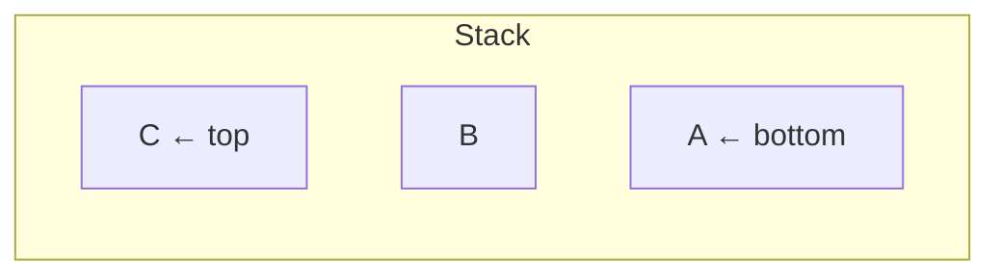

# Stack

**Categoría:** Linear

## El problema

Algunos problemas son naturalmente "deshacer lo más reciente primero": emparejar un corchete
de cierre con el corchete de apertura que aún quede sin pareja, retroceder (backtracking) desde
la última decisión tomada, desenrollar llamadas de función anidadas. Nada de eso es acceso
indexado ni recorrido ordenado — es estrictamente last-in-first-out.

## La solución

Restringe el acceso a un solo extremo: solo puedes mirar, agregar o quitar en el tope. Esa
única restricción es lo que hace que toda operación sea trivial y O(1) — nunca hay duda sobre
*cuál* elemento tocar, siempre es el que está en el tope. Este módulo reutiliza la misma
estrategia de crecimiento por duplicación de array que [Dynamic Array](../dynamic-array): push
es O(1) amortizado.



| Operación | Costo | Por qué |
|---|---|---|
| `push` | O(1) amortizado | mismo truco de array por duplicación de Dynamic Array |
| `pop` / `peek` | O(1) | siempre el último índice, nada que buscar |

## Ejemplo clásico

[`classic/Stack`](src/main/java/com/datastructures/linear/stack/classic/Stack.java) está
respaldado por array (sin `java.util.Stack`/`ArrayDeque`), exponiendo solo `push`, `pop`,
`peek`, `size`, `isEmpty` — `pop`/`peek` en una stack vacía lanzan `EmptyStackException`,
siguiendo la propia convención del JDK para exactamente este modo de fallo.
[`StackTest`](src/test/java/com/datastructures/linear/stack/classic/StackTest.java) cubre el
orden LIFO, ambos casos de fallo por stack vacía, y el crecimiento más allá de la capacidad
inicial.

## Ejemplo aplicado: validación de corchetes en copybooks COBOL heredados

[`applied/CopybookBracketValidator`](src/main/java/com/datastructures/linear/stack/applied/CopybookBracketValidator.java)
es el clásico ejercicio de stack de "corchetes balanceados" del libro de texto, aplicado a un
problema real: una herramienta construida durante la modernización de mainframe a
microservicios de un banco heredado necesita validar que los paréntesis en cláusulas `PICTURE`
y expresiones `COMPUTE` estén balanceados *antes* de que un parser automatizado intente traducir
la línea — una línea de copybook malformada debe fallar de forma ruidosa aquí, no producir una
traducción silenciosamente incorrecta más adelante. Cada corchete de apertura se apila (push);
cada corchete de cierre debe coincidir con lo que esté en el tope, y la stack debe quedar vacía
de nuevo al final de la línea.
[`CopybookBracketValidatorTest`](src/test/java/com/datastructures/linear/stack/applied/CopybookBracketValidatorTest.java)
cubre líneas balanceadas, un corchete de cierre inesperado, un tipo de corchete no coincidente,
y un corchete sin cerrar al final de la línea.

## Benchmark

```bash
./gradlew :linear:stack:jmh
```

Ejecución real (JMH 1.37, JDK 26.0.2, 2 iteraciones de warmup + 3 de medición, 1 fork):

| Benchmark | size=100 | size=10,000 | size=1,000,000 |
|---|---:|---:|---:|
| `push` (total para N pushes) | 619 ns | 71,850 ns | 35.5 ms |
| `peek` | 2.39 ns | 1.79 ns | 2.36 ns |

`peek` se mantiene estable sin importar el tamaño — O(1), confirmado. El costo total de `push`
escala con el tamaño de la misma forma O(1)-amortizado-por-elemento que lo hace el `append` de
[Dynamic Array](../dynamic-array), ya que por debajo es la misma estrategia de crecimiento.

## Cuándo no usarlo

- ¿Necesitas mirar o quitar algo que no sea el elemento agregado más recientemente? Una stack
  simplemente no puede hacer eso por diseño — consulta [Queue / Deque](../queue-deque) para
  acceso FIFO/en ambos extremos, o [Linked List](../linked-list) para insertar en cualquier
  lugar.
- Los algoritmos recursivos ya usan implícitamente el call stack como una stack; una stack
  explícita es principalmente útil cuando necesitas convertir recursión en iteración
  (anidamiento profundo que de otro modo desbordaría el call stack) o cuando el propio orden
  LIFO es el punto, como aquí.

## Cobertura de pruebas

100% de cobertura de instrucciones, 100% de cobertura de ramas (JaCoCo). Reprodúcelo tú mismo:

```bash
./gradlew :linear:stack:jacocoTestReport
```

Informe en `linear/stack/build/reports/jacoco/test/html/index.html`.
