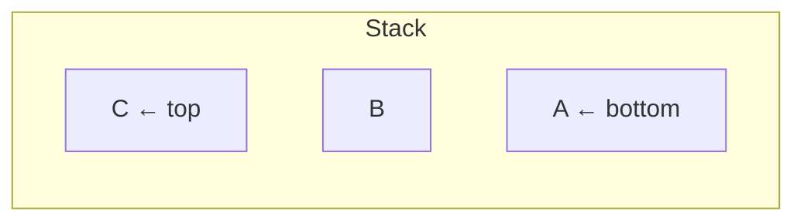

# Stack

**Category:** Linear

## The problem

Some problems are naturally "undo the most recent thing first": matching a closing bracket to
whichever opening bracket is still unmatched, backtracking out of the last decision made,
unwinding nested function calls. None of that is indexed access or ordered traversal — it's
strictly last-in-first-out.

## The solution

Restrict access to one end only: you can only look at, add to, or remove from the top. That
single restriction is what makes every operation trivial and O(1) — there's never a question
of *which* element to touch, it's always the one on top. This module reuses the same
doubling-array growth strategy as [Dynamic Array](../dynamic-array): push is amortized O(1).



| Operation | Cost | Why |
|---|---|---|
| `push` | O(1) amortized | same doubling-array trick as Dynamic Array |
| `pop` / `peek` | O(1) | always the last index, nothing to search |

## Classic example

[`classic/Stack`](src/main/java/com/datastructures/linear/stack/classic/Stack.java) is
array-backed (no `java.util.Stack`/`ArrayDeque`), exposing only `push`, `pop`, `peek`,
`size`, `isEmpty` — `pop`/`peek` on an empty stack throw `EmptyStackException`, matching the
JDK's own convention for this exact failure mode.
[`StackTest`](src/test/java/com/datastructures/linear/stack/classic/StackTest.java) covers
LIFO ordering, both empty-stack failure cases, and growth past the initial capacity.

## Applied example: legacy COBOL copybook bracket validation

[`applied/CopybookBracketValidator`](src/main/java/com/datastructures/linear/stack/applied/CopybookBracketValidator.java)
is the textbook "balanced brackets" stack exercise pointed at a real problem: tooling built
during a mainframe-to-microservices modernization (at a legacy bank) needs to validate that parentheses in
`PICTURE` clauses and `COMPUTE` expressions are balanced *before* an automated parser attempts
to translate the line — a malformed copybook line should fail loudly here, not produce a
silently wrong translation downstream. Every opening bracket is pushed; every closing bracket
must match whatever's on top, and the stack must be empty again at end of line.
[`CopybookBracketValidatorTest`](src/test/java/com/datastructures/linear/stack/applied/CopybookBracketValidatorTest.java)
covers balanced lines, an unexpected closing bracket, a mismatched bracket type, and an
unclosed bracket at end of line.

## Benchmark

```bash
./gradlew :linear:stack:jmh
```

Real run (JMH 1.37, JDK 26.0.2, 2 warmup + 3 measurement iterations, 1 fork):

| Benchmark | size=100 | size=10,000 | size=1,000,000 |
|---|---:|---:|---:|
| `push` (total for N pushes) | 619 ns | 71,850 ns | 35.5 ms |
| `peek` | 2.39 ns | 1.79 ns | 2.36 ns |

`peek` stays flat regardless of size — O(1), confirmed. `push`'s total cost scales with size
the same amortized-O(1)-per-element way [Dynamic Array](../dynamic-array)'s `append` does,
since it's the same growth strategy underneath.

## When not to use it

- Need to look at or remove anything other than the most-recently-added element? A stack can't
  do that at all by design — see [Queue / Deque](../queue-deque) for FIFO/both-ends access, or
  [Linked List](../linked-list) for splicing anywhere.
- Recursive algorithms are implicitly using the call stack as a stack already; an explicit
  stack is mainly useful when you need to convert recursion to iteration (deep nesting that
  would otherwise blow the call stack) or when the LIFO order itself is the point, like here.

## Test coverage

100% instruction coverage, 100% branch coverage (JaCoCo). Reproduce it yourself:

```bash
./gradlew :linear:stack:jacocoTestReport
```

Report at `linear/stack/build/reports/jacoco/test/html/index.html`.
