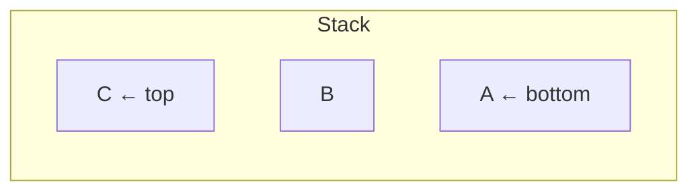

# Stack

**Categoria:** Linear

## O problema

Alguns problemas são naturalmente "desfaça a coisa mais recente primeiro": casar um colchete
de fechamento com qualquer colchete de abertura que ainda esteja sem par, retroceder (backtrack)
a partir da última decisão tomada, desenrolar chamadas de função aninhadas. Nada disso é acesso
indexado ou travessia ordenada — é estritamente last-in-first-out.

## A solução

Restrinja o acesso a apenas uma ponta: você só pode olhar, adicionar ou remover no topo. Essa
única restrição é o que torna toda operação trivial e O(1) — nunca há dúvida sobre *qual*
elemento tocar, é sempre o que está no topo. Este módulo reaproveita a mesma estratégia de
crescimento por duplicação de array do [Dynamic Array](../dynamic-array): push é O(1)
amortizado.



| Operação | Custo | Por quê |
|---|---|---|
| `push` | O(1) amortizado | mesmo truque de array por duplicação do Dynamic Array |
| `pop` / `peek` | O(1) | sempre o último índice, nada para buscar |

## Exemplo clássico

[`classic/Stack`](src/main/java/com/datastructures/linear/stack/classic/Stack.java) é baseado
em array (sem `java.util.Stack`/`ArrayDeque`), expondo apenas `push`, `pop`, `peek`, `size`,
`isEmpty` — `pop`/`peek` numa stack vazia lançam `EmptyStackException`, seguindo a própria
convenção do JDK para exatamente esse modo de falha.
[`StackTest`](src/test/java/com/datastructures/linear/stack/classic/StackTest.java) cobre a
ordenação LIFO, os dois casos de falha por stack vazia, e o crescimento além da capacidade
inicial.

## Exemplo aplicado: validação de colchetes em copybooks COBOL legados

[`applied/CopybookBracketValidator`](src/main/java/com/datastructures/linear/stack/applied/CopybookBracketValidator.java)
é o clássico exercício de stack de "colchetes balanceados" do livro-texto, aplicado a um
problema real: uma ferramenta construída durante a modernização de mainframe para microsserviços
de um banco legado precisa validar que os parênteses em cláusulas `PICTURE` e expressões
`COMPUTE` estão balanceados *antes* de um parser automatizado tentar traduzir a linha — uma
linha de copybook malformada deve falhar de forma escancarada aqui, não produzir uma tradução
silenciosamente errada mais adiante. Todo colchete de abertura é empilhado (push); todo
colchete de fechamento precisa casar com o que está no topo, e a stack precisa estar vazia
novamente ao final da linha.
[`CopybookBracketValidatorTest`](src/test/java/com/datastructures/linear/stack/applied/CopybookBracketValidatorTest.java)
cobre linhas balanceadas, um colchete de fechamento inesperado, um tipo de colchete
incompatível, e um colchete não fechado ao final da linha.

## Benchmark

```bash
./gradlew :linear:stack:jmh
```

Execução real (JMH 1.37, JDK 26.0.2, 2 iterações de warmup + 3 de medição, 1 fork):

| Benchmark | size=100 | size=10,000 | size=1,000,000 |
|---|---:|---:|---:|
| `push` (total para N pushes) | 619 ns | 71,850 ns | 35.5 ms |
| `peek` | 2.39 ns | 1.79 ns | 2.36 ns |

`peek` se mantém estável independentemente do tamanho — O(1), confirmado. O custo total de
`push` escala com o tamanho da mesma forma O(1)-amortizado-por-elemento que o `append` do
[Dynamic Array](../dynamic-array), já que por baixo dos panos é a mesma estratégia de
crescimento.

## Quando não usar

- Precisa olhar ou remover qualquer coisa que não seja o elemento adicionado mais
  recentemente? Uma stack simplesmente não faz isso, por design — veja [Queue / Deque](../queue-deque)
  para acesso FIFO/em ambas as pontas, ou [Linked List](../linked-list) para encaixe em
  qualquer lugar.
- Algoritmos recursivos já usam implicitamente a call stack como uma stack; uma stack explícita
  é principalmente útil quando você precisa converter recursão em iteração (aninhamento
  profundo que de outra forma estouraria a call stack) ou quando a própria ordem LIFO é o
  ponto, como aqui.

## Cobertura de testes

100% de cobertura de instruções, 100% de cobertura de branches (JaCoCo). Reproduza você mesmo:

```bash
./gradlew :linear:stack:jacocoTestReport
```

Relatório em `linear/stack/build/reports/jacoco/test/html/index.html`.
