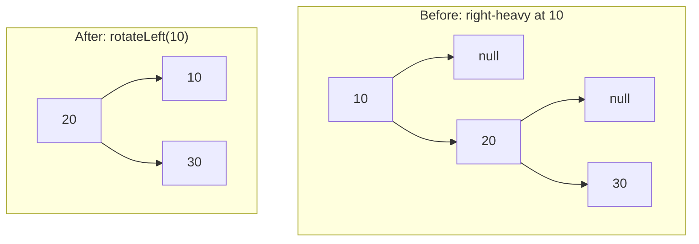

# AVL Tree

**Categoría:** Trees

## El problema

El [Binary Search Tree](../binary-search-tree) ya demostró el problema aquí: la altura de un BST simple depende enteramente del orden de inserción. Un orden aleatorio tiende a `O(log n)`; un orden ordenado (o adversarial) lo degenera en una cadena recta, altura `O(n)`, no mejor que una lista enlazada. Quien lo invoca no siempre puede controlar el orden de inserción — y no debería tener que hacerlo solo para mantener las búsquedas rápidas.

## La solución

Después de cada inserción, sube de vuelta hacia la raíz restaurando un invariante en cada nodo: `|height(left) - height(right)| <= 1`. La inserción siempre hace crecer un solo subárbol en exactamente un nivel, así que un nodo solo puede desbalancearse en exactamente 2 — lo que significa que una sola rotación (uno de cuatro casos: left-left, right-right, left-right, right-left) siempre es suficiente para corregirlo antes de continuar subiendo. Esa única garantía es lo que hace que la altura sea demostrablemente `O(log n)` *sin importar* el orden de inserción — ordenado, ordenado en reversa, adversarial, no importa.



| Operación | Costo | Por qué |
|---|---|---|
| `insert` | O(log n) garantizado | la altura está demostrablemente acotada; cada inserción hace como máximo una rotación |
| `get` / `contains` | O(log n) garantizado | mismo límite de altura, descenso al estilo BST simple |
| `height()` | O(1) | almacenado en caché por nodo, actualizado durante las rotaciones en lugar de recalculado |

## Ejemplo clásico

[`classic/AvlTree`](src/main/java/com/datastructures/trees/avltree/classic/AvlTree.java) implementa `insert`, `get`, `contains` y `height()` desde cero, con los cuatro casos de rotación. La eliminación queda deliberadamente fuera de alcance — la eliminación real en AVL necesita las mismas cuatro rotaciones más el control de empalme de dos hijos que el [Binary Search Tree](../binary-search-tree) ya cubre, sin ningún valor didáctico nuevo. [`AvlTreeTest`](src/test/java/com/datastructures/trees/avltree/classic/AvlTreeTest.java) traza a mano una secuencia de inserción dedicada para cada uno de los cuatro casos de rotación y — el punto real del módulo — inserta exactamente la misma secuencia ordenada de 100 claves que degenera la altura del `BinarySearchTree` simple a 100, y verifica que la altura del árbol AVL se mantiene en **7**.

## Ejemplo aplicado: índice de reglas de una plataforma de detección de fraude

[`applied/FraudRuleIndex`](src/main/java/com/datastructures/trees/avltree/applied/FraudRuleIndex.java) indexa reglas de detección de fraude por el umbral de score de riesgo en el que cada una se dispara. Los equipos de compliance tienden a registrar reglas en orden ascendente de umbral a medida que se lanzan nuevos niveles ("agregar una en 700, luego 750, luego 800...") — precisamente el patrón de inserción ordenada que degrada un BST simple. Como la búsqueda de reglas está en el camino crítico de cada transacción puntuada, un `O(log n)` garantizado sin importar el orden de registro es el requisito real, no solo el caso común. [`FraudRuleIndexTest`](src/test/java/com/datastructures/trees/avltree/applied/FraudRuleIndexTest.java) cubre la búsqueda por umbral exacto y el caso de umbral inexistente.

## Benchmark

```bash
./gradlew :trees:avl-tree:jmh
```

Ejecución real (JMH 1.37, JDK 26.0.2, 2 iteraciones de calentamiento + 3 de medición, 1 fork) — costo de `get()` en el propio [`BinarySearchTree`](../binary-search-tree) de este repositorio (vía una dependencia real de `project(":trees:binary-search-tree")`) frente al `AvlTree` de este módulo, cada uno construido tanto a partir de una secuencia de claves mezclada aleatoriamente como de una secuencia ordenada:

| Costo de `get` (ns/op) | size=100 | size=1,000 | size=10,000 |
|---|---:|---:|---:|
| BST, orden de inserción aleatorio | 20.8 | 44.1 | 31.2 |
| BST, orden de inserción **ordenado** | 128.0 | 1,253.7 | 21,514.5 |
| AVL, orden de inserción aleatorio | 18.5 | 20.9 | 36.0 |
| AVL, orden de inserción **ordenado** | 24.1 | 29.5 | 27.8 |

El BST simple explota con entrada ordenada — ~168x más lento en size=10,000 que su propia ejecución en orden aleatorio. El árbol AVL casi no nota en qué orden llegaron las mismas claves: sus números en orden ordenado y en orden aleatorio se mantienen en la misma banda estrecha en todos los tamaños. Esa es la garantía, hecha medible en lugar de simplemente afirmada.

## Cuándo no usarlo

- La eliminación no está implementada aquí. Si una carga de trabajo real necesita eliminación balanceada, esa es una complejidad adicional real que este módulo deliberadamente no asumió — ver la nota del ejemplo clásico.
- ¿Lectura intensiva, escritura poco frecuente, y el orden de inserción ya es efectivamente aleatorio? Un [Binary Search Tree](../binary-search-tree) simple es más simple e igual de rápido en ese caso específico — la garantía del AVL es un seguro contra un riesgo de orden de inserción que tal vez ni siquiera exista.
- ¿Necesitas un rendimiento promedio más cercano al de los árboles Red-Black bajo inserción/eliminación intercaladas intensas (menos rotaciones por eliminación, a costa de una garantía de balanceo un poco más laxa)? Esa es una estructura diferente, relacionada, que este repositorio (todavía) no implementa.

## Cobertura de pruebas

100% de cobertura de instrucciones, 100% de cobertura de ramas (JaCoCo). Reprodúcelo tú mismo:

```bash
./gradlew :trees:avl-tree:jacocoTestReport
```

Informe en `trees/avl-tree/build/reports/jacoco/test/html/index.html`.
