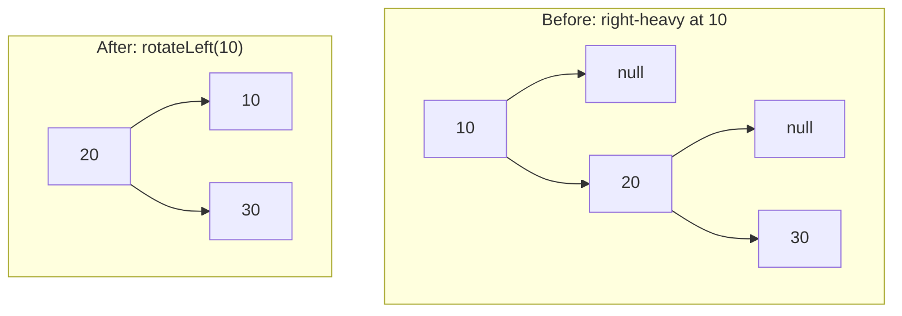

# AVL Tree

**Category:** Trees

## The problem

[Binary Search Tree](../binary-search-tree) already proved the problem here: a plain BST's
height depends entirely on insertion order. Random order tends toward `O(log n)`; sorted (or
adversarial) order degenerates it into a straight chain, `O(n)` height, no better than a linked
list. A caller can't always control insertion order — and shouldn't have to, just to keep
lookups fast.

## The solution

After every insert, walk back up toward the root restoring one invariant at every node:
`|height(left) - height(right)| <= 1`. Insert only ever grows one subtree by exactly one level,
so a node can only ever fall out of balance by exactly 2 — which means a single rotation
(one of four cases: left-left, right-right, left-right, right-left) is always enough to fix it
before continuing back up. That single guarantee is what makes height provably `O(log n)`
*regardless* of insertion order — sorted, reverse-sorted, adversarial, it doesn't matter.



| Operation | Cost | Why |
|---|---|---|
| `insert` | O(log n) guaranteed | height is provably bounded; each insert does at most one rotation |
| `get` / `contains` | O(log n) guaranteed | same height bound, plain BST-style descent |
| `height()` | O(1) | cached per node, updated during rotations instead of recomputed |

## Classic example

[`classic/AvlTree`](src/main/java/com/datastructures/trees/avltree/classic/AvlTree.java)
implements `insert`, `get`, `contains`, and `height()` from scratch, with all four rotation
cases. Delete is deliberately out of scope — real AVL deletion needs the same four rotations
plus the two-children splice bookkeeping [Binary Search Tree](../binary-search-tree) already
covers, for no new teaching value. [`AvlTreeTest`](src/test/java/com/datastructures/trees/avltree/classic/AvlTreeTest.java)
hand-traces a dedicated insertion sequence for each of the four rotation cases, and — the
module's real point — inserts the exact same 100-key sorted sequence that degenerates the
plain `BinarySearchTree`'s height to 100, and asserts the AVL tree's height stays at **7**.

## Applied example: fraud-detection platform's rule index

[`applied/FraudRuleIndex`](src/main/java/com/datastructures/trees/avltree/applied/FraudRuleIndex.java)
indexes fraud-detection rules by the risk-score threshold each one fires at. Compliance teams
tend to register rules in ascending threshold order as new tiers roll out ("add one at 700,
then 750, then 800...") — precisely the sorted-insertion pattern that degrades a plain BST.
Since rule lookup sits on the hot path of every scored transaction, a guaranteed `O(log n)`
regardless of registration order is the actual requirement, not just the common case.
[`FraudRuleIndexTest`](src/test/java/com/datastructures/trees/avltree/applied/FraudRuleIndexTest.java)
covers exact-threshold lookup and the missing-threshold case.

## Benchmark

```bash
./gradlew :trees:avl-tree:jmh
```

Real run (JMH 1.37, JDK 26.0.2, 2 warmup + 3 measurement iterations, 1 fork) — `get()` cost on
this repo's own [`BinarySearchTree`](../binary-search-tree) (via a real `project(":trees:binary-search-tree")`
dependency) versus this module's `AvlTree`, each built from both a random-shuffled and a
sorted key sequence:

| `get` cost (ns/op) | size=100 | size=1,000 | size=10,000 |
|---|---:|---:|---:|
| BST, random insert order | 20.8 | 44.1 | 31.2 |
| BST, **sorted** insert order | 128.0 | 1,253.7 | 21,514.5 |
| AVL, random insert order | 18.5 | 20.9 | 36.0 |
| AVL, **sorted** insert order | 24.1 | 29.5 | 27.8 |

The plain BST explodes on sorted input — ~168x slower at size=10,000 than its own random-order
run. The AVL tree barely notices which order the same keys arrived in: its sorted-order and
random-order numbers sit in the same narrow band at every size. That's the guarantee, made
measurable rather than just asserted.

## When not to use it

- Delete isn't implemented here. If a real workload needs balanced deletion, that's real
  additional complexity this module deliberately didn't take on — see the classic example note.
- Read-heavy, write-rarely, and insertion order is already effectively random? A plain
  [Binary Search Tree](../binary-search-tree) is simpler and just as fast in that specific case
  — the AVL guarantee is insurance against an insertion-order risk that may not exist.
- Need average-case performance closer to Red-Black trees under heavy interleaved
  insert/delete (fewer rotations per delete, at the cost of a slightly looser balance
  guarantee)? That's a different, related structure this repo doesn't (yet) implement.

## Test coverage

100% instruction coverage, 100% branch coverage (JaCoCo). Reproduce it yourself:

```bash
./gradlew :trees:avl-tree:jacocoTestReport
```

Report at `trees/avl-tree/build/reports/jacoco/test/html/index.html`.
