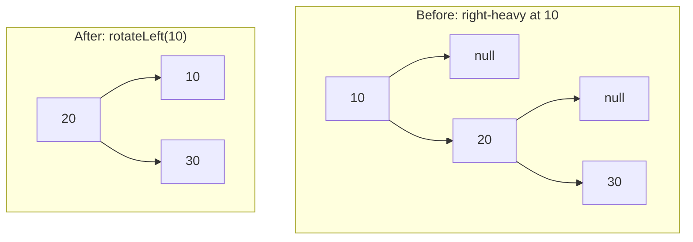

# AVL Tree

**Categoria:** Trees

## O problema

O [Binary Search Tree](../binary-search-tree) já demonstrou o problema aqui: a altura de uma BST simples depende inteiramente da ordem de inserção. Ordem aleatória tende a `O(log n)`; ordem ordenada (ou adversarial) a degenera em uma cadeia reta, altura `O(n)`, não melhor que uma lista ligada. Quem chama nem sempre pode controlar a ordem de inserção — e não deveria precisar, só para manter as buscas rápidas.

## A solução

Depois de cada inserção, suba de volta em direção à raiz restaurando um invariante em cada nó: `|height(left) - height(right)| <= 1`. A inserção sempre cresce apenas uma subárvore em exatamente um nível, então um nó só pode sair de balanço em exatamente 2 — o que significa que uma única rotação (um dos quatro casos: left-left, right-right, left-right, right-left) sempre é suficiente para corrigi-lo antes de continuar subindo. Essa única garantia é o que torna a altura comprovadamente `O(log n)` *independentemente* da ordem de inserção — ordenada, ordenada ao contrário, adversarial, não importa.



| Operação | Custo | Por quê |
|---|---|---|
| `insert` | O(log n) garantido | a altura é comprovadamente limitada; cada inserção faz no máximo uma rotação |
| `get` / `contains` | O(log n) garantido | mesmo limite de altura, descida no estilo BST simples |
| `height()` | O(1) | armazenado em cache por nó, atualizado durante as rotações em vez de recalculado |

## Exemplo clássico

[`classic/AvlTree`](src/main/java/com/datastructures/trees/avltree/classic/AvlTree.java) implementa `insert`, `get`, `contains` e `height()` do zero, com os quatro casos de rotação. A remoção é deliberadamente deixada de fora do escopo — a remoção real em AVL precisa das mesmas quatro rotações mais o controle de emenda de dois filhos que o [Binary Search Tree](../binary-search-tree) já cobre, sem nenhum valor didático novo. [`AvlTreeTest`](src/test/java/com/datastructures/trees/avltree/classic/AvlTreeTest.java) traça manualmente uma sequência de inserção dedicada para cada um dos quatro casos de rotação e — o ponto real do módulo — insere exatamente a mesma sequência ordenada de 100 chaves que degenera a altura da `BinarySearchTree` simples para 100, e verifica que a altura da árvore AVL permanece em **7**.

## Exemplo aplicado: índice de regras de uma plataforma de detecção de fraude

[`applied/FraudRuleIndex`](src/main/java/com/datastructures/trees/avltree/applied/FraudRuleIndex.java) indexa regras de detecção de fraude pelo limiar de score de risco em que cada uma dispara. Equipes de compliance tendem a registrar regras em ordem crescente de limiar conforme novos níveis entram em vigor ("adicionar uma em 700, depois 750, depois 800...") — exatamente o padrão de inserção ordenada que degrada uma BST simples. Como a busca de regras fica no caminho crítico de cada transação pontuada, um `O(log n)` garantido independentemente da ordem de registro é o requisito real, não apenas o caso comum. [`FraudRuleIndexTest`](src/test/java/com/datastructures/trees/avltree/applied/FraudRuleIndexTest.java) cobre a busca por limiar exato e o caso de limiar inexistente.

## Benchmark

```bash
./gradlew :trees:avl-tree:jmh
```

Execução real (JMH 1.37, JDK 26.0.2, 2 iterações de aquecimento + 3 de medição, 1 fork) — custo de `get()` no próprio [`BinarySearchTree`](../binary-search-tree) deste repositório (via uma dependência real de `project(":trees:binary-search-tree")`) contra o `AvlTree` deste módulo, cada um construído tanto a partir de uma sequência de chaves embaralhada aleatoriamente quanto de uma sequência ordenada:

| Custo de `get` (ns/op) | size=100 | size=1,000 | size=10,000 |
|---|---:|---:|---:|
| BST, ordem de inserção aleatória | 20.8 | 44.1 | 31.2 |
| BST, ordem de inserção **ordenada** | 128.0 | 1,253.7 | 21,514.5 |
| AVL, ordem de inserção aleatória | 18.5 | 20.9 | 36.0 |
| AVL, ordem de inserção **ordenada** | 24.1 | 29.5 | 27.8 |

A BST simples explode com entrada ordenada — ~168x mais lenta em size=10,000 do que sua própria execução em ordem aleatória. A árvore AVL quase não percebe em que ordem as mesmas chaves chegaram: seus números em ordem ordenada e em ordem aleatória ficam na mesma faixa estreita em todos os tamanhos. Essa é a garantia, tornada mensurável em vez de apenas afirmada.

## Quando não usar

- A remoção não está implementada aqui. Se uma carga de trabalho real precisar de remoção balanceada, essa é uma complexidade adicional real que este módulo deliberadamente não assumiu — veja a nota do exemplo clássico.
- Leitura intensa, escrita rara, e a ordem de inserção já é efetivamente aleatória? Um [Binary Search Tree](../binary-search-tree) simples é mais simples e igualmente rápido nesse caso específico — a garantia da AVL é um seguro contra um risco de ordem de inserção que talvez nem exista.
- Precisa de desempenho médio mais próximo do de árvores Red-Black sob inserção/remoção intercaladas intensas (menos rotações por remoção, ao custo de uma garantia de balanceamento um pouco mais frouxa)? Essa é uma estrutura diferente, relacionada, que este repositório ainda não implementa.

## Cobertura de testes

100% de cobertura de instruções, 100% de cobertura de branches (JaCoCo). Reproduza você mesmo:

```bash
./gradlew :trees:avl-tree:jacocoTestReport
```

Relatório em `trees/avl-tree/build/reports/jacoco/test/html/index.html`.
