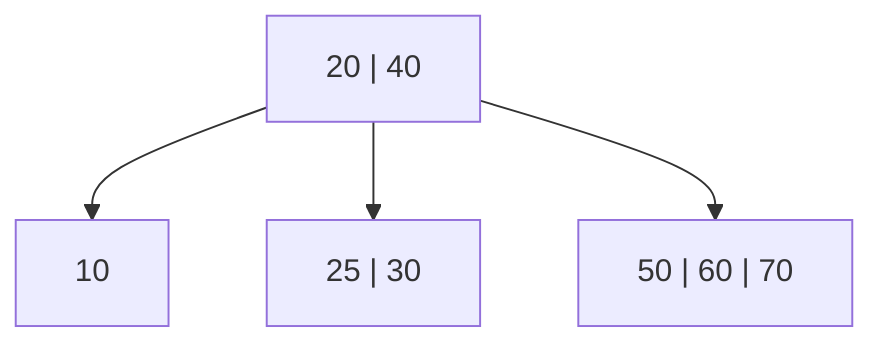

# B-Tree

**Categoría:** Trees

## El problema

Un [Binary Search Tree](../binary-search-tree) responde "encuentra esta clave" en O(altura), pero cada nodo guarda exactamente una clave y tiene como máximo dos hijos — así que la altura crece con `log2(n)` incluso en el mejor caso, y degenera a `O(n)` con un orden de inserción adversarial. Para un árbol en memoria, eso normalmente está bien. Deja de estar bien en el momento en que el árbol no cabe en memoria: un índice de base de datos real vive en disco, y cada nivel del árbol atravesado durante la búsqueda es, en el peor caso, una lectura de página de disco. Un índice de un millón de filas como árbol binario necesita alrededor de 20 niveles — 20 posibles lecturas de página — solo para encontrar una fila. La latencia de disco (o incluso de SSD) por lectura empequeñece una comparación en memoria por órdenes de magnitud, así que el número de *niveles*, no el número de *comparaciones*, es lo que realmente hay que minimizar.

## La solución

Deja que cada nodo guarde muchas claves en lugar de una, y tenga proporcionalmente muchos hijos en lugar de dos. Un árbol B de grado mínimo `t` empaqueta entre `t - 1` y `2t - 1` claves en cada nodo que no sea raíz, con hasta `2t` hijos — así que, en lugar de ramificarse por 2 en cada nivel, se ramifica de `t` a `2t`. Ese único cambio es lo que colapsa la altura del árbol de `O(log2 n)` a `O(log_t n)`: con `t = 32`, un árbol que necesitaría ~20 niveles como árbol binario necesita 3-4.

La inserción aquí usa la estrategia de "división preventiva en el camino hacia abajo": mientras se desciende hacia la hoja a la que pertenece una nueva clave, cualquier nodo lleno encontrado en el camino — incluyendo la raíz — se divide *antes* de que la recursión entre en él. Eso garantiza que el padre de un nodo lleno a punto de dividirse siempre tenga espacio para la clave mediana que la división promueve hacia arriba, así que una división nunca necesita "burbujear de vuelta" después. También garantiza que cada hoja permanezca exactamente a la misma profundidad en todo momento, lo que es lo que hace que "la altura del árbol" sea un único número bien definido, en lugar de "la altura de la rama que resulte ser la más profunda".



| Operación | Costo | Por qué |
|---|---|---|
| `get` | O(log_t n) | la altura es O(log_t n); cada nivel hace un recorrido O(t) por las claves de ese nodo |
| `insert` | O(log_t n) amortizado | mismo límite de altura; cada división preventiva en el camino cuesta O(t) |
| `height()` | O(log_t n) | recorre el único camino más a la izquierda una vez — cada hoja está a la misma profundidad |

## Ejemplo clásico

[`classic/BTree`](src/main/java/com/datastructures/trees/btree/classic/BTree.java) implementa `insert`, `get` y `height()` desde cero, con un grado mínimo `t` configurable (parámetro del constructor, por defecto 3). La división es la parte difícil: `splitChild` rompe un nodo lleno de `2t - 1` claves en dos nodos de `t - 1` claves y promueve la clave/valor mediano al padre, y `insertNonFull` vuelve a verificar la clave recién promovida después de cada división que dispara, ya que esa clave podría terminar *siendo* la clave que se está insertando (una sobrescritura, no una clave nueva). [`BTreeTest`](src/test/java/com/datastructures/trees/btree/classic/BTreeTest.java) fuerza divisiones en múltiples niveles con secuencias de inserción de 200 claves tanto ascendentes como descendentes (usando `t = 2`, el grado legal más pequeño, para hacer las divisiones lo más frecuentes posible), e incluye una secuencia deliberadamente construida que reinserta una clave en el momento exacto en que es la mediana de un nodo a punto de dividirse preventivamente — el branch más complicado de toda la clase.

## Ejemplo aplicado: simulación de un índice legado de cuentas bancarias

[`applied/AccountIndexSimulation`](src/main/java/com/datastructures/trees/btree/applied/AccountIndexSimulation.java) indexa registros de cuentas por número de cuenta de la misma forma en que lo haría un índice de RDBMS real durante una modernización de mainframe a microservicios: "encontrar la cuenta 4471203" necesita seguir siendo rápido ya sea que la tabla tenga mil filas o cien millones. Precisamente por eso las bases de datos de producción indexan con un árbol B (o un pariente cercano) en lugar de un árbol binario — cada nodo de árbol B se dimensiona para coincidir aproximadamente con una página de disco, así que un factor de ramificación alto significa directamente menos páginas tocadas por búsqueda, no solo un exponente asintótico menor. [`AccountIndexSimulationTest`](src/test/java/com/datastructures/trees/btree/applied/AccountIndexSimulationTest.java) indexa 100,000 cuentas y verifica que la altura resultante se mantenga en 4 o menos, y por separado confirma que un grado mínimo más bajo produce un índice mensurablemente más alto para la misma cantidad de cuentas — la afirmación sobre el factor de ramificación, hecha concreta.

## Benchmark

```bash
./gradlew :trees:b-tree:jmh
```

Ejecución real (JMH 1.37, JDK 26.0.2, 2 iteraciones de calentamiento + 3 de medición, 1 fork). Mismo conjunto de claves mezcladas (semilla `Random(42)`) insertado tanto en un árbol B (`t = 32`) como en el [`BinarySearchTree`](../binary-search-tree) de este repositorio — el `@Setup` del benchmark imprime la altura real, recién medida, de cada estructura inmediatamente después de construirla:

| Altura (niveles a descender) | size=1,000 | size=10,000 | size=100,000 |
|---|---:|---:|---:|
| B-tree (t=32) | 2 | 3 | 3 |
| BinarySearchTree (orden de inserción aleatorio) | 27 | 30 | 44 |

Ese es el punto central de este módulo: las mismas 100,000 claves necesitan 3 niveles en un árbol B con `t=32` y 44 en un árbol binario desbalanceado — una reducción de aproximadamente 15x en el número de visitas a nodos/páginas que necesita una búsqueda, que se amplía (y no solo proporcionalmente) a medida que crece la cantidad de claves.

El costo de `get` cuenta una historia diferente, igualmente honesta:

| Costo de `get` | size=1,000 | size=10,000 | size=100,000 |
|---|---:|---:|---:|
| B-tree (t=32) | 37.7 ns | 115.0 ns | 167.3 ns |
| BinarySearchTree (orden de inserción aleatorio) | 35.3 ns | 27.2 ns | 48.2 ns |

Contraintuitivamente, el `get` del árbol B *no* es más rápido aquí a pesar de necesitar muchos menos niveles — en estos tamaños, es ligeramente más lento. La razón es la otra mitad de la compensación de altura: cada nodo de árbol B guarda hasta `2t - 1 = 63` claves, y `get` recorre esa lista linealmente en cada nivel, así que el total de comparaciones termina en el mismo rango que recorrer un árbol binario más alto una comparación a la vez. La ganancia de altura solo se paga a sí misma cuando cada visita a un nodo tiene un costo *real* asociado — una lectura de página de disco, un viaje de ida y vuelta por la red, un fallo de línea de caché en datos demasiado grandes para la RAM — que es precisamente el escenario que modela `AccountIndexSimulation` y que un benchmark JMH simple en memoria no puede: una visita a nodo en memoria es barata sin importar el factor de ramificación, así que este benchmark muestra correctamente que la compensación tiene *dos* lados, no solo el favorable con el que este módulo abre.

## Cuándo no usarlo

- Conjuntos de datos pequeños, enteramente en memoria, sin costo de disco o red por acceso a nodo: como muestra el benchmark de `get` de arriba, el recorrido lineal por nodo de un árbol B puede hacerlo *más lento* que un [Binary Search Tree](../binary-search-tree) simple una vez que no hay costo de lectura de página que amortizar.
- Esta implementación solo soporta `insert` y `get` — sin `delete`. La eliminación real en árbol B (tomar prestado de nodos hermanos o fusionarse con ellos para mantener cada nodo en `t - 1` claves o más) es una de las operaciones más intrincadas de toda esta familia de estructuras, y queda fuera de alcance aquí.
- ¿Necesitas consultas de rango ordenadas en una estructura ya en memoria sin el enfoque de página de disco? Un [Binary Search Tree](../binary-search-tree) ofrece el mismo acceso ordenado con forma `O(log n)` con una implementación más simple.

## Cobertura de pruebas

100% de cobertura de instrucciones, 100% de cobertura de ramas (JaCoCo). Reprodúcelo tú mismo:

```bash
./gradlew :trees:b-tree:jacocoTestReport
```

Informe en `trees/b-tree/build/reports/jacoco/test/html/index.html`.
