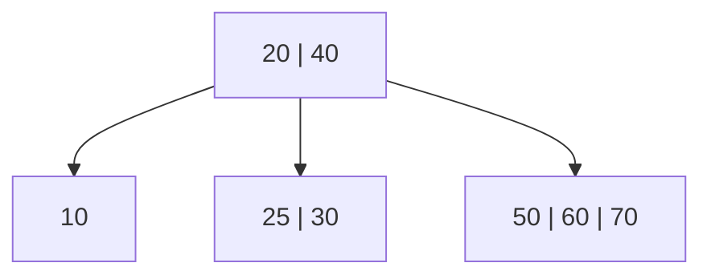

# B-Tree

**Category:** Trees

## The problem

A [Binary Search Tree](../binary-search-tree) answers "find this key" in O(height), but every
node holds exactly one key and has at most two children — so height grows with `log2(n)` even in
the best case, and degenerates to `O(n)` on adversarial insert order. For an in-memory tree that
is usually fine. It stops being fine the moment the tree doesn't fit in memory: a real database
index lives on disk, and every level of the tree crossed while searching is, in the worst case,
one disk-page read. A million-row index as a binary tree needs roughly 20 levels — 20 potential
page reads — just to find one row. Disk (or even SSD) latency per read dwarfs an in-memory
comparison by orders of magnitude, so the number of *levels*, not the number of *comparisons*, is
what actually has to be minimized.

## The solution

Let each node hold many keys instead of one, and have proportionally many children instead of
two. A B-tree of minimum degree `t` packs between `t - 1` and `2t - 1` keys into every non-root
node, with up to `2t` children — so instead of branching by 2 at every level, it branches by
`t` to `2t`. That single change is what collapses the tree's height from `O(log2 n)` to
`O(log_t n)`: with `t = 32`, a tree that would need ~20 levels as a binary tree needs 3-4.

Insertion here uses the "preemptive split on the way down" strategy: while descending toward the
leaf a new key belongs in, any full node encountered along the path — including the root — gets
split *before* the recursion steps into it. That guarantees the parent of a full node about to be
split always has room for the median key the split promotes upward, so a split never needs to
"bubble back up" afterward. It also guarantees every leaf stays at exactly the same depth at all
times, which is what makes "the tree's height" a single well-defined number instead of "the
height of whichever branch happens to be deepest".



| Operation | Cost | Why |
|---|---|---|
| `get` | O(log_t n) | height is O(log_t n); each level does an O(t) scan through that node's keys |
| `insert` | O(log_t n) amortized | same height bound; each preemptive split along the way costs O(t) |
| `height()` | O(log_t n) | walks the single leftmost path once — every leaf is at the same depth |

## Classic example

[`classic/BTree`](src/main/java/com/datastructures/trees/btree/classic/BTree.java) implements
`insert`, `get`, and `height()` from scratch with a configurable minimum degree `t` (constructor
parameter, default 3). Splitting is the hard part: `splitChild` breaks a full `2t - 1`-key node
into two `t - 1`-key nodes and promotes the median key/value into the parent, and `insertNonFull`
re-checks the just-promoted key after every split it triggers, since that key might turn out to
*be* the key being inserted (an overwrite, not a new key). [`BTreeTest`](src/test/java/com/datastructures/trees/btree/classic/BTreeTest.java)
forces splits at multiple levels with both ascending and descending 200-key insertion sequences
(using `t = 2`, the smallest legal degree, to make splits as frequent as possible), and includes
a deliberately constructed sequence that reinserts a key at the exact moment it's the median of a
node that's about to be preemptively split — the single trickiest branch in the whole class.

## Applied example: legacy bank account index simulation

[`applied/AccountIndexSimulation`](src/main/java/com/datastructures/trees/btree/applied/AccountIndexSimulation.java)
indexes account records by account number the way a real RDBMS index would during a
mainframe-to-microservices modernization: "find account 4471203" needs to stay fast whether the
table holds a thousand rows or a hundred million. This is exactly why production databases index
with a B-tree (or a close relative) instead of a binary tree — each B-tree node is sized to match
roughly one disk page, so a high branching factor directly means fewer pages touched per lookup,
not just a smaller asymptotic exponent. [`AccountIndexSimulationTest`](src/test/java/com/datastructures/trees/btree/applied/AccountIndexSimulationTest.java)
indexes 100,000 accounts and asserts the resulting height stays at or below 4, and separately
confirms that a lower minimum degree produces a measurably taller index for the same account
count — the branching-factor claim, made concrete.

## Benchmark

```bash
./gradlew :trees:b-tree:jmh
```

Real run (JMH 1.37, JDK 26.0.2, 2 warmup + 3 measurement iterations, 1 fork). Same shuffled key
set (seeded `Random(42)`) inserted into both a B-tree (`t = 32`) and this repo's
[`BinarySearchTree`](../binary-search-tree) — the benchmark's `@Setup` prints each structure's
real, just-measured height immediately after building it:

| Height (levels to descend) | size=1,000 | size=10,000 | size=100,000 |
|---|---:|---:|---:|
| B-tree (t=32) | 2 | 3 | 3 |
| BinarySearchTree (random insert order) | 27 | 30 | 44 |

That's the entire point of this module: the same 100,000 keys need 3 levels in a `t=32` B-tree
and 44 in an unbalanced binary tree — roughly a 15x reduction in the number of node/page visits a
lookup needs, growing wider (not just proportionally) as the key count grows.

`get` cost tells a different, equally honest story:

| `get` cost | size=1,000 | size=10,000 | size=100,000 |
|---|---:|---:|---:|
| B-tree (t=32) | 37.7 ns | 115.0 ns | 167.3 ns |
| BinarySearchTree (random insert order) | 35.3 ns | 27.2 ns | 48.2 ns |

Counterintuitively, the B-tree's `get` is *not* faster here despite needing far fewer levels —
at these sizes it's slightly slower. The reason is the other half of the height trade-off: each
B-tree node holds up to `2t - 1 = 63` keys, and `get` scans that list linearly at every level, so
total comparisons end up in the same ballpark as walking a taller binary tree one comparison at a
time. The height win only pays for itself once each node visit has a *real* cost attached to it —
a disk-page read, a network round trip, a cache-line miss on data too large for RAM — which is
precisely the scenario `AccountIndexSimulation` models and a plain in-memory JMH benchmark
cannot: an in-memory node visit is cheap regardless of branching factor, so this benchmark
correctly shows the trade-off has *two* sides, not just the favorable one this module leads with.

## When not to use it

- Small, entirely in-memory datasets with no disk or network cost per node access: as the `get`
  benchmark above shows, a B-tree's per-node linear scan can make it *slower* than a plain
  [Binary Search Tree](../binary-search-tree) once there's no page-read cost to amortize against.
- This implementation only supports `insert` and `get` — no `delete`. Real B-tree deletion
  (borrowing from or merging with sibling nodes to keep every node at or above `t - 1` keys) is
  one of the more intricate operations in this whole family of structures, and out of scope here.
- Need ordered range queries in an already-in-memory structure without the disk-page framing? A
  [Binary Search Tree](../binary-search-tree) offers the same `O(log n)`-shaped ordered access
  with a simpler implementation.

## Test coverage

100% instruction coverage, 100% branch coverage (JaCoCo). Reproduce it yourself:

```bash
./gradlew :trees:b-tree:jacocoTestReport
```

Report at `trees/b-tree/build/reports/jacoco/test/html/index.html`.
