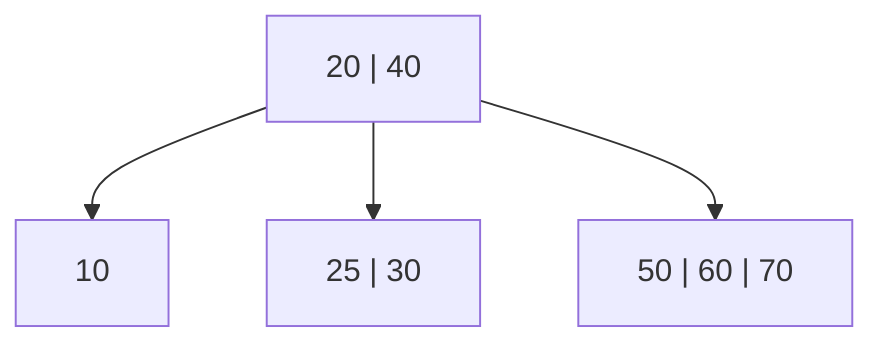

# B-Tree

**Categoria:** Trees

## O problema

Um [Binary Search Tree](../binary-search-tree) responde "encontre esta chave" em O(altura), mas cada nó guarda exatamente uma chave e tem no máximo dois filhos — então a altura cresce com `log2(n)` mesmo no melhor caso, e degenera para `O(n)` em ordem de inserção adversarial. Para uma árvore em memória, isso geralmente é aceitável. Deixa de ser aceitável no momento em que a árvore não cabe mais em memória: um índice de banco de dados real vive em disco, e cada nível da árvore atravessado durante a busca é, no pior caso, uma leitura de página de disco. Um índice de um milhão de linhas como árvore binária precisa de cerca de 20 níveis — 20 leituras de página em potencial — só para encontrar uma linha. A latência de disco (ou até de SSD) por leitura ofusca uma comparação em memória por ordens de grandeza, então o número de *níveis*, não o número de *comparações*, é o que realmente precisa ser minimizado.

## A solução

Deixe cada nó guardar muitas chaves em vez de uma, e ter proporcionalmente muitos filhos em vez de dois. Uma árvore B de grau mínimo `t` empacota entre `t - 1` e `2t - 1` chaves em cada nó que não seja raiz, com até `2t` filhos — então, em vez de ramificar por 2 em cada nível, ela ramifica de `t` a `2t`. Essa única mudança é o que colapsa a altura da árvore de `O(log2 n)` para `O(log_t n)`: com `t = 32`, uma árvore que precisaria de ~20 níveis como árvore binária precisa de 3-4.

A inserção aqui usa a estratégia de "divisão preventiva no caminho para baixo": ao descer em direção à folha à qual uma nova chave pertence, qualquer nó cheio encontrado ao longo do caminho — incluindo a raiz — é dividido *antes* de a recursão entrar nele. Isso garante que o pai de um nó cheio prestes a ser dividido sempre tenha espaço para a chave mediana que a divisão promove para cima, então uma divisão nunca precisa "borbulhar de volta" depois. Isso também garante que toda folha permaneça exatamente na mesma profundidade o tempo todo, o que é o que torna "a altura da árvore" um único número bem definido, em vez de "a altura de qualquer ramo que aconteça de ser o mais profundo".



| Operação | Custo | Por quê |
|---|---|---|
| `get` | O(log_t n) | a altura é O(log_t n); cada nível faz uma varredura O(t) pelas chaves daquele nó |
| `insert` | O(log_t n) amortizado | mesmo limite de altura; cada divisão preventiva ao longo do caminho custa O(t) |
| `height()` | O(log_t n) | percorre o único caminho mais à esquerda uma vez — toda folha está na mesma profundidade |

## Exemplo clássico

[`classic/BTree`](src/main/java/com/datastructures/trees/btree/classic/BTree.java) implementa `insert`, `get` e `height()` do zero, com um grau mínimo `t` configurável (parâmetro do construtor, padrão 3). A divisão é a parte difícil: `splitChild` quebra um nó cheio de `2t - 1` chaves em dois nós de `t - 1` chaves e promove a chave/valor mediano para o pai, e `insertNonFull` reverifica a chave recém-promovida após cada divisão que dispara, já que essa chave pode acabar *sendo* a chave que está sendo inserida (uma sobrescrita, não uma chave nova). [`BTreeTest`](src/test/java/com/datastructures/trees/btree/classic/BTreeTest.java) força divisões em múltiplos níveis com sequências de inserção de 200 chaves tanto crescentes quanto decrescentes (usando `t = 2`, o menor grau permitido, para tornar as divisões o mais frequentes possível), e inclui uma sequência deliberadamente construída que reinsere uma chave no exato momento em que ela é a mediana de um nó prestes a ser dividido preventivamente — o branch mais complicado de toda a classe.

## Exemplo aplicado: simulação de um índice legado de contas bancárias

[`applied/AccountIndexSimulation`](src/main/java/com/datastructures/trees/btree/applied/AccountIndexSimulation.java) indexa registros de contas por número de conta da mesma forma que um índice de RDBMS real faria durante uma modernização de mainframe para microsserviços: "encontrar a conta 4471203" precisa continuar rápido, seja a tabela contendo mil linhas ou cem milhões. É exatamente por isso que bancos de dados de produção indexam com uma árvore B (ou uma parente próxima) em vez de uma árvore binária — cada nó de árvore B é dimensionado para corresponder aproximadamente a uma página de disco, então um fator de ramificação alto significa diretamente menos páginas tocadas por busca, não apenas um expoente assintótico menor. [`AccountIndexSimulationTest`](src/test/java/com/datastructures/trees/btree/applied/AccountIndexSimulationTest.java) indexa 100,000 contas e verifica que a altura resultante permanece em 4 ou menos, e separadamente confirma que um grau mínimo menor produz um índice mensuravelmente mais alto para a mesma quantidade de contas — a afirmação sobre o fator de ramificação, tornada concreta.

## Benchmark

```bash
./gradlew :trees:b-tree:jmh
```

Execução real (JMH 1.37, JDK 26.0.2, 2 iterações de aquecimento + 3 de medição, 1 fork). Mesmo conjunto de chaves embaralhadas (semente `Random(42)`) inserido tanto em uma árvore B (`t = 32`) quanto no [`BinarySearchTree`](../binary-search-tree) deste repositório — o `@Setup` do benchmark imprime a altura real, recém-medida, de cada estrutura logo após construí-la:

| Altura (níveis para descer) | size=1,000 | size=10,000 | size=100,000 |
|---|---:|---:|---:|
| B-tree (t=32) | 2 | 3 | 3 |
| BinarySearchTree (ordem de inserção aleatória) | 27 | 30 | 44 |

Esse é o ponto central deste módulo: as mesmas 100,000 chaves precisam de 3 níveis em uma árvore B com `t=32` e de 44 em uma árvore binária desbalanceada — uma redução de aproximadamente 15x no número de visitas a nós/páginas que uma busca precisa fazer, que aumenta (e não apenas proporcionalmente) conforme a quantidade de chaves cresce.

O custo de `get` conta uma história diferente, igualmente honesta:

| Custo de `get` | size=1,000 | size=10,000 | size=100,000 |
|---|---:|---:|---:|
| B-tree (t=32) | 37.7 ns | 115.0 ns | 167.3 ns |
| BinarySearchTree (ordem de inserção aleatória) | 35.3 ns | 27.2 ns | 48.2 ns |

Contraintuitivamente, o `get` da árvore B *não* é mais rápido aqui, apesar de precisar de bem menos níveis — nesses tamanhos, ele é ligeiramente mais lento. O motivo é a outra metade da troca envolvendo altura: cada nó de árvore B guarda até `2t - 1 = 63` chaves, e `get` varre essa lista linearmente em cada nível, então o total de comparações acaba na mesma faixa de percorrer uma árvore binária mais alta uma comparação de cada vez. O ganho de altura só se paga quando cada visita a um nó tem um custo *real* associado a ela — uma leitura de página de disco, uma viagem de ida e volta pela rede, um cache miss em dados grandes demais para caber na RAM — que é precisamente o cenário que `AccountIndexSimulation` modela, e que um benchmark JMH simples em memória não consegue: uma visita a nó em memória é barata independentemente do fator de ramificação, então este benchmark mostra corretamente que a troca tem *dois* lados, não apenas o favorável com que este módulo começa.

## Quando não usar

- Conjuntos de dados pequenos, inteiramente em memória, sem custo de disco ou rede por acesso a nó: como o benchmark de `get` acima mostra, a varredura linear por nó de uma árvore B pode torná-la *mais lenta* que um [Binary Search Tree](../binary-search-tree) simples quando não há custo de leitura de página para amortizar.
- Esta implementação só suporta `insert` e `get` — sem `delete`. A remoção real em árvore B (pegar emprestado de nós irmãos ou mesclar com eles para manter cada nó em `t - 1` chaves ou mais) é uma das operações mais intrincadas de toda essa família de estruturas, e está fora do escopo aqui.
- Precisa de consultas de intervalo ordenadas em uma estrutura já em memória, sem o enquadramento de página de disco? Um [Binary Search Tree](../binary-search-tree) oferece o mesmo acesso ordenado no formato `O(log n)` com uma implementação mais simples.

## Cobertura de testes

100% de cobertura de instruções, 100% de cobertura de branches (JaCoCo). Reproduza você mesmo:

```bash
./gradlew :trees:b-tree:jacocoTestReport
```

Relatório em `trees/b-tree/build/reports/jacoco/test/html/index.html`.
