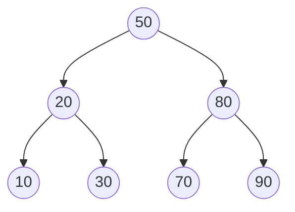

# Binary Search Tree

**Categoría:** Trees

## El problema

Un array ordenado ofrece búsqueda O(log n) mediante búsqueda binaria, pero insertar en el medio cuesta O(n) porque hay que desplazar todo lo que viene después. Una lista enlazada ofrece inserción O(1), pero búsqueda O(n). Ninguna de las dos ofrece búsqueda rápida *e* inserción rápida al mismo tiempo — y ninguna puede responder "cuál es la clave más cercana a X" sin un recorrido completo.

## La solución

Mantén la clave de cada nodo mayor que todo lo que hay en su subárbol izquierdo y menor que todo lo que hay en su subárbol derecho. Ese único invariante es lo que permite que las búsquedas, inserciones y consultas de "clave más cercana" descarten la mitad del árbol restante en cada paso, de la misma manera que lo hace la búsqueda binaria — salvo que aquí es la propia estructura la que está ordenada, no un array subyacente, así que la inserción no necesita desplazar nada.



Nada aquí se rebalancea. Esa es la trampa: el orden de inserción controla la forma del árbol. Un orden de inserción aleatorio tiende a una altura de aproximadamente `O(log n)`. Un orden de inserción ordenado (o en orden inverso) degenera el árbol en una cadena recta — altura `O(n)`, búsquedas `O(n)`, nada mejor que una lista enlazada. El benchmark de abajo mide exactamente esa brecha; un futuro módulo AVL/Red-Black en este repositorio existe específicamente para cerrarla, rebalanceando en cada inserción.

| Operación | Promedio (orden de inserción aleatorio) | Peor caso (orden de inserción ordenado) |
|---|---|---|
| `get` / `insert` / `delete` | O(log n) | O(n) |
| `floorEntry` (clave más cercana `<=` X) | O(log n) | O(n) |
| `inOrderKeys` (recorrido ordenado) | O(n) | O(n) |

## Ejemplo clásico

[`classic/BinarySearchTree`](src/main/java/com/datastructures/trees/binarysearchtree/classic/BinarySearchTree.java) implementa `insert`, `get`, `delete`, `floorEntry` y el recorrido en orden (in-order) desde cero. El delete maneja los tres casos clásicos — hoja, un hijo, dos hijos (empalmando el sucesor en orden, la clave más pequeña del subárbol derecho) — sin dejar rota la propiedad del BST. [`BinarySearchTreeTest`](src/test/java/com/datastructures/trees/binarysearchtree/classic/BinarySearchTreeTest.java) cubre los tres casos de delete, más el caso degenerado directamente: insertar 100 claves en orden ascendente y verificar que la altura resultante sea exactamente 100.

## Ejemplo aplicado: búsqueda de nivel de límite de transacción del BACEN

[`applied/TransactionLimitTierIndex`](src/main/java/com/datastructures/trees/binarysearchtree/applied/TransactionLimitTierIndex.java) resuelve qué nivel de límite de transacción PIX definido por el BACEN se aplica a un monto dado — los niveles se definen por umbral ("desde R$1.000 se aplica hasta que se cruza un umbral mayor"), así que responder "¿qué nivel cubre R$1.347,50?" requiere una búsqueda ordenada de *piso* (floor), no una de coincidencia exacta. Esta es la operación que una hash table estructuralmente no puede ofrecer mejor que un recorrido completo; un BST la resuelve en O(altura) por construcción. [`TransactionLimitTierIndexTest`](src/test/java/com/datastructures/trees/binarysearchtree/applied/TransactionLimitTierIndexTest.java) cubre un monto exactamente en un límite, un monto entre dos niveles y un monto por debajo de todos los umbrales registrados.

## Benchmark

```bash
./gradlew :trees:binary-search-tree:jmh
```

Ejecución real (JMH 1.37, JDK 26.0.2, 2 iteraciones de calentamiento + 3 de medición, 1 fork). Mismo conjunto de claves, misma operación de búsqueda — la única variable es si el árbol se construyó a partir de un orden de inserción mezclado (shuffled) u ordenado.

| Costo de `get` | size=100 | size=1,000 | size=10,000 |
|---|---:|---:|---:|
| orden de inserción aleatorio | 18.9 ns | 38.7 ns | 32.3 ns |
| orden de inserción ordenado (degenerado) | 115.7 ns | 1,079.1 ns | 22,575.8 ns |

El costo de búsqueda del árbol con orden aleatorio se mantiene prácticamente plano a lo largo de un aumento de 100x en el tamaño — la forma que predice `O(log n)`. El costo del árbol con orden ordenado, en cambio, crece casi linealmente con el tamaño — pasar de 1,000 a 10,000 claves (10x más datos) hace que las búsquedas sean ~21x más lentas, consistente con que el árbol se haya degenerado en una cadena de 10,000 nodos. Mismo código, mismos datos, solo cambió el orden de inserción — y por eso, precisamente, nada aquí se rebalancea solo, y por eso importa.

## Cuándo no usarlo

- Si el orden de inserción no se puede controlar o no es confiable (entrada ordenada o adversarial), un BST no balanceado degrada a una lista enlazada — ver el benchmark de arriba. Una variante autobalanceada (AVL, Red-Black) es la solución; este repositorio agregará una justamente para contrastarla con este módulo.
- ¿Solo necesitas búsqueda por coincidencia exacta, nunca orden ni consultas de rango/piso? Una hash table (ver el módulo [Hash Table](../../hashing/hash-table) de este repositorio) da O(1) promedio en lugar de O(log n) para esa necesidad más acotada.
- ¿Necesitas una altura garantizada en el peor caso (no solo en el caso promedio)? Misma respuesta: un árbol balanceado.

## Cobertura de pruebas

100% de cobertura de instrucciones, 100% de cobertura de ramas (JaCoCo). Reprodúcelo tú mismo:

```bash
./gradlew :trees:binary-search-tree:jacocoTestReport
```

Reporte en `trees/binary-search-tree/build/reports/jacoco/test/html/index.html`.
