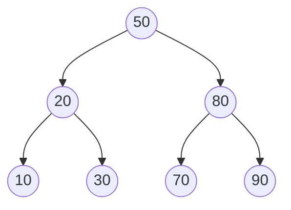

# Binary Search Tree

**Category:** Trees

## The problem

A sorted array gives O(log n) lookup via binary search, but inserting into the middle costs
O(n) to shift everything after it. A linked list gives O(1) insertion but O(n) lookup. Neither
gives fast lookup *and* fast insertion at the same time — and neither can answer "closest key
to X" without a scan.

## The solution

Keep every node's key greater than everything in its left subtree and smaller than everything
in its right subtree. That single invariant is what makes lookup, insertion, and "closest key"
queries all able to discard half the remaining tree at every step, the same way binary search
does — except the structure itself is what's sorted, not a backing array, so insertion doesn't
need to shift anything.



Nothing here rebalances. That's the catch: insert order controls the tree's shape. Random
insertion order tends toward roughly `O(log n)` height. Sorted (or reverse-sorted) insertion
order degenerates the tree into a straight chain — `O(n)` height, `O(n)` lookups, no better
than a linked list. The benchmark below measures exactly that gap; a future AVL/Red-Black
module in this repo exists specifically to close it by rebalancing on every insert.

| Operation | Average (random insert order) | Worst case (sorted insert order) |
|---|---|---|
| `get` / `insert` / `delete` | O(log n) | O(n) |
| `floorEntry` (closest key `<=` X) | O(log n) | O(n) |
| `inOrderKeys` (sorted traversal) | O(n) | O(n) |

## Classic example

[`classic/BinarySearchTree`](src/main/java/com/datastructures/trees/binarysearchtree/classic/BinarySearchTree.java)
implements `insert`, `get`, `delete`, `floorEntry`, and in-order traversal from scratch. Delete
handles all three textbook cases — leaf, one child, two children (splice in the in-order
successor, the smallest key in the right subtree) — without leaving the BST property broken.
[`BinarySearchTreeTest`](src/test/java/com/datastructures/trees/binarysearchtree/classic/BinarySearchTreeTest.java)
covers all three delete cases plus the degenerate case directly: inserting 100 keys in sorted
order and asserting the resulting height is exactly 100.

## Applied example: BACEN transaction-limit tier lookup

[`applied/TransactionLimitTierIndex`](src/main/java/com/datastructures/trees/binarysearchtree/applied/TransactionLimitTierIndex.java)
resolves which BACEN-defined PIX transaction-limit tier applies to a given amount — tiers are
defined by threshold ("R$1,000 and above applies until a higher threshold is crossed"), so
answering "which tier covers R$1,347.50?" needs an ordered *floor* lookup, not an exact-match
one. This is the operation a hash table structurally cannot offer in better than a full scan; a
BST answers it in O(height) by construction. [`TransactionLimitTierIndexTest`](src/test/java/com/datastructures/trees/binarysearchtree/applied/TransactionLimitTierIndexTest.java)
covers an amount exactly on a boundary, an amount between two tiers, and an amount below every
registered threshold.

## Benchmark

```bash
./gradlew :trees:binary-search-tree:jmh
```

Real run (JMH 1.37, JDK 26.0.2, 2 warmup + 3 measurement iterations, 1 fork). Same key set,
same lookup operation — the only variable is whether the tree was built from a shuffled or a
sorted insertion order.

| `get` cost | size=100 | size=1,000 | size=10,000 |
|---|---:|---:|---:|
| random insertion order | 18.9 ns | 38.7 ns | 32.3 ns |
| sorted insertion order (degenerate) | 115.7 ns | 1,079.1 ns | 22,575.8 ns |

The random-order tree's lookup cost stays roughly flat across a 100x size increase — the shape
`O(log n)` predicts. The sorted-order tree's cost grows almost linearly with size instead —
going from 1,000 to 10,000 keys (10x the data) makes lookups ~21x slower, consistent with the
tree having degenerated into a 10,000-node chain. Same code, same data, only insertion order
changed — which is precisely why nothing here rebalances on its own and why that matters.

## When not to use it

- If insertion order can't be controlled or trusted (sorted or adversarial input), an
  unbalanced BST degrades to a linked list — see the benchmark above. A self-balancing variant
  (AVL, Red-Black) is the fix; this repo will add one specifically to contrast against this
  module.
- Only need exact-match lookup, never ordering or range/floor queries? A hash table (see this
  repo's [Hash Table](../../hashing/hash-table) module) gives average O(1) instead of O(log n)
  for that narrower need.
- Need worst-case (not just average-case) guaranteed height? Same answer: a balanced tree.

## Test coverage

100% instruction coverage, 100% branch coverage (JaCoCo). Reproduce it yourself:

```bash
./gradlew :trees:binary-search-tree:jacocoTestReport
```

Report at `trees/binary-search-tree/build/reports/jacoco/test/html/index.html`.
