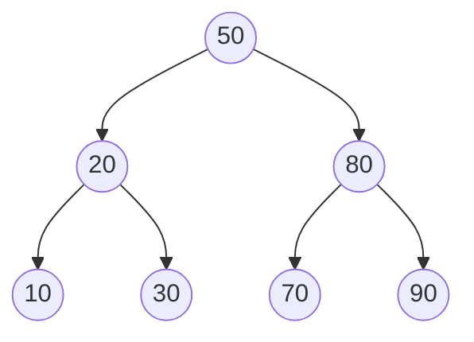

# Binary Search Tree

**Categoria:** Trees

## O problema

Um array ordenado oferece busca O(log n) via busca binária, mas inserir no meio custa O(n) para deslocar tudo que vem depois. Uma lista encadeada oferece inserção O(1), mas busca O(n). Nenhum dos dois oferece busca rápida *e* inserção rápida ao mesmo tempo — e nenhum consegue responder "qual a chave mais próxima de X" sem uma varredura.

## A solução

Mantenha a chave de cada nó maior do que tudo em sua subárvore esquerda e menor do que tudo em sua subárvore direita. Esse único invariante é o que permite que buscas, inserções e consultas de "chave mais próxima" descartem metade da árvore restante a cada passo, da mesma forma que a busca binária faz — exceto que é a própria estrutura que está ordenada, não um array subjacente, então a inserção não precisa deslocar nada.



Nada aqui se rebalanceia. Essa é a pegadinha: a ordem de inserção controla o formato da árvore. Uma ordem de inserção aleatória tende a uma altura de aproximadamente `O(log n)`. Uma ordem de inserção ordenada (ou em ordem reversa) degenera a árvore em uma cadeia reta — altura `O(n)`, buscas `O(n)`, nada melhor do que uma lista encadeada. O benchmark abaixo mede exatamente essa diferença; um futuro módulo AVL/Red-Black neste repositório existe justamente para eliminá-la, rebalanceando a cada inserção.

| Operação | Média (ordem de inserção aleatória) | Pior caso (ordem de inserção ordenada) |
|---|---|---|
| `get` / `insert` / `delete` | O(log n) | O(n) |
| `floorEntry` (chave mais próxima `<=` X) | O(log n) | O(n) |
| `inOrderKeys` (percurso ordenado) | O(n) | O(n) |

## Exemplo clássico

[`classic/BinarySearchTree`](src/main/java/com/datastructures/trees/binarysearchtree/classic/BinarySearchTree.java) implementa `insert`, `get`, `delete`, `floorEntry` e o percurso em ordem (in-order) do zero. O delete trata os três casos clássicos — folha, um filho, dois filhos (encaixando o sucessor em ordem, a menor chave da subárvore direita) — sem deixar a propriedade da BST quebrada. [`BinarySearchTreeTest`](src/test/java/com/datastructures/trees/binarysearchtree/classic/BinarySearchTreeTest.java) cobre os três casos de delete, além do caso degenerado diretamente: inserir 100 chaves em ordem crescente e verificar que a altura resultante é exatamente 100.

## Exemplo aplicado: consulta de faixa de limite de transação do BACEN

[`applied/TransactionLimitTierIndex`](src/main/java/com/datastructures/trees/binarysearchtree/applied/TransactionLimitTierIndex.java) resolve qual faixa de limite de transação PIX definida pelo BACEN se aplica a um determinado valor — as faixas são definidas por limiar ("a partir de R$1.000 aplica-se até que um limiar maior seja ultrapassado"), então responder "qual faixa cobre R$1.347,50?" exige uma busca ordenada por *piso* (floor), não uma busca por correspondência exata. Essa é a operação que uma hash table estruturalmente não consegue oferecer melhor do que uma varredura completa; uma BST responde isso em O(altura) por construção. [`TransactionLimitTierIndexTest`](src/test/java/com/datastructures/trees/binarysearchtree/applied/TransactionLimitTierIndexTest.java) cobre um valor exatamente em uma fronteira, um valor entre duas faixas e um valor abaixo de todos os limiares cadastrados.

## Benchmark

```bash
./gradlew :trees:binary-search-tree:jmh
```

Execução real (JMH 1.37, JDK 26.0.2, 2 iterações de aquecimento + 3 de medição, 1 fork). Mesmo conjunto de chaves, mesma operação de busca — a única variável é se a árvore foi construída a partir de uma ordem de inserção embaralhada ou ordenada.

| Custo de `get` | size=100 | size=1,000 | size=10,000 |
|---|---:|---:|---:|
| ordem de inserção aleatória | 18.9 ns | 38.7 ns | 32.3 ns |
| ordem de inserção ordenada (degenerada) | 115.7 ns | 1,079.1 ns | 22,575.8 ns |

O custo de busca da árvore com ordem aleatória permanece praticamente estável ao longo de um aumento de 100x no tamanho — o formato que `O(log n)` prevê. Já o custo da árvore com ordem ordenada cresce quase linearmente com o tamanho — passar de 1,000 para 10,000 chaves (10x mais dados) torna as buscas ~21x mais lentas, consistente com a árvore ter degenerado em uma cadeia de 10,000 nós. Mesmo código, mesmos dados, apenas a ordem de inserção mudou — e é exatamente por isso que nada aqui se rebalanceia sozinho, e por que isso importa.

## Quando não usar

- Se a ordem de inserção não pode ser controlada ou não é confiável (entrada ordenada ou adversarial), uma BST não balanceada degrada para uma lista encadeada — veja o benchmark acima. Uma variante autobalanceada (AVL, Red-Black) é a correção; este repositório vai adicionar uma justamente para contrastar com este módulo.
- Só precisa de busca por correspondência exata, nunca de ordenação ou consultas de intervalo/piso? Uma hash table (veja o módulo [Hash Table](../../hashing/hash-table) deste repositório) oferece O(1) médio em vez de O(log n) para essa necessidade mais restrita.
- Precisa de uma garantia de altura no pior caso (não só no caso médio)? Mesma resposta: uma árvore balanceada.

## Cobertura de testes

100% de cobertura de instruções, 100% de cobertura de branches (JaCoCo). Reproduza você mesmo:

```bash
./gradlew :trees:binary-search-tree:jacocoTestReport
```

Relatório em `trees/binary-search-tree/build/reports/jacoco/test/html/index.html`.
