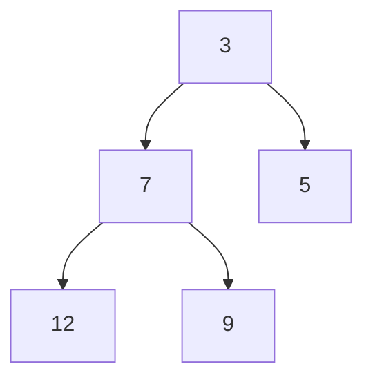

# Heap (Priority Queue)

**Categoría:** Trees

## El problema

Algunas colas no son FIFO — el próximo elemento a procesar no es el que llegó primero, sino el que es más urgente en este momento. Mantener una lista ordenada por prioridad hace que "obtener el más urgente" sea O(1), pero cada inserción pasa a ser O(n) para mantenerla ordenada. Un [Binary Search Tree](../binary-search-tree) resuelve la inserción, pero agrega overhead de punteros y complejidad para una necesidad que, en el fondo, es solo "conocer siempre el mínimo, de forma barata".

## La solución

Almacena un árbol binario completo de forma implícita en un array simple: el elemento en el índice `i` tiene hijos en `2i+1` y `2i+2`, así que no hace falta ningún puntero — las relaciones padre/hijo son pura aritmética sobre el índice. Mantén exactamente un invariante: todo nodo es `<=` que ambos sus hijos. Con eso alcanza para que el mínimo esté siempre en el índice 0 (`peek` es O(1)), y tanto `offer` como `poll` solo necesitan corregir el invariante a lo largo de un único camino raíz-hoja — nunca el árbol entero — lo que es lo que los hace O(log n).



| Operación | Costo | Por qué |
|---|---|---|
| `peek` | O(1) | el mínimo está siempre en la posición raíz del array |
| `offer` | O(log n) | desplaza el nuevo elemento hacia arriba a lo largo de, como máximo, un camino hasta la raíz |
| `poll` | O(log n) | mueve el último elemento a la raíz y lo desplaza hacia abajo a lo largo de, como máximo, un camino |

## Ejemplo clásico

[`classic/MinHeap`](src/main/java/com/datastructures/trees/heap/classic/MinHeap.java) es un min-heap binario sobre un `Object[]` puro (sin `java.util.PriorityQueue`), reutilizando la idea de crecimiento por duplicación de [Dynamic Array](../../linear/dynamic-array) para el `offer`. [`MinHeapTest`](src/test/java/com/datastructures/trees/heap/classic/MinHeapTest.java) recorre a mano secuencias de offer/poll que pasan por todas las ramas de `siftUp` y `siftDown` — subiendo cero pasos, un paso y varios pasos; bajando cuando el hijo izquierdo, el hijo derecho, o ninguno de los dos, es el menor.

## Ejemplo aplicado: cola de escalamiento de SLA de telecom

[`applied/SlaEscalationQueue`](src/main/java/com/datastructures/trees/heap/applied/SlaEscalationQueue.java) ordena los tickets de soporte por el tiempo de SLA restante: el ticket más cercano a incumplir su SLA es siempre el "mínimo" según el orden natural de [`SlaTicket`](src/main/java/com/datastructures/trees/heap/applied/SlaTicket.java), y siempre es O(log n) tanto enviar un ticket recién llegado como extraer el próximo a escalar, sin importar el tamaño de la cola. [`SlaEscalationQueueTest`](src/test/java/com/datastructures/trees/heap/applied/SlaEscalationQueueTest.java) cubre el orden de escalamiento con tickets enviados fuera de orden de urgencia.

## Benchmark

```bash
./gradlew :trees:heap:jmh
```

Ejecución real (JMH 1.37, JDK 26.0.2, 2 iteraciones de calentamiento + 3 de medición, 1 fork). Medir `offer` y `poll` contra un heap creciente de la forma ingenua (reconstruir un heap nuevo de tamaño N en cada llamada cronometrada) entierra la señal de O(log n) bajo el ruido de GC/asignación de la propia reconstrucción — así que este benchmark, en cambio, construye el heap una sola vez por trial y empareja cada operación cronometrada con una operación compensatoria barata y no cronometrada para mantener el tamaño estable, el patrón estándar de JMH para medir el costo en estado estable de una estructura mutable:

| Operación (estado estable) | size=100 | size=10,000 | size=100,000 |
|---|---:|---:|---:|
| `offer` | 66.8 ns | 118.5 ns | 135.2 ns |
| `poll` | 64.5 ns | 130.2 ns | 154.7 ns |

`log2(100,000/100) = log2(1,000) ≈ 9.97`, y `log2(10,000/100) = log2(100) ≈ 6.64`. Ambas operaciones crecen aproximadamente con esa forma, en lugar de plana o lineal: `poll` crece ~2.4x de size=100 a size=100,000 (verificación de la forma esperada: ~2x por década de tamaño), no el ~1,000x que mostraría un recorrido lineal.

## Cuándo no usarlo

- ¿Necesitas encontrar o eliminar un elemento *arbitrario*, no solo el mínimo? Un heap solo da acceso barato al mínimo — buscar cualquier otra cosa es O(n), igual que en un array sin ordenar.
- ¿Necesitas el orden totalmente ordenado, no solo acceso repetido al mínimo actual? Heapsort es un uso razonable de esta estructura, pero si los datos también necesitan permanecer ordenados para consultas de rango, un [Binary Search Tree](../binary-search-tree) encaja mejor.
- ¿Necesitas un máximo en lugar de un mínimo? Invierte la comparación (o niega el orden natural) — este módulo solo implementa un min-heap, ya que el escenario aplicado solo necesitaba una dirección.

## Cobertura de pruebas

100% de cobertura de instrucciones, 100% de cobertura de ramas (JaCoCo). Reprodúcelo tú mismo:

```bash
./gradlew :trees:heap:jacocoTestReport
```

Reporte en `trees/heap/build/reports/jacoco/test/html/index.html`.
