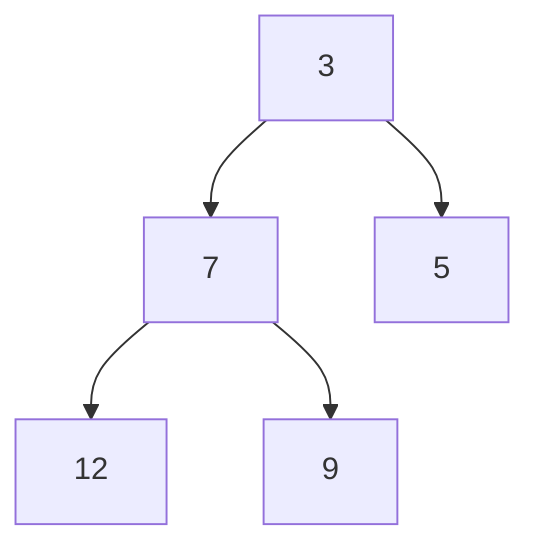

# Heap (Priority Queue)

**Category:** Trees

## The problem

Some queues aren't FIFO — the next item to process isn't whichever arrived first, it's
whichever is most urgent right now. Keeping a list sorted by priority makes "get the most
urgent one" O(1), but every insertion becomes O(n) to keep it sorted. A [Binary Search Tree](../binary-search-tree)
fixes insertion but adds pointer overhead and complexity for a need that's really just "always
know the minimum, cheaply."

## The solution

Store a complete binary tree implicitly in a plain array: the element at index `i` has children
at `2i+1` and `2i+2`, so no pointers are needed at all — parent/child relationships are just
arithmetic on the index. Maintain exactly one invariant: every node is `<=` both its children.
That's enough to make the minimum always sit at index 0 (`peek` is O(1)), and both `offer` and
`poll` only ever need to fix the invariant along a single root-to-leaf path — never the whole
tree — which is what makes them O(log n).



| Operation | Cost | Why |
|---|---|---|
| `peek` | O(1) | the minimum is always the array's root slot |
| `offer` | O(log n) | sifts the new element up at most one path to the root |
| `poll` | O(log n) | moves the last element to the root, sifts it down at most one path |

## Classic example

[`classic/MinHeap`](src/main/java/com/datastructures/trees/heap/classic/MinHeap.java) is a
binary min-heap on a raw `Object[]` (no `java.util.PriorityQueue`), reusing the doubling-growth
idea from [Dynamic Array](../../linear/dynamic-array) for `offer`. [`MinHeapTest`](src/test/java/com/datastructures/trees/heap/classic/MinHeapTest.java)
hand-traces offer/poll sequences that walk through every branch of `siftUp` and `siftDown` —
sifting up zero steps, one step, and multiple steps; sifting down where the left child, the
right child, or neither is smaller.

## Applied example: telecom SLA escalation queue

[`applied/SlaEscalationQueue`](src/main/java/com/datastructures/trees/heap/applied/SlaEscalationQueue.java)
orders support tickets by remaining SLA time: the ticket closest to breaching its SLA is always
the "minimum" by [`SlaTicket`](src/main/java/com/datastructures/trees/heap/applied/SlaTicket.java)'s
natural ordering, and it's always O(log n) to submit a newly-arrived ticket or pull the next one
to escalate, regardless of queue size. [`SlaEscalationQueueTest`](src/test/java/com/datastructures/trees/heap/applied/SlaEscalationQueueTest.java)
covers escalation order across tickets submitted out of urgency order.

## Benchmark

```bash
./gradlew :trees:heap:jmh
```

Real run (JMH 1.37, JDK 26.0.2, 2 warmup + 3 measurement iterations, 1 fork). Measuring `offer`
and `poll` against a growing heap the naive way (rebuild a fresh size-N heap on every timed
call) buries the O(log n) signal under GC/allocation noise from the rebuild itself — so this
benchmark instead builds the heap once per trial and pairs every timed operation with a cheap,
untimed compensating operation to hold size steady, the standard JMH pattern for measuring a
mutating structure's steady-state cost:

| Operation (steady state) | size=100 | size=10,000 | size=100,000 |
|---|---:|---:|---:|
| `offer` | 66.8 ns | 118.5 ns | 135.2 ns |
| `poll` | 64.5 ns | 130.2 ns | 154.7 ns |

`log2(100,000/100) = log2(1,000) ≈ 9.97`, and `log2(10,000/100) = log2(100) ≈ 6.64`. Both
operations grow by roughly that shape rather than flat or linear: `poll` grows ~2.4x from
size=100 to size=100,000 (predicted-shape check: ~2x per decade of size), not the ~1,000x a
linear scan would show.

## When not to use it

- Need to find or remove an *arbitrary* element, not just the minimum? A heap only gives cheap
  access to the minimum — searching for anything else is O(n), same as an unsorted array.
- Need the fully sorted order, not just repeated access to the current minimum? Heapsort is a
  reasonable use of this structure, but if the data needs to stay sorted for range queries too,
  a [Binary Search Tree](../binary-search-tree) is a better fit.
- Need a maximum instead of a minimum? Flip the comparison (or negate the natural ordering) —
  this module only implements a min-heap, since the applied scenario only needed one direction.

## Test coverage

100% instruction coverage, 100% branch coverage (JaCoCo). Reproduce it yourself:

```bash
./gradlew :trees:heap:jacocoTestReport
```

Report at `trees/heap/build/reports/jacoco/test/html/index.html`.
