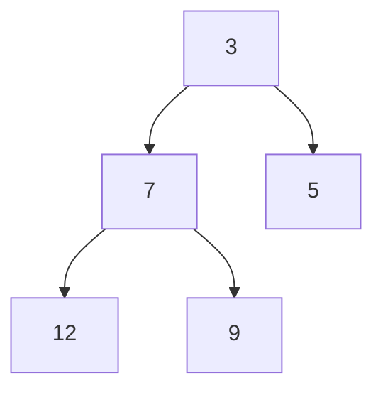

# Heap (Priority Queue)

**Categoria:** Trees

## O problema

Algumas filas não são FIFO — o próximo item a processar não é o que chegou primeiro, e sim o que é mais urgente agora. Manter uma lista ordenada por prioridade torna "pegar o mais urgente" O(1), mas cada inserção passa a ser O(n) para manter a ordenação. Uma [Binary Search Tree](../binary-search-tree) resolve a inserção, mas adiciona overhead de ponteiros e complexidade para uma necessidade que, no fundo, é só "saber sempre o mínimo, de forma barata".

## A solução

Armazene uma árvore binária completa implicitamente em um array simples: o elemento no índice `i` tem filhos nos índices `2i+1` e `2i+2`, então não é necessário nenhum ponteiro — as relações pai/filho são pura aritmética sobre o índice. Mantenha exatamente um invariante: todo nó é `<=` a ambos os seus filhos. Isso já basta para que o mínimo esteja sempre no índice 0 (`peek` é O(1)), e tanto `offer` quanto `poll` só precisam corrigir o invariante ao longo de um único caminho raiz-folha — nunca a árvore inteira — o que é o que torna ambos O(log n).



| Operação | Custo | Por quê |
|---|---|---|
| `peek` | O(1) | o mínimo está sempre na posição raiz do array |
| `offer` | O(log n) | reposiciona o novo elemento para cima ao longo de no máximo um caminho até a raiz |
| `poll` | O(log n) | move o último elemento para a raiz e o reposiciona para baixo ao longo de no máximo um caminho |

## Exemplo clássico

[`classic/MinHeap`](src/main/java/com/datastructures/trees/heap/classic/MinHeap.java) é um min-heap binário sobre um `Object[]` puro (sem `java.util.PriorityQueue`), reaproveitando a ideia de crescimento por duplicação de [Dynamic Array](../../linear/dynamic-array) para o `offer`. [`MinHeapTest`](src/test/java/com/datastructures/trees/heap/classic/MinHeapTest.java) percorre manualmente sequências de offer/poll que passam por todos os ramos de `siftUp` e `siftDown` — subir zero passos, um passo e múltiplos passos; descer quando o filho esquerdo, o filho direito, ou nenhum dos dois, é o menor.

## Exemplo aplicado: fila de escalonamento de SLA de telecom

[`applied/SlaEscalationQueue`](src/main/java/com/datastructures/trees/heap/applied/SlaEscalationQueue.java) ordena chamados de suporte pelo tempo restante de SLA: o chamado mais próximo de violar o SLA é sempre o "mínimo" segundo a ordenação natural de [`SlaTicket`](src/main/java/com/datastructures/trees/heap/applied/SlaTicket.java), e submeter um chamado recém-chegado ou retirar o próximo a escalonar é sempre O(log n), independentemente do tamanho da fila. [`SlaEscalationQueueTest`](src/test/java/com/datastructures/trees/heap/applied/SlaEscalationQueueTest.java) cobre a ordem de escalonamento com chamados submetidos fora da ordem de urgência.

## Benchmark

```bash
./gradlew :trees:heap:jmh
```

Execução real (JMH 1.37, JDK 26.0.2, 2 iterações de aquecimento + 3 de medição, 1 fork). Medir `offer` e `poll` contra um heap crescente da forma ingênua (reconstruir um heap novo de tamanho N a cada chamada cronometrada) esconde o sinal de O(log n) sob o ruído de GC/alocação da própria reconstrução — então este benchmark, em vez disso, constrói o heap uma única vez por trial e combina cada operação cronometrada com uma operação compensatória barata e não cronometrada para manter o tamanho estável, o padrão usual do JMH para medir o custo em regime estável de uma estrutura mutável:

| Operação (regime estável) | size=100 | size=10,000 | size=100,000 |
|---|---:|---:|---:|
| `offer` | 66.8 ns | 118.5 ns | 135.2 ns |
| `poll` | 64.5 ns | 130.2 ns | 154.7 ns |

`log2(100,000/100) = log2(1,000) ≈ 9.97`, e `log2(10,000/100) = log2(100) ≈ 6.64`. Ambas as operações crescem aproximadamente nesse formato, em vez de plano ou linear: `poll` cresce ~2.4x de size=100 para size=100,000 (verificação do formato previsto: ~2x por década de tamanho), não os ~1,000x que uma varredura linear mostraria.

## Quando não usar

- Precisa encontrar ou remover um elemento *arbitrário*, não só o mínimo? Um heap só oferece acesso barato ao mínimo — buscar qualquer outra coisa é O(n), igual a um array não ordenado.
- Precisa da ordem totalmente ordenada, não só de acesso repetido ao mínimo atual? Heapsort é um uso razoável dessa estrutura, mas se os dados também precisam permanecer ordenados para consultas de intervalo, uma [Binary Search Tree](../binary-search-tree) se encaixa melhor.
- Precisa de um máximo em vez de um mínimo? Inverta a comparação (ou negue a ordenação natural) — este módulo só implementa um min-heap, já que o cenário aplicado só precisava de uma direção.

## Cobertura de testes

100% de cobertura de instruções, 100% de cobertura de branches (JaCoCo). Reproduza você mesmo:

```bash
./gradlew :trees:heap:jacocoTestReport
```

Relatório em `trees/heap/build/reports/jacoco/test/html/index.html`.
