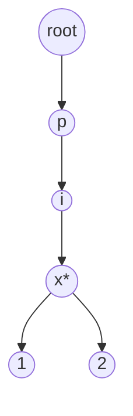

# Trie

**Categoría:** Trees

## El problema

Un [Hash Table](../../hashing/hash-table) responde "¿existe esta clave exacta?" en O(1) promedio, pero no puede responder "¿existe *alguna* clave que empiece con este prefijo?" sin recorrer todas las claves almacenadas — el hashing descarta a propósito cualquier relación estructural entre claves parecidas. Autocompletar, validar prefijos y saber si "tiene sentido seguir escribiendo esto" necesitan que esa relación se conserve.

## La solución

Almacena las claves carácter por carácter a lo largo de un árbol: cada nodo guarda sus hijos indexados por el siguiente carácter, y una marca por nodo indica "aquí termina una clave completa". Buscar una clave o un prefijo significa recorrer un carácter a la vez desde la raíz — el costo es `O(m)`, donde `m` es la longitud de la clave o el prefijo, y, fundamentalmente, ese costo no tiene nada que ver con cuántas *otras* claves están almacenadas. Un trie con 100 claves y uno con 100.000 responden la misma consulta de prefijo en el mismo tiempo, porque el recorrido solo toca nodos a lo largo de un único camino.



`*` marca un nodo donde termina una clave completa (por ejemplo, `"pix"` en sí misma es una clave registrada, al igual que `"pix1"` y `"pix2"`).

| Operación | Costo | Por qué |
|---|---|---|
| `insert(key)` | O(m) | se crea o reutiliza un nodo por cada carácter de `key` |
| `contains(key)` | O(m) | recorre el camino exacto de `key`, verifica la marca de fin de palabra |
| `startsWith(prefix)` | O(m) | recorre el camino exacto de `prefix`, con la mera existencia alcanza |

`m` = longitud de la clave/prefijo. Ninguna de estas operaciones depende de cuántas otras claves estén almacenadas — ver el benchmark de abajo.

## Ejemplo clásico

[`classic/Trie`](src/main/java/com/datastructures/trees/trie/classic/Trie.java) construye los hijos de cada nodo como un `Map<Character, Node>` en lugar de un array fijo de 26/128 posiciones, ya que las claves PIX no están restringidas a un solo alfabeto (letras, dígitos, `@`, `.`, `+`). [`TrieTest`](src/test/java/com/datastructures/trees/trie/classic/TrieTest.java) cubre un bug real detectado mientras se escribía: el nodo raíz existe incondicionalmente como campo (no lo crea `insert`), así que `startsWith("")` en un trie completamente vacío devolvería `true` — una protección para trie vacío en `startsWith` lo corrige, y el test fija el comportamiento correcto (`false`).

## Ejemplo aplicado: índice de prefijos de claves PIX del BACEN

[`applied/PixKeyPrefixIndex`](src/main/java/com/datastructures/trees/trie/applied/PixKeyPrefixIndex.java) valida y autocompleta claves PIX (las claves registradas ante el BACEN pueden ser un CPF, un email, un número de teléfono o una clave aleatoria estilo UUID) mientras un usuario la va escribiendo en un formulario de pago, sin un viaje de ida y vuelta al servicio de directorio en cada pulsación de tecla: [`hasKeyStartingWith`](src/main/java/com/datastructures/trees/trie/applied/PixKeyPrefixIndex.java) sostiene la interfaz de autocompletado, [`isRegisteredKey`](src/main/java/com/datastructures/trees/trie/applied/PixKeyPrefixIndex.java) es la verificación de coincidencia exacta una vez que termina de escribir. [`PixKeyPrefixIndexTest`](src/test/java/com/datastructures/trees/trie/applied/PixKeyPrefixIndexTest.java) cubre ambos casos.

## Benchmark

```bash
./gradlew :trees:trie:jmh
```

Ejecución real (JMH 1.37, JDK 26.0.2, 2 iteraciones de calentamiento + 3 de medición, 1 fork). La longitud de la clave se mantiene constante (claves de 12 caracteres, `"PIX" + ` un número de 9 dígitos con ceros a la izquierda) mientras varía el *número de claves almacenadas* — la forma deliberadamente distinta respecto al benchmark de los demás módulos, ya que la afirmación aquí es que este eje no debería importar en absoluto:

| Operación | 100 claves | 10,000 claves | 100,000 claves |
|---|---:|---:|---:|
| `contains` | 102.0 ns | 98.7 ns | 98.2 ns |
| `startsWith` | 73.5 ns | 89.2 ns | 58.4 ns |

Plano dentro del margen de ruido a lo largo de un aumento de 1,000x en la cantidad de claves almacenadas — a ninguna de las dos operaciones le importa cuántas otras claves compartan el trie. Compáralo con [Hash Table](../../hashing/hash-table), donde una búsqueda por coincidencia exacta también es plana respecto al *tamaño*, pero no puede responder una consulta de prefijo de ninguna manera sin un recorrido O(n) de todas las claves.

## Cuándo no usarlo

- ¿Las claves no son naturalmente jerárquicas/secuenciales por carácter, o nunca se necesitan consultas de prefijo? Un [Hash Table](../../hashing/hash-table) da la misma búsqueda por coincidencia exacta en O(1)-ish con mucho menos overhead de memoria por clave (un trie asigna un nodo por cada posición de carácter única, lo cual se acumula en un conjunto de claves grande y con poca superposición de prefijos).
- ¿Necesitas consultas de rango (todas las claves entre X e Y), no consultas de prefijo? Un [Binary Search Tree](../binary-search-tree) encaja mejor para ese tipo de pregunta.
- Claves muy largas con poca estructura de prefijo compartida hacen que el overhead de nodo por carácter cueste más de lo que ahorra — un trie se justifica en datos con localidad de prefijo real (palabras, claves PIX, rutas de archivos, URLs), no en strings largos arbitrarios.

## Cobertura de pruebas

100% de cobertura de instrucciones, 100% de cobertura de ramas (JaCoCo). Reprodúcelo tú mismo:

```bash
./gradlew :trees:trie:jacocoTestReport
```

Reporte en `trees/trie/build/reports/jacoco/test/html/index.html`.
